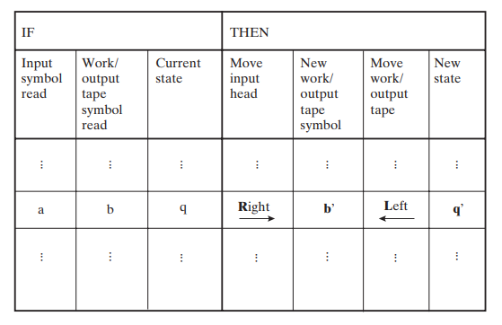
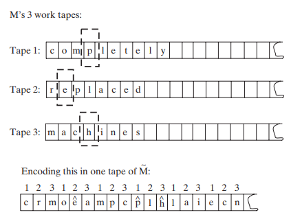

- [The Computational Model](#the-computational-model)
  - [The K-Tape Turing Machine](#the-k-tape-turing-machine)
  - [Running Time](#running-time)
  - [Simulation of Other Formatted TM's](#simulation-of-other-formatted-tms)
    - [Binary-ize Alphabet](#binary-ize-alphabet)
    - [Enforce Single Tape](#enforce-single-tape)
    - [Oblivious TM's](#oblivious-tms)
    - [Double Ended TM's](#double-ended-tms)
  - [String Encodings of TM's](#string-encodings-of-tms)
  - [Uncomputability](#uncomputability)
  - [Class P](#class-p)
  - [Universal Simulation's Time Bound](#universal-simulations-time-bound)
- [NP](#np)
  - [Non-Deterministic TM](#non-deterministic-tm)
  - [Reducibility](#reducibility)
  - [Cook-Levin Theorem](#cook-levin-theorem)
  - [Decision vs. Search](#decision-vs-search)

# The Computational Model
- *def.*
  - **algorithm**: for some function $f:S^* \to \{0, 1\}$, the algorithm that computes $f$ is a set of mechanical rules consisting of elementary operations
    - reading one bit of input
    - reading one bit from memory
    - writing a bit to memory
    - at each step, either stop and output 0/1 or choose a new rule to apply
  - the **running time** of that algorithm, $T(n)$ is the number of basic operations
  - an algorithm/Turing machine can be canonically represented as a bit string, for bit string $\alpha$ its represented machine is $M_\alpha$
  - the universal Turing machine simulates any other Turing machine $M_\alpha(x)$ when provided $(x, \alpha)$

## The K-Tape Turing Machine
- memory consists of $k$ infinite one-directional line lf cells, each holding a symbol from the alphabet $\Gamma$
- a *tape head* can read/write symbols or move by one cell along the tape
- the first tape is the `input`, the last is the `output`
- the machine has finite set of states $Q$ and one register holding $q \in Q$
- formally, a machine is defined by $(\Gamma, Q, \delta)$
  - the alphabet $\Gamma$ contains at least a stop symbol, start symbol, and 0/1
  - the finite state space $Q$ containing at least $q_{start}$ and $q_{halt}$
  - the transition function $\delta: Q \times \Gamma^k \to Q \times \Gamma^{k-1} \times \{L, S, R\}^k$ (left, right, stay)
    - takes in current state, current alphabet(s)
    - outputs next state, next alphabet(s), next move(s)
  
  
- complexity theory deals extensively with machines that do enter $q_{halt}$ for all finite input

## Running Time
- *def*. $M$ **computes** $f$ if for every bit string $x$, an $M$ configured with $x$ on its input tape will enter halt with $f(x)$ on its output tape
  - moreover, $M$ is said to compute $f$ in $T(n)$ time if on every input the step count is at most $T(|x|)$ for some $T:\mathbb{N \to N}$
- *def.* $T$ is **time constructible** if $T(n) \leq n$ and some $M$ compoutes $f(x) = x \mapsto \llcorner T(|x|) \lrcorner$
  - the canonical bitstring representation of $T(n)$ is computable by a Turing machine
  - the $n$ constraint is to allow reading the full input

## Simulation of Other Formatted TM's
- this section basically shows that the book's definition of a Turing Machine is general enough to incorporate other definitions
- this means that the class $\bold{P}$ remains the same across Turing machine formulations

### Binary-ize Alphabet
- *thm.* every $M$ with a time-constructible $T$ can be simulated by a binary turing machine with time of at most $4 \log |\Gamma| T$
  - simply encode each original tape with bits, and r/w $log|\Gamma|$ bits to match reading one original letter
    - the 4 comes from input read, input move, output write, output move
  - the new state space $Q'$ has the size less than $c|Q||\Gamma|^{k+1}$ for some constant $c$ (using a larger state space to handle multi-bit letter r/w)

### Enforce Single Tape
- *thm.* a $k$-tape Turing machine with runtime $T(n)$ can be converted to a single tape Turing machine with runtime $5kT(n)^2$
  - here, the encoding takes multiple tapes (say $i$) and maps cells 0, 1, ... to cells $i$, $i+k$, $i+2k$, ...
  
    
  - the new alphabet $\Gamma'$ contains a copy of the original letters as well as a `^` version for denoting the head of tape $i$ is on that letter
    - for every encoded representation of a tape, there is only one head (one `^`-marked cell)
  - first takes $O(n^2)$ steps to copy the input to the encoded 0'th tape
  - to simulate one step of $M$, $M'$:
    1. sweeps the tape from left to right and records the $k$ `^`-marked symbols
    2. uses $M$'s transition function to determine the next sequence of operations, which sweeps right to left and updates if necessasry
  - note the maximum locations reached in the original $M$ is at most $T(n)$ (one unique cell per step in the ideal case), which menaas in $M'$ the maximum location count is $2n+kT(n)$ (which is $\leq (k+2)T(n)$ because $T$ is at least linear)
  - the sweeping (per original step) takes at most $4kT(n)$, r/w pushes the constraint at most to $5kT(n)$ per original step

### Oblivious TM's
- at step $i$ the head of each tape of an **oblivious** Turing machine is not affected by the content of the input, but rather only the length of the input
- all Turing machines can be simulated by an oblivious version

### Double Ended TM's
- *thm* a bidirectional Turing machine with time-constructible $T$ is computable by a unidirectional Turing machine in $4T$
  - the unidirectional Turing machine will store pairs or letters $(i, -i)$ (i.e. $\Gamma' = \Gamma^2$)
  - the state space will contain two sets of original states in "positive" and "negative" mode (i.e. whether an original L/R move actually corresponds to L/R or R/L in the current machine)

## String Encodings of TM's
- on a simple level, the string that defines the Turing machine can be encoded in Binary
- *all* binary encodings represent "some" Turing machine, invalid ones map to some trivial Turing machine that halts immediately and outputs 0
- every Turing machine can be represented by infinitely many strings
  - analogous to comments in actual programming languages
- *def.* the **universal Turing machine** $\mathcal{U}$ satisfies $\mathcal{U}(x, \alpha) = M_\alpha(x)$ for all $\alpha$
  - moreover, the time constraint of $\mathcal{U}$ is $CTlogT$ for some $C$ dependent only on $|\alpha|$, $k$, and $|\Gamma|$
  - for this book, $\mathcal{U}$ is assumed to have
    - 1 i tape, 1 o tape, 3 work tapes
      - simulation of $M'$'s work tape
      - description of $M'$
      - current state of $M'$
    - (note that $M'$ is the 1 i + 1 o + 1 work tape equivalent of $M$ )
    - letters start, halt, 0, 1
- note that according to previous sections the worst case of this universal interpretation of $M$ is a quadratic slowdown
- some other formalizations have $\mathcal{U}(x, \alpha, T)=\begin{cases}M_\alpha(x) \textrm{ if M halts within T}\\\textrm{reserved failure symbol}\end{cases}$

## Uncomputability
- construct $UC$ such that it must not be computable:
  - $UC(x, \alpha)  = 0$ when $M_\alpha(\alpha) = 1$
  - otherwise (halt or other symbol), $UC(x, \alpha)=1$
  - if $UC$ is computable,
    - $\exists M, \forall \alpha: M(\alpha)=UC(\alpha)$
    - this is impossible in the case where $M = M_\alpha$ because $UC$ is defined to negate such $M$
- construct $HALT$ and prove that it is not computable
  - $HALT(x, \alpha) = 1$ when $M_\alpha(x)$ eventually halts
  - suppose $HALT$ is computable, then $UC$ can be computed, which is against the definition of $UC$
    - if not $HALT(\alpha, \alpha)$, then $UC=1$
    - otherwise, $UC=\lnot\mathcal{U}(\alpha, \alpha)$
  - this proof technique is called **reduction**:
    - for some problem A, show that A is at least as hard to solve as B by showing that any algorithm solving B can be wrapped in another algorithm solving A
    - here, $UC$ is at least as hard as $HALT$
## Class P
- *def.* a Turing machine **decides** a language $L \subseteq \{0, 1\}^*$ if it computes $f_L=\{0, 1\}^* \to \{0, 1\}$
  - the book deals mainly with these deciding problems, which basically evaluates if a string is valid or not
- *def. * the class $\bold{DTIME}$ has, for all $T$, language $L \in \bold{DTIME}(T)$ iff some Turing machine decides $L$ under $cT$ for some $c > 0$
  - the class stands for "deterministic time", meaning that for the same input the Turing machine must only have one execution path (as opposed to non-deterministic/probablistic Turing machines)
- *def.* $\bold{P} = \bigcup_{c \leq 1} \bold{DTIME(n^c)}$
  - *i.e.* the set of all languages that can be solved in polynomial time
  - even though decision problems seem to limit the type of problem, it can actually simulate functions with larger codomains by combining separate bits the canonical bitstring representation codomain values
  - *ex.* whether the first bit is 1 in the result of an integer multiplication
- practically, showing some language to be in $\bold{P}$ refers to it being something reasonable like $n^3$ or $n^5$
  - being in $\bold{P}$ means the problem is somewhat feasible to solve
- issues with the $\bold{P}$ view
  - does not account for issues of precision since everything is discrete
  - does not account for average efficiency or "good enough" solutions
  - other forms of computation like quantum
  - decision problems are limited

## Universal Simulation's Time Bound
- *thm.* $\mathcal{U}$ outputs $M$ within $O(T log T)$ of the original $T$
- note that the previous tape reduction technique introduces a $T^2$ overhead which is too much
- instead we switch to using the alphabet $\Gamma^k$, which encapsulates tuples of cells but also forces each tape head to only move in the same direction during one original step
- the solution for the movement constraint is to shift the tapes instead of moving the head
  - the book talks about special encodings to amortize shifting operations to a lower cost than actual

# NP
- $\bold{NP}$ class problems are efficiently verified but not efficiently solved
- *def.* all problems that can be verified in polynomial time
  - there exists $M$ such that $x \in L \iff \exists u \in \{0, 1\}^{p(|x|)}: M (x, u)=1$
    - $u$ is called a cerificate/verifier/witness of $x$ with respect to $L$ and $M$
  - here, $p$ is a polynomial and $M$ runs in polynomial time
  - for the special case $p=0$, this formulation actually describes $\bold{P}$
    - $u=null$ and $M$ is just the solver of the problem itself which runs in polynomial time 
    - for this reason, $\bold{P} \subseteq \bold{NP}$
- *def.* $\bold{EXP}=\bigcup_{c > 1}\bold{DTIME}(2^{n^k})$
- *thm.* $\bold{P \subseteq NP \subseteq EXP}$
  - note that the verifier can be numerated on all possible bitstrings (of length $O(p(n))$, yielding $2^{O(p(n))}$ possibilities) to construct an exponential-time solution
## Non-Deterministic TM
- originally the NP class was defined with NDTM (non-deterministic)
  - two transition functions $\delta_0$, $\delta_1$ and state $q_{accept}$
  - each steps arbitrarily chooses a transition function to apply
  - eventually reaches $q_{accept}$
  - if every sequence of choices makes $M$ halt without reaching $q_{accept}$, then $M(x)=0$
  - $M$ is said to run in $T$ time if every input $M$ either halts or reaches $q_{accept}$ within $T$ steps
- *def.* problem $L \in \bold{NTIME}(T)$ if for some $c>0$ a non-deterministic $M$ computes $L$ in $cT$
- *thm.* $\bold{NP} = \bigcup_{c} \bold{NTIME}(n^c)$
  - there is always a polynomial NDTM that solves $L$
  - the sequence of choices between $\delta_0$ and $\delta_1$ acts as a certificate (of polynomial length, since each step in the NDTM is one element)
  - the verification of such certificates takes polynomial time (as defined for all $\bold{NP}$ languages)

## Reducibility
- *def.* **NP-hardness**: the particular problem $L$ is as hard as any other $L' \in \bold{NP}$
  - this means if that problem can be solved in polynomial time, then *all* NP problems can be solved in polynomial time
  - hardness is proven via **reduction**
    - $L$ is (polynomial-time karp) reducible to $L'$ (i.e. $L \leq_p L'$) if for some polynomial-time $f$ has $x \in L \iff f(x) \in L'$
  - any problem $L'$ (doesn't have to be an NP problem) is NP-hard if all other NP problems are reducible to it
  - an NP problem $L'$ is NP-complete if it is NP-hard
- *thm.* intuitively, anything reduciable to a P problem is also in $\bold{P}$
- *thm.* intuitively, $\leq_p$ is transitive
- the usefulness of the $\bold{P=NP}$ opinion
  -  if *any* NP-hard problem is in $\bold{P}$, then $\bold{P=NP}$
  - if a language is NP-complete, then it is in $\bold{P}$ iff $\bold{P=NP}$

## Cook-Levin Theorem
- below details the notion of NP-completeness outside the Turing machine sense, using boolean propositions
- *def.* let $\phi$ be a boolean formula consisting of certain boolean variables $u_k$, the operations $\land$, $\lor$, and $\lnot$
  - $\phi$ is **satisfiable** if for some assignment of each $u_k$ $\phi = 1$
- `SAT` denotes all satisfiable formulas
- `3SAT` denotes all satisfiable formulas at most 3 literals per clause
  - *def.* the **CNF** format stands for $\phi = \lor_i (\lor_j v_{ij})$, where
    - each $v_{ij}$ is one **literal** (either some variable or its negation)
    - each $\lor_j v_{ij}$ is a **clause**
- *thm.* both are in $\bold{NP}$
  - given the right assignment as the certificate, the verification is just boolean calculation which is simple
  - *lem.* `SAT` is NP-hard
    - all boolean functions $f:B^l\to B$ can be expressed by some formula $\phi$ with $l$ variables and $l2^l$ and/or operations
    - intuitively, all boolean strings can be associated with a clause $C$ that only rejects one single string $v$
    - for all strings $v$ with $f(v)=0$, $\phi = \land_v C_v$
      - the worst case has $|\phi|=l2^l$ where each $C$ is $l$ long and all strings (with $2^l$ possibilities) map to $0$
      - if $f$ rejects $u$, then for some $v=u$, $C_v(u)=0$ (and $\phi = 0$)
      - if $f$ accepts $u$ then $C_v(u)=1$ because $u$ is different from all $v$'s (and $\phi=1$)
    - constructed this way, $\phi$ computes $f$
  - all languages can be translated to `SAT` in polynomial time
    - construct from $x$ a $\phi_x$ such that $\phi_x \in SAT \iff \exists u \in B^{p(|x|)}: M(x \circ u)=1$ (where $\circ$ denotes concatenation)
    - here $u$ is the certificate and $p$ is its verification time in machine $M$
      - $M$ only has
        - one read-only input tape
        - one writable output tape
      - $M$ is oblivious, meaning that the position of $M(x \circ u)$ is the same as $M(x \circ 0^{p(|x|)})$
      - (these constraints do not actually reduce generality of applicable TM's)
      - the snapshot of $M$ at any step is $(a \in \Gamma, b \in \Gamma, q \in Q)$
        - let $c$ be the length of the canonical binary representation of the snapshot 
        - $c$ depends on $|Q|$ and $|\Gamma|$
      - suppose $u$ does exist which corresopnds to a series of snapshots $(z_i)$, the *verification* of those snapshots consists of
        - let
          - $y = x \circ u$
          - $prev(i)$ be the previous snapshot index where the write-head is on the current position; if first time then $prev=1$
          - $input(i)$ be the position of the read head on step $i$
          - all these can be computed in polynomial time by simulating $M$ on the trivial input
        - each $z_i$ depends on $z_{i-1}$, $y_{input(i)}$, and $z_{prev(i)}$
        - this means there is a direct derivation of $\delta$ of $M$, let $F$, where $z_i = F(z_{i - 1}, z_{prev(i)}, y_{input(i)})$
          - $F:B^{2c+1} \to B^c$
    - $x \in L \iff$
      - there exists $y = x \circ u$ of length $n+p(n)$
      - there exists $z_1, ..., z_{T(n)} \in B^c$ 
      1. condition: $y[0, n] = x$
      2. $z_1=(inputstart, blank, q_{start})$
      3. $\forall i \in \{2, ..., T(n)\}: z=F$ (see previous definition)
      4. $z_{T(n)}$ writes $1$ to the output
    - $\phi_x$ takes variables $y \circ (\bigcirc_i z_i)$ and verifies the AND of the conditions above
      - condition 1: CNF has length $4n$
      - condition 2, 4: CNF has length $c2^c$ since only one state is checked
      - condition 3: $T$ snapshots each with $3c+1$ variables, so CNF has length $T(3c+1)2^{3c+1}$
      - combined, the four conditions is below $d \cdot (n + T(n))$ where $d$ is some constant dependent on $M$, this means the computation of $\phi_x$ is polynomial to the runtime of $M$
        - $\phi_x$ is polynomial iff $M$ (the solver of any arbitrary $L$) is polynomial
  - *lem.* $SAT \leq_p 3SAT$
    - *i.e.* any kCNF $\phi$ can be comverted to a 3CNF $\psi$ such that $\phi$ satisfiable iff $\psi$ satisfiable
    - to reduce any kCNF with $k>3$ to k-1CNF
      - let $C = x_1 \lor ... x_j ... \lor x_k$, $j \geq 3$
      - introduce new variable $z$ such that
        - $C = (x_1\lor ... \lor x_{j-1} \lor z)\land(x_j \lor ... \lor x_k \lor \neg z)$
        - this way, if $C$ is satisfiable, there is some $X$ assignment where at least one $x_i$ is true, that one might be in the left or right partitions
          - if it is in the left, then $z=0$
          - otherwise, $z=1$
          - this way both partitions (after adding the new variable) is always $1$, meaning $C'$ is satisfiable iff $C$ is satisfiable
      - this can be repeated until all clauses are at most $3$ long
- using the efficient ($O(T \log T)$ instead of $O(T^2)$) simulation, the size of $\phi_x$ can also be reduced to the same complexity
> the book gives a series of reductions from common NP-Complete problems either to `SAT` or `3SAT`

## Decision vs. Search
- another way to formulate many problems is as a search (search for shortest path, minimal element, etc.)
  - search problems are harder than decision problems
  - if decision problem can be solved in polynomial time, then so do search problems
- *thm.* if $\bold{P=NP}$, then for every NP language $L$ and verifier $M$ there is a polynomial-time $B$ on input $x \in L$ outputs the certificate for $x$
  - for every $x \in B^n$, if for some $u\in B^{p(n)}: M(x, u)=1$, then $|B(x)=p(n)$ and $M(x, B(x))=1$
  - for some algorithm $A$ that decides $SAT$, $B$ can be constructed
    - 