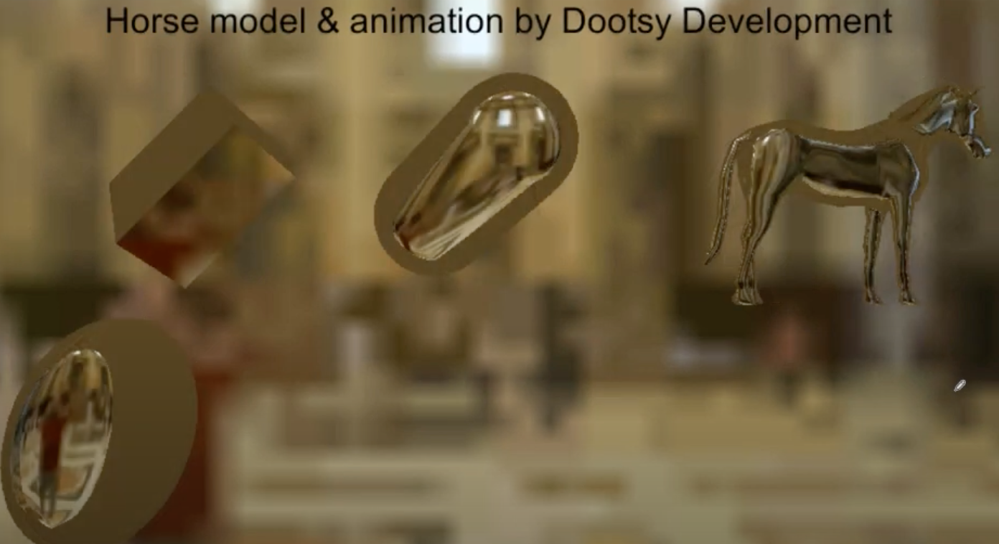
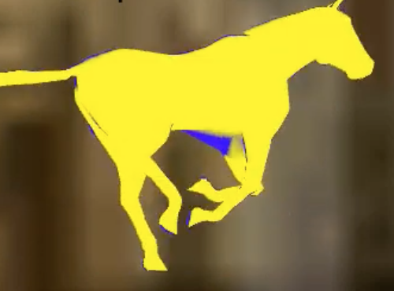
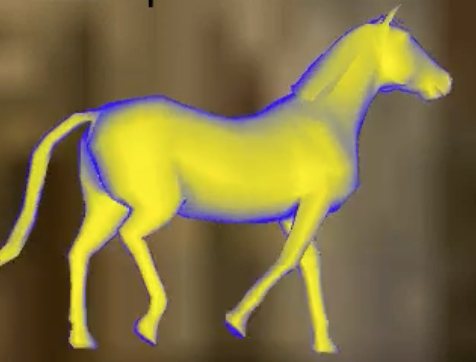
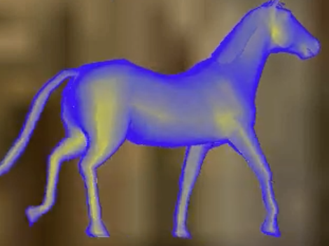
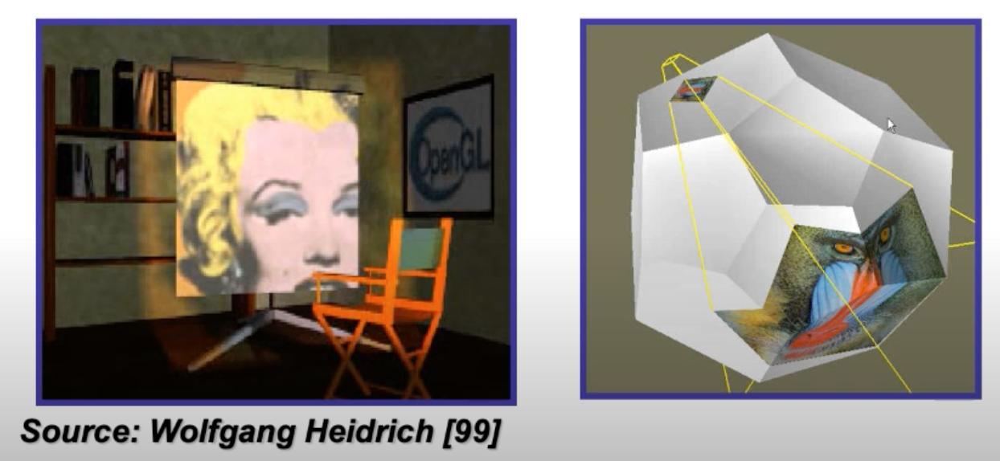
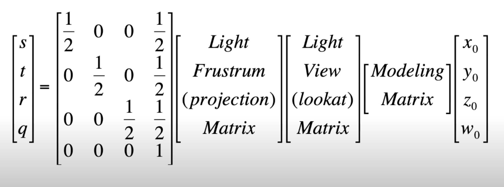
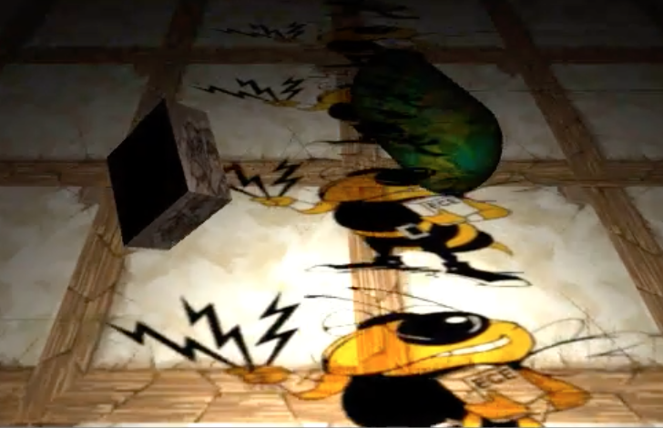
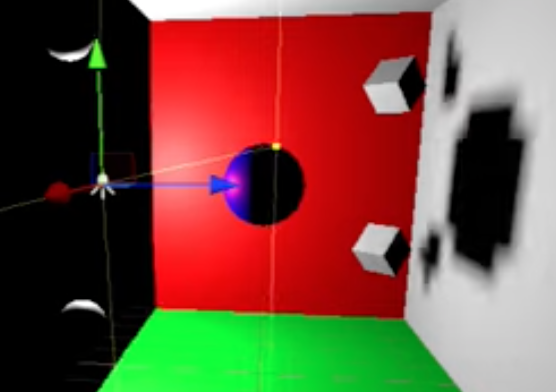

# Environment Mapping
- a *simulation of* reflection effects
  - the real thing requires ray tracing
- for incident vector $i$ *to* the point on surface (not from)
  - reflection vector $r = i - 2n(n \cdot i)$
- cubemaps can be used to sample reflections from, using the direction of $r$
  - `texCUBE((samplerCUBE) envMap, (float3) vec)`
- the simplest reflection model is a perfect mirror (completely smooth and specular)
- refraction ratio
  - dependent on *index of refraction*
  - Snell's law $\eta_i \sin(\theta_i)=C$, where $\theta_i$ is measured against the normal
  - $\eta$ ratio: $\eta_1 / \eta_2$
  - there is a `refract(float3 i, float3 n, float etaRatio) -> float3 r` command returning the refracted ray
  - beyond the critical angle, `refract` returns 0
- Fresnel effect
  - quick approximation, not the actual physically correct version
  - at shallow angles from the tangent, more reflection than refraction
  - at deep angles from the tangent, more refraction and less reflection
  - $t_{ref} = (b + s(1 + i \cdot n)^p)^{\plusmn}$
    - bias $b$, scale $s$, power $p$
  - the final color is interpolated using $t_{ref}$ from refracted to reflected
## Implementation 
- setup
  - ```
    _Cube("Reflection Cubemap", CUBE) = "white" {}
    _etaRatio("Eta Ratio", range(0.01, 3)) = 1.5
    _fB("Fresnel Bias", Range(0, 1)) = 0.5
    _fS("Fresnel Scale", Range(0, 1)) = 0.5
    _fP("Fresnel Power", Range(0, 10)) = 0.5
    // features bdlow for demo purpose only!
    _crossfade("Crossfade", Range(0, 1)) = 0 // for demo
    [Toggle(BLUE_YELLOW)] _BlueYellow ("Blue Yellow", Float) = 0 // ON is 1, OFF is 0
    [KeywordEnum(Crossfade, Fresnel)] _Blend("Blend Mode", Float) = 0
    ```
  - subshader setup for specially-typed inputs
    ```
    // note the naming convention is exact match with toggle name (specified in the attribute, not the variable identifier itself)
    #pragma shader_feature BLUE_YELLOW
    // note the naming convention is <enumName>_<optionName>
    #pragma multi_compile _BLEND_CROSSFADE _BLEND_FRESNEL
    ```
- structures
  - ```
    struct a2v {
        float4 positionOS: POSITION;
        float4 normalOS: NORMAL;
    }

    struct v2f {
        float4 sv: SV_POSITION;
        float3 positionWS: TEXCOORD0;
        float3 normalWS: TEXCOORD1;
    }
    ```
- the vertex shader is exactly the same with the unlit example (see 4.basic_shaders)
- fragment shader
  ```
  float3 incidentWS = normalize(input.positionWS - _WorldSpaceCameraPos.xyz);
  float3 reflectWS = reflect(incidentWS, input.normalWS);
  float3 refractWS = refract(incidentWS, input.normalWS, _etaRatio);

  float4 reflectColor = texCUBE(_Cube, reflectWS);
  float4 refractColor = texCUBE(_Cube, refractWS);
  float reflectFactor = saturate(_fB + fS * pow(1 + dot(incidentWS, input.normalWS), fP));

  // use of directive along with toggles and enums
  // this reduces compiled shader size and removes branching

  #ifdef BLUE_YELLOW
    // for demo purposes, 
    refractColor = float(1, 1, 0, 1);
    reflectColor = float(0, 0, 1, 1);
  #endif

  // use of the defined macro to handle multiple conditions
  // there is no elifdef
  #if defined(_BLEND_CROSSFADE)
    return lerp(reflectColor, refractColor, _crossfade);
  #elif defined(_BLEND_FRESNEL)
    return lerp(refractColor, reflectColor, _reflectFactor);
  #endif
  ```
- note that for high $\eta$ ratios, the numeric calculations break down, causing the following artifact
  - *ex.* when $\eta_1 / \eta_2 = 1.5$
  - 
- fresnel power controls the roughness of the refraction-reflection division
  - at $>1$, most of the angles have refraction dominating, with clear-cut boundaries
    
  - at clost to 0, most of the angles have reflection dominating
  - between 0-1, the lower power is, the more reflection is present throughout the visible face of the model
    - 1
    
    - 0.3
    
## Chromatic Dispersion
- different refraction angles for R, G, and B channels
  - sample at each refraction angles, then combine the separate channels into one `refracionColor`

# Projective Textures
- 
- use of a texture matrix, similar to the regular projection matrix
- 
  - in order of application...
  - translate world position into object space
  - transform from object space to the view space (clip space), but in the view of the projector light (this involves the lookat and projection matrices)
  - lastly, convert from [-1, 1] to [0, 1] range because texture coordinates are in that range
- note that this technique demands one separate camera to be used solely for this projection, while on each material a corresponding texture needs to be set
  - for that texture, tiling, offset, and overflow settings of the texture affect the projection itself
  - for example, a project may be repeated across an axis
  - 

## Implementation
- setup
  ```
  _BaseTex ("Base (RGB) Gloss (A)", 2D) = "white" {}
  _ProjTex ("Projected (RGB)", 2D) = "white" {}
  _SpotPower ("Spotlight", Range(0.01, 1)) = 0.7
  ```
  - `ForwardAdd` light to accommodate point lighting
  - additional inputs that are not exposed in the material settings, but injected programmatically
    - `float4x4 _projVP;`
    - `float3 spotLightDir;`
- structures
  - simple `a2f` with position, normal, and uv
  - ```
    struct v2f {
        float4 sv: SV_POSITION;
        float2 uv: TEXCOORD0;
        float3 positionWS: TEXCOORD1;
        float3 normalWS: TEXCOORD2;
        float4 positionProjected: TEXCOORD3;
    }
    ```
- vertex shader
```
//...  calculate sv, positionWS, normalWS, uv
output.positionProjected = mul(_myProjectorMatrixVP, float4(positionWS.xyz, 1.0));
```
- fragment shader
```
    // ... calculate lightDir, diffAlmost, and renormalized normalWS n

    float spotlightEffect = pow(dot(normalize(_spotlightDir), -lightDir), spotPower * 128.0); // 128 is here just to control the effect's range

    diffAlmost *= spotlightEffect;
    diffAlmost *= tex2Dproj(_ProjTex, input.positionProjected);

    float4 base =  tex2D(_BaseTex, input.uv);
    float3 output = diffAlmost * base.rgb;
    return float(output.xyz, 1);
```
- injecting the projection matrix
``` c#
void Update() {
    // note: redundant computations are placed here to minimize code, some variables are better left in the instance scope
    Vector3 halfs = 0.5f * Vector3.one;
    // translate rotate scale
    var offsetMatrix = Matrix4x4.TRS(halfs, Quaternion.identity, halfs);
    var projectorMatrix = offsetMatrix * myCamera.projectionMatrix * myCamera.worldToCameraMatrix;
    Shader.setGlobalMatrix("_projVP", projectorMatrix);
    Shader.setGlobalVector("_spotlightDir", transform.forward); // this script is added to the projector camera's gameobject
}
```
- note that for the above implementation, the projection does not care about direction (+z and -z in the camera fustrum)
- also, the projection is tintable as `diffAlmost` relies on `_LightColor0` (refer to per-pixel lit shader for the code)

## Unity's Built-in Spotlight
- the projected texture in Unity spotlight is called the *Cookie*
- projection direction is respected, unlike the custom implementation above

# Shadow Mapping
- as opposed to the shadow volume approach
- two path algorithm
  - in the first pass, render the depth buffer from the light's point of view (depth map/shadow map)
  - in the second pass, render the depth buffer from the eye's point of view but in the space of the light's frustum
    - in this case, the eye may see something that the light cannot, but that world space position still has a valid depth in the light's point of view
    - if the depth is greater than the first pass's depth, then it means something is blocking the light from reaching it (i.e. it is in some shadow)
    - otherwise, the pixel's associated fragment is lit
- note that different resolutions of the two depth buffers could lead to artifacts
  
- global ambience is sometimes added after the shadowing because this method can only create absolutely blocking umbra
- a bias is usually added to resolve colliding comparison (i.e. different close to 0)
> see further discussion of artifacts and smooth shadowing in RTR chapter 7