# Principles of PBR
- linear space lighting
- energy conservation
- reciprocity
  - the same solution preserves when POV switches with the light source
- metallic/dielectric distinction in workflows
  - dielectric here can be generalized to non-metals
- "everything has specular"
- "everything has Fresnel"
  - in a more generalized sense, not just about refraction
## Impacts
- high dynamic range as resultant from physical simlations
- high defintiion render buffers and tone mapping may be required for those HDR results in order to present them in a conventional manner

## BRDF
- bidirectional reflectance distribution factor
- takes $L$(light) $V$(view)
- reciprocity just means that $BRDF(L, V) = BRDF(V, L)$
    - *ex.* classic diffuse lighting is reciprocal
      - $BRDF = c_{dif} /\pi$ which holds for all arguments
    - *ex.2* classic Blinn-Phong is not reciprocal
      - $BRDF = c_{dif}/\pi\frac{n \cdot (L+V)/|L+V|}{n\cdot L}$ for $n\cdot L > 0$
      - note that this does not hold for switched arguments, as $n\cdot L \neq n \cdot V$ in most cases
    - *ex.3* Blinn-Phong modified to preserve reciprocity
      - diffuse: as long as $\pi c_{dif} < 1$, energy is preserved
        - the derivation of this is from the fact that outgoing rays sum up to less than the incoming ray
        - $\int_\Omega c_{dif} L_i \cos \theta \delta \omega < L_i$
        - $\int_\Omega c_{dif} \cos \theta \delta \omega < 1$
        - with the light-facing area $\Omega$ and incident angle $\theta$
      - specular:
        - $BRDF = c_{spec}/\pi(n \cdot H)^s$
        - $H$ denotes halfway, and $s$ is specular factor
          - since $H$ is always the arithmetic average of $L$ and $V$, flipping $L$ and $V$ does not matter
        - note that the lambertian term is still in the overall lighting function $c = c_l * BRDF (n \cdot L)^-$
        - however, the issue is that the introduced $s$ factor does not preserve energy in general
          - but for $c_{spec} < 1$ the preservation still holds if a term were to be added to the BRDF
          - $BRDF = \frac{s+8}{8\pi}c_{spec}(n\cdot H)^s$
          > this normalized model is derived similarly from integration like in the diffuse lighting case, but the $\cos^s$ aspect is out of scope and will be skipped
       
        - normalization makes specular lighting more intense when it is in a smaller area
          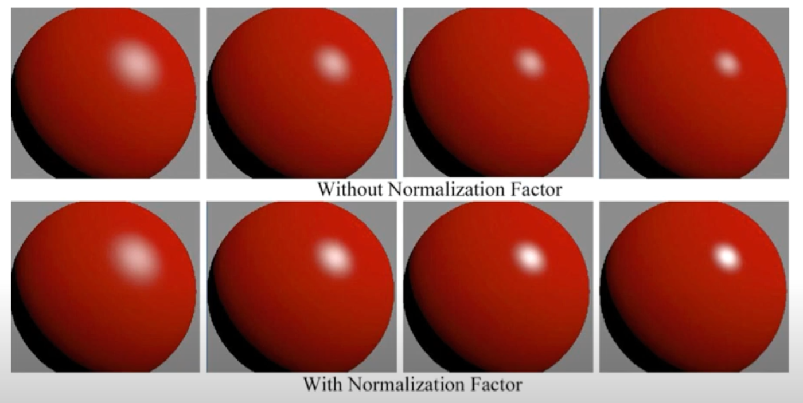
        - however, this specular part also means the dynamic range could get higher than otherwise
## Metals vs. Dielectrics
- dielectrics have both diffuse and specular reflections
  - specular reflections are white
- metals have purely specular reflections
  - specular reflections can be non-white
  - however at large viewing angles the reflections will still be white in general
### Fresnel Effect 
- Schlick approximation: $F(V, H) = F_0 + (1 - F_0)(1 - V\cdot H)^5$
  - an alternative way is to write $L \cdot H$, this is the same with $V \cdot H$
  - $F_0$ denotes the reflection when $V=L$
    - this is gray for dielectrics but can have color for metals
  - $1-F_0$ denotes the complement color to $F_0$
    - as the modifier for the complement color approaches 1, the two colors add up to become more white
    - note that this occurs at large viewing angles where $V\cdot H$ is minimized
    - the power 5 gives an aggressive increase at extremely large angles, while being relatively calm at smaller angles
  - for global illumination where there is no specific $L$ (thereby no $H$) but there is a defined view $V$
    - alternative form replacing $V \cdot H$ with $n \cdot V$
- reference values
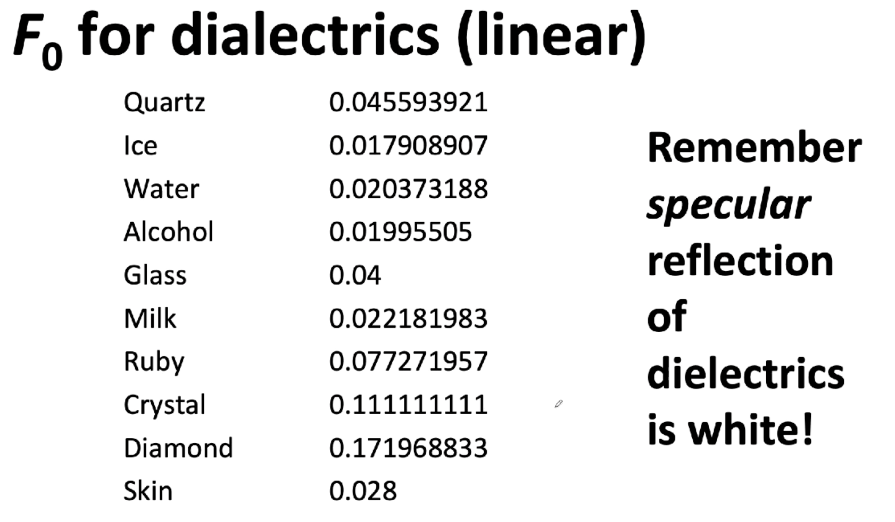
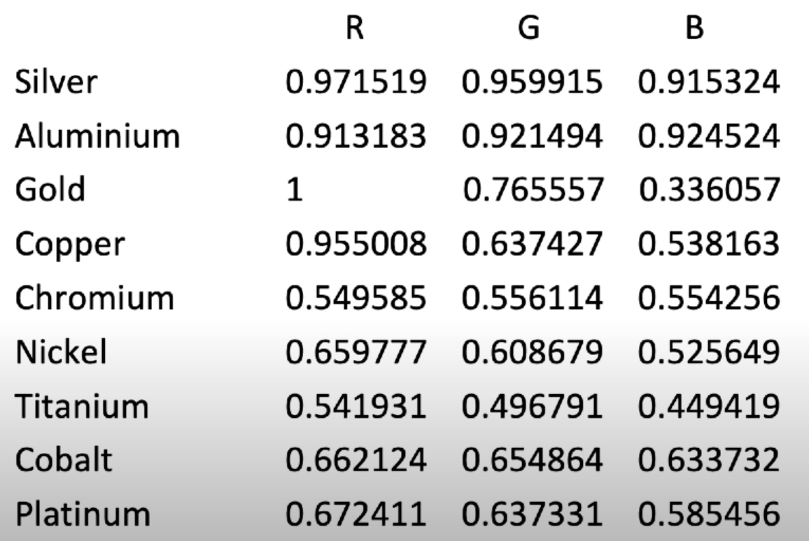
  - due to small values, engines usually disable dielectric specular reflections

### Micro-Geometry
- smooth/roughness of the surface
  - this can be described in terms of the half-vector
  - general Cook-Torrance specular model
    - $S=\frac{D(n\cdot H)F(V \cdot H) G(n, L, V)}{4 (n \cdot L)(n \cdot V)}$
    - overall, $BRDF = c_{dif}/\pi + S$, adding a diffuse term
    - the original paper had a $\pi$ in the place of 4, which is erroneous
      - certain reproductions of the paper may have the same issue
    - $F$ is Fresnel
    - $D$ is the distribution term parametrized by glossiness
      - *ex.* Blinn-Phong microfacet distribution 
        - $D_{BP}(n \cdot H) = \frac{s + 2}{2\pi}(n \cdot H)^s$
        - note the different normalization constant 2 used instead of 8
        - the difference is caused by a different set of assumptions in the physical calculations
        - note that in practice $s$ is usually replaced with a glossiness factor $g$ in the range [0, 1]
          - *ex.* $s = 2^{13g}$
        - this $D_{BP}$ is not very popular
      - *ex.* GGX microfacet distribution
        - $D_{GGX}(n \cdot H) = \alpha^2 / \pi[(n \cdot H)^2(\alpha^2-1)+1]^2$
        - unlike $D_{BP}$, GGX was not derived from prior models
        - instead it is a model that balances between fitting experimental data and being cheap enough to compute
          - the tail behavior ($> \plusmn k\sigma$ at large $k$'s) fits better
        - different formulations of $\alpha$
          - Crytek: $\alpha = (1 - 0.7g)^2$
          - Unreal/Disney: $\alpha = (1-g)^2$
          - note that $\alpha$ is essentially a roughness factor
    - $G$ is the geometric term
    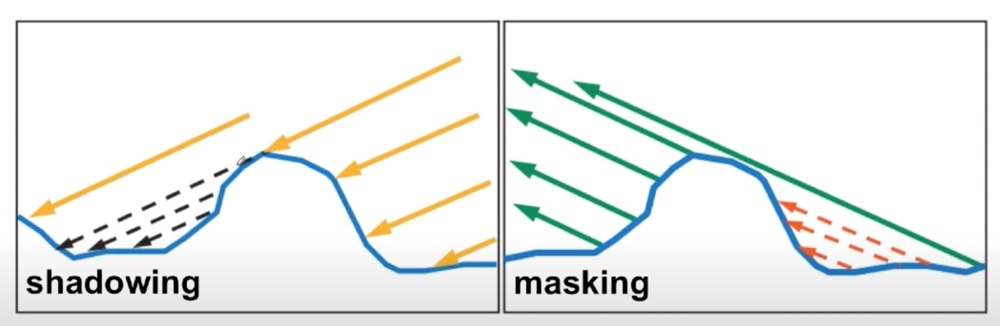
      - from the picture, notice that the larger the viewing angle, the more rays will be blocked by the microgeometry of the rough surface
      - similarly, at larger incident angles for the light, the more it will be blocked
      - GGX-based geometric term
        - $G_{GGX-R}(n, L, V) = G_{GGX-R}(n\cdot L) G_{GGX-R}(n \cdot V)$
        - $G_{GGX-R}(n \cdot V) = \frac{2(n \cdot V)}{n \cdot V + \sqrt{\alpha^2 + (1-\alpha^2)(n \cdot V)^2}}$
          - note this style of defining a full form taking and then defining a factor form
          - in this case $L$ and $V$ are symmetric as required by the BRDF, $G$ subjects them both to the same process and combines their result in an dot product (order-agnostic)
        - note the full expanded form contains a $4 (n \cdot L)(n \cdot V)$ numerator that cancels out with the full specular term's denominator (see Cook-Torrance specular)
          - not all models have this kind of canceling out
        - this optimization leads to the new form $BRDF = c_{dif}/\pi + D(nH)F(V,H)Vis(n,L,V)$ with $Vis$ being $G/4 (n \cdot L)(n \cdot V)$
      - Modified GGX to remove the square root
        - a similar factor expansion, with the factor being $G_{GGX-M}(n \cdot V) = \frac{n \cdot V}{(n \cdot V)(1-k) +k}$
        - again, $k$ is formulated differently across implementations
          - Disney standard: $k = \alpha / 2 = (1-g)^2 / 2$
          - Disney "hotness-remapping": $k = [0.5 + (1-g)/2]^2/2$
            - this is just one that artists feel more intuitive, the different formulations evaluate to the same result as long as $g$ is set appropriately
      - Kelemen geometric term
        - cheaper but less accurate
        - $G_K(n, L, V) = \frac{4(n \cdot L)(n \cdot V)}{(V \cdot H)^2}$
        - $Vis_K(n, L, V) = 1/(V \cdot H)^2$
      - note the above implementations are all isotropic
        - for an-isotropic (directioned microgeometries), there are other implementations adding directionality

# Fully Baked Lights
- real-time light mode without global illumination
  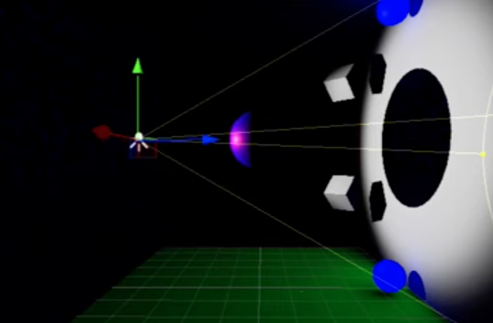
- baked light mode with global illumination
  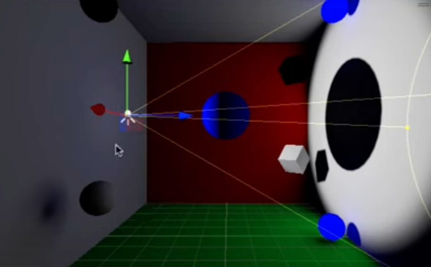
- note that emissive materials do not automatically impart light on the surrounding
  - need to explicitly mark object as `static` in order for Unity to include them in the baking process
  - the wall itself must also be marked `static` to be included as a reflector in the baking process, even if it is not emissive itself
  - the end result is the blue glow and tint in shadows as seen above
- the lightmap itself is a texture, partitioned automatically by Unity
  - *ex.* for the room above
  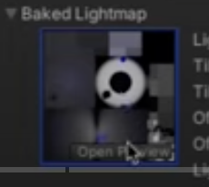
- note that nothing guarantees a `static` object to maintain same orientation and shape
  - the programmer is reponsible to keep track
  - when changed, the light map is still used, causing visual errors
- light maps do not include specular lighting due to dependency on camera orientation
- baked directionality
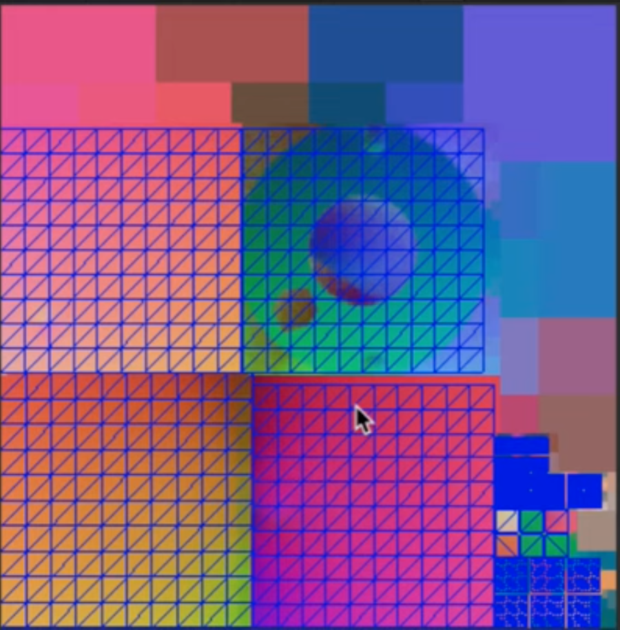
  - records the distribution of direction of the light hitting the surface in some encoding (not neccessarily just R3 $\to$ RGB)
  - shaders can make use of how much light comes from each direction
    - how soft the main light source is, etc.
- the `indirect multiplier` for built-in lights control the bounced rays
  - it is usually set in the range [0, 1] but the engine allows going above

# Mixed Baked/Real-Time Lights
- include specular lighting, global illumination, and bounced lighting
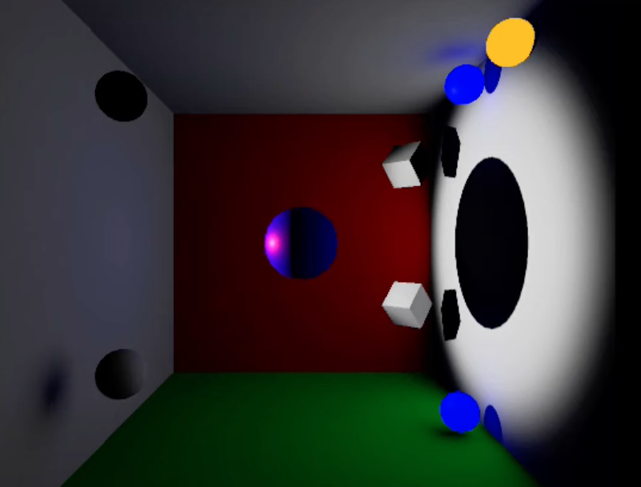
- the lightmap for mixed lighting only includes bounded and global lighting, without direct diffused lighting
- this way, the direct diffuse and specular lighting from real-time lighting is added to the baked lightmap
- note that the ShadowMask shadowing method automatically includes both baked shadowmap and real-time measurements
  - additional information are gathered by light probes
  - occlusion from baked lights are stored in the shadowmap texture
    - up to 4 lights, in RGBA channels
    - beyond 4 lights, the occlusion falls back to baked lighting
  - light probes also have this 4 light limit
  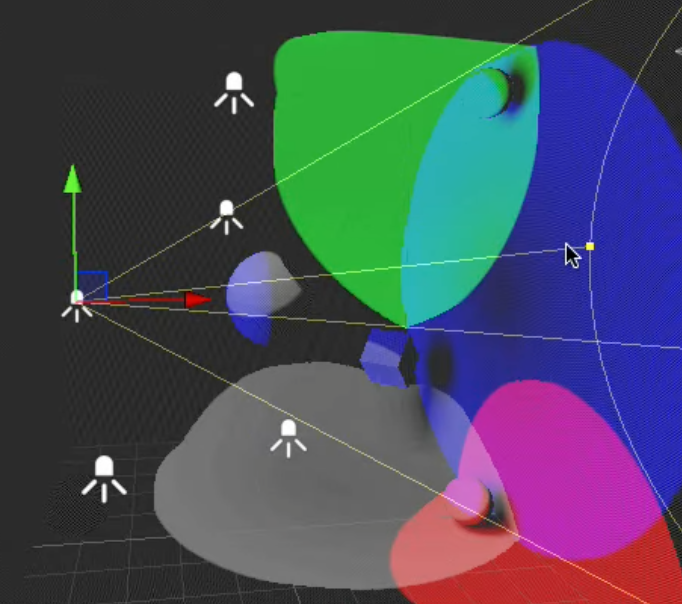
    - note the 5 lights in the scene but only 4 shadow maps (RGBA, with A marked gray)
    - removing any of the already mapped lights will give the missing light a map
- the scene's baking can be set to directional or non-directional
  - in the directional mode, the directionality map will be enabled for baking
    - inclusion of directions can help show mesogeometry (see floor)
    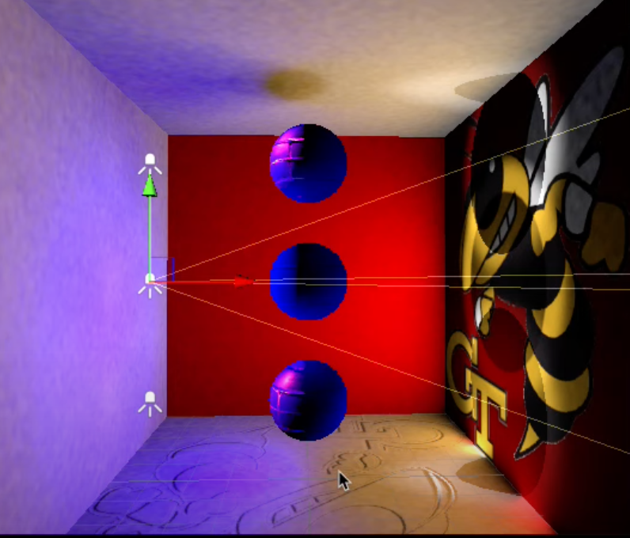
    - without directions, normals do not affect backed lighting
    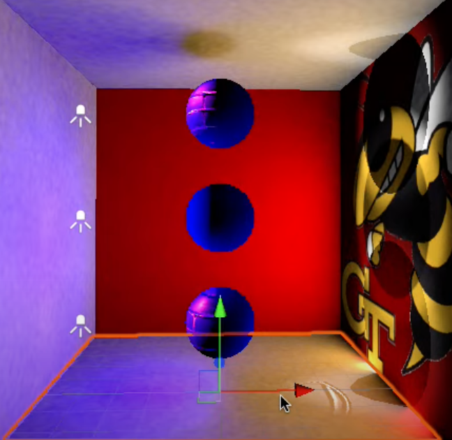
      - the part with normals is the effect of real-time lighting under the mixed lighting mode

# Ambient Occlusion in Light Maps
- this is different from screen space ambient occlusion (SSAO) which is a post-processing effect
- modeling software like Maya can also generate ambient occlusion textures for the model, which is another concept
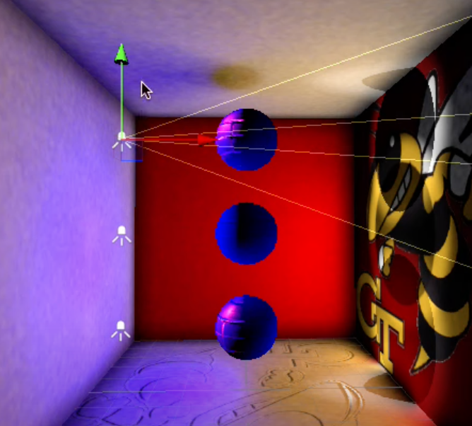
- note the darkened edges
  - for best effect, only apply ambient occlusion to indirect lighting
  - the idea of ambient occlusion is it simulates out-going rays from  certain points within a maximum traveling distance
    - the broader region those rays touch, the more incoming rays are allowed to enter the origin from those regions (and beyond)
    - the narrower region those rays touch, the less incoming rays could light up the origin, meaning that it is occluded
- ambient occlusion is just an artistic approximation of actual occlusion
  - do not overuse it, as it does not approach some physical reality when set close to max
  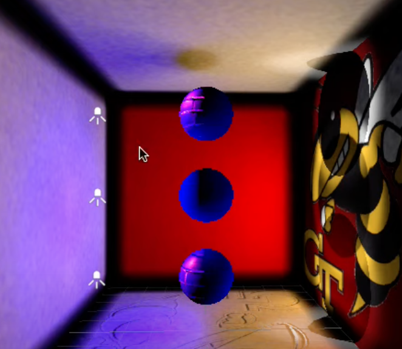
    - exaggerated edge occlusion when indirect lighting contribution is overly emphasized in the baking process

# Light Probing in Unity
- object can receive baked lighting in the range of the light probe group, even if it was not marked `static` in the baking process
  - for each light probe in the light probe group, Unity "summarizes" the light rays and their respective directions that go through the probe
  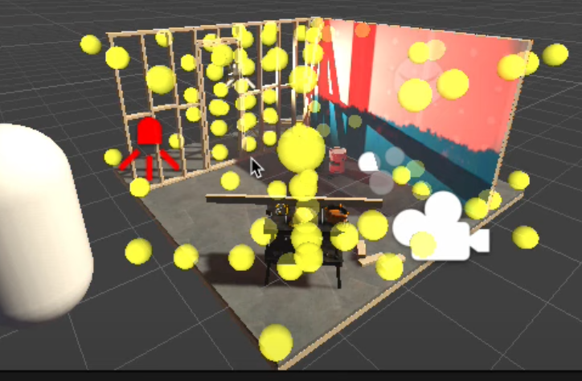
    - light probes in the URP demo room, marked yellow
  - in gizmo view, light probes contributing to the lighting calculations of an object are highlighted when that object is selected
  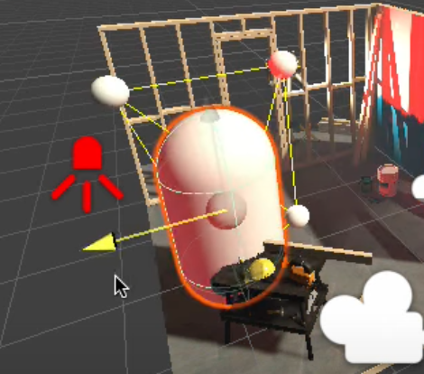
    - note the spheres around the capsule
- light probes are *not* precise
- under mixed lighting, direct lighting is also ignored in light probes
- Unity's documentation states
  - each probe is a spherical panoramic HDR image, stored as 27 values corresponding to spherical harmonics
  - spherical harmonics are the Fourier series-equivalent for functions applying onto spheres
  - the first 2 (0~2) levels of spherical harmonics, with yellow marking negative and blue marking positive
  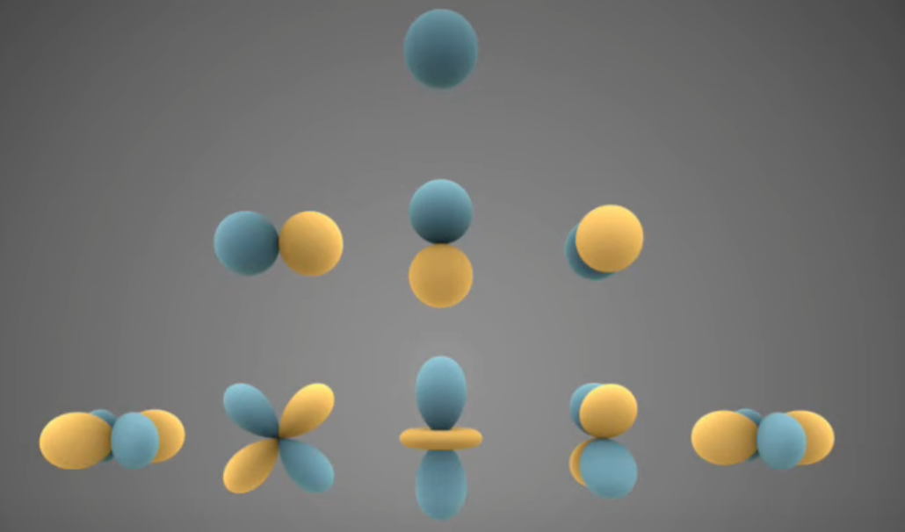
    - there are 9 values per channel that linearly composes an approximation of the actual panorama
    - for 3 channels, there are 27 values (per probe)
  - light probes are prone to ringing artifacts when opposite sides of a probe face significantly different lighting (such as complete white/complete black)
    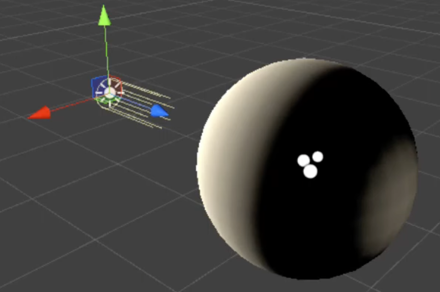
    - in this case Unity has built-in settings that can be enabled to remove ringing
    - this solution comes at a cost of reduced accuracy and contrast
    - alternatively, avoid baking direct lights into light probes, usually the large disparities are caused by direct lighting (as shown in the demonstration above where the direct, directional light is at the left) 
      - this demands using mixed lighting mode

# Reflection Probing in Unity
- automates the creation of cubemaps based on surrounding scenes
- in the range, reflective materials can sample from the probe's cubemap instead of the scene's skybox
- only `static` objects are included in the reflection probe
- when multiple reflection probes have overlapping ranges, the reflective fragments in those ranges will crossface between the reflection probes to favor the closer (more accurate) probe
- reflection probes do support real-time snapshots, however it is very expensive
  - Unity includes certain built-in optimization strategies, as well as different resolutions to select from
- mip-maps are also created in the process
  - this facilitates the roughness settings of the reflective fragments (rougher surfaces sample from smaller mipmaps)