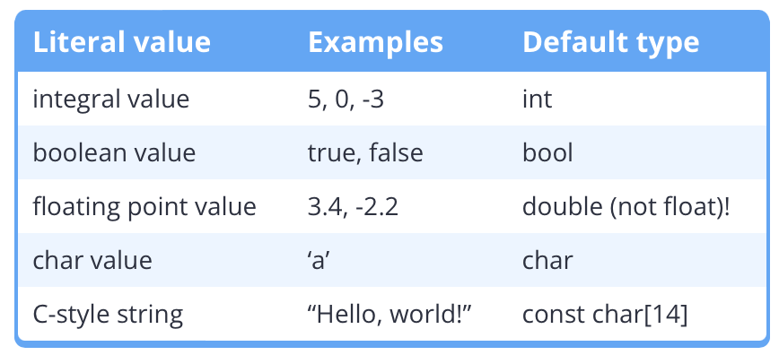

- [Intro](#intro)
- [Void](#void)
- [Sizes](#sizes)
- [Signed Integer Types](#signed-integer-types)
- [Unsigned Integer Types](#unsigned-integer-types)
- [Data Sizes](#data-sizes)
  - [Fast & Least Integers](#fast--least-integers)
  - [Size_t](#size_t)
- [Floating Point Numbers](#floating-point-numbers)
- [Boolean](#boolean)
- [Characters](#characters)
- [Type Conversion](#type-conversion)
- [Strings](#strings)
  - [String Utils](#string-utils)
- [Constants](#constants)
  - [Literal Constants](#literal-constants)
  - [Symbolic Constants (Constant Variables)](#symbolic-constants-constant-variables)
  - [Constexpr](#constexpr)
  - [Object Macros as Constants](#object-macros-as-constants)
- [Chapter 4 End Quiz Incorrect](#chapter-4-end-quiz-incorrect)

# Intro
- the book defines a byte to be the smallest addressable unit of bits, which makes it different per implementation
  - currently 8 bits per byte is the standard
  - all machines by this definition are "byte addressible"

    - *def.* **integral**: integer-like
    - usually, types have a ```-t``` suffix

# Void
- cannot be used with variables
- can be used with functions to indicate no return value
- *can, but not recommended*: use in function parameters to indicate not taking any parameters

# Sizes

- the sizes sted here are minimal, meaning that you shouldn't assume the variables to take more data than stated
- ```sizeof(type_t)``` returns the size of any ```type_t``` typed variable in the current implementation
- ```sizeof(variable_v)``` returns the size of the variable in memory

# Signed Integer Types
- ```short```, ```int```, ```long```, ```long long```
- redundant prefixes/suffixes:
  - ```int```
    - *ex.* ```short int x;```, ```long int y;```
  - ```signed```
    - *ex.* ```signed short int x;```
- stores $-2^{n-1}$ to $2^{n-1}-1$
- *def.* **overflow**: data entry larger than range of data allowed
  - leads to undefined behavior

# Unsigned Integer Types
- use the ```unsigned``` prefix
- stores $0$ to $2^{n}-1$
- unsigned overflow results in a modulo operation against $2^n$
  - negative values assigned to unsigned integers will also result in modulo
- reasons against unsigned integers
  - unsigned integers more frequently encounter overflows under "normal operations"
    - *ex.* it is common to define unsigned ```x=3```, ```y=5```, but ```x-y``` overflows.
  - c++ converts signed to unsigned within an arithmetic operation between both types, which could result in loss of data
  - there are no compiler guards against unsigned-signed conversions
- unsigned values are relatively more accetable in embedded systems due to better performance

# Data Sizes
- defined in ```C99```, adopted in ```C++11```
  - ```<cstdint>```
- ```<u>int<n>_t``` where ```u``` is the optional ```unsigned``` and $n$ is the bit count, being multiples of $8$
  - for $n=8$, most systems treat like signed/unsigned char
    - this is system-dependent, and should be avoided due to unexpected behavior
  - *ex.* ```std::int16_t```
- pros: fixed width, 
- cons: not terribly universal (but at least most modern systems support them), *could* be slower
## Fast & Least Integers
- C++ alternatives to ```size_t```, guarantees support
  - ```std::<u>int_fast<n>_t```: fastest integer at least $n$ bits wide under the current implementation
  - ```std::<u>int_least<n>_t```: smallest possible width at least $n$, usually equal to $n$
- However, these types are not popular and therefore leads to implementation errors and possible confusion
  - per architecture implementation issues
- The book recommends supporting fixed-width before fast-least. Only migrate when absolutely needed

## Size_t
- the return type of ```sizeof```
  - it is a data type that is unsigned and integral, at least 16 bits
  - practically, the size will match the system and application bit size (32 bit vs. 64 bit)
  - ```std::size_t```
- any object with size larger than the boundary of ```size_t``` is considered *ill-formed*

# Floating Point Numbers
- uses the scientific notation
  - *def.* **precision**: number of significant digits supported
  - ```std::cout``` has default precision of $6$, no matter the entered value
    - use *output manipulator* to change precision:
        ```c++
        std::cout << std::setprecision(10);
        ```
- ```float``` (usually 7 precision, from 6 to 9)
- ```double``` (usually 16, from 15 to 18)
- ```long double``` (either 15, 18, or 33, depending on the size)
- although it is possible to set precision values of ```std::cout``` larger than supported, it will result in rounding because the actual literals are still stored in respective data types
- floating point comparisons could be bugged by rounding errors
  - errors increase with operation count
- special constants under ```IEEE 754```
  - ```posinf```, ```neginf```, ```nan```

# Boolean
- in C++, ```bool```s are integral and evaluate to $0$ and $1$
  - in conversion anything non-zero is ```true```, only zero is ```false```
- ```std::cout``` prints bools as integers by default
  - to change this behavior, use ```std::cout << std::boolalpha```
  - to go back, use ```std::cout << std::noboolalpha ```
- ```std::cin``` only accepts $0$ and $1$ by default
  - use the same manipulators as ```cout```

# Characters
- always one byte, stores ASCII
- 
- ```char16_t``` and ```char32_t``` added in ```C++11``` to support Unicode
- ```char8_t``` added in ```C++20```

# Type Conversion
- *def.* **implicit type conversion**: done without specification in the source code
  - sometimes implicit type conversions lead to compiler warnings about possible data loss
- *def.* **explicit type conversion**: specified in the source code
  - this is usually needed at narrowing conversions
  - ```static_cast<target_type_t>(expr)```
  - unpredictable when outside target type range

# Strings
- ```std::string``` as a compound type instead of fundamental
  - in header file ```<string>```
- using ```std::cin``` to get string only gets the first token
  - use ```std::getline(<input>, <str out>, <delimiter>)``` instead
    - ```std::ws``` tells ```cin``` to ignore white space
    - *ex.*
        ```c++
        std::string name{}; // zero init a string
        std::getline(std::cin >> std::ws, name);
        ```
    - note that ```\n``` counts whitespace, and ```std::cin``` doesn't remove the ending ```\n``` in a line
## String Utils
- ```str.length()```
  - member function within the string type, sometimes addressed as ```std::string::length```

# Constants
## Literal Constants
- declared within the source code
- type dependent on format+suffix
  - even if they are assigned/casted, the actual literal itself is still the same type
  - 
  - 
- scientific notation ```<sig figs>e<exp>```
- non-dec integers
  - oct: ```0```
  - hex: ```0x```
  - ```C++14``` additions:
    - bin: ```0b```
    - digit separators:
      - *ex.1* ```0b1011'0010```
      - *ex.2* ```2'131'242```
  - printing non-dec using output manipulators
    - ```std::hex```, ```std::dec```, ```std::oct```
    - printing binary requires the ```<bitset>``` library
    - *ex.* ```std::bitset<n> b{<num>}```

## Symbolic Constants (Constant Variables)
- specify with the ```const``` keyword in definition
  - must be initialized
  - when used along a function parameter, makes sure the parameter is not changed within the function run
- It is good practice to replace magic numbers with symbolic constants, and organize symbolic constants into their own files
  - *ex.* have constants for physics like g, G, etc. in one file

## Constexpr
- *def.* **runtime constants**: can only be resolved at runtime, but after resolution the value does not change
- *def.* **compiled constants**: is resolved at compile time, most oftenly with literal values
- ```constexpr``` forces the constant to be *compiled*, meaning that initializing with variables or function calls result in compiler error

## Object Macros as Constants
- *ex.* ```#define MAX_SIZE 10```
- reason against:
  - cannot see in debug window, since by definition it is a literal in the compiled code
  - messes with scopes
  - name may collide with actual variable name, resulting in cases such as
    ```c++
    #define max_t = 10

    //...
    // original
    type_t max_t = literal_b;
    // after preprocessing
    type_t literal_a = literal_b;
    ```
# Chapter 4 End Quiz Incorrect
- for single characters, use ```''``` isntead of ```""``` to optimize