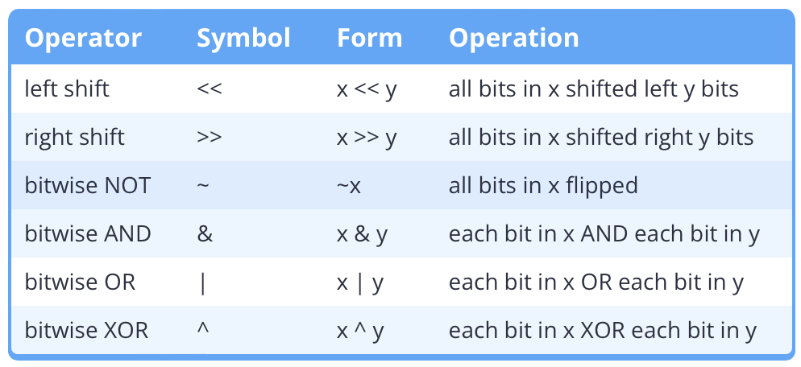

- [Bitset Member Functions](#bitset-member-functions)
- [Bitwise Operators](#bitwise-operators)
- [Bit Masks](#bit-masks)
- [Binary/Decimal Conversion](#binarydecimal-conversion)

# Bitset Member Functions
- *def.* **flag**: a value that holds a signal purely for some *other* function or process
  - as opposed to things like ```g = 9.81``` that has physical / entity significance
- the following runs for ```std::bitset<n>```
  - ```std::bitset<n>.set(i)``` sets bit $i$ to 1 
  - ```std::bitset<n>.flip(i)``` reverses bit $i$
  - ```std::bitset<n>.reset(i)``` clears bit $i$ to 0
  - ```std::bitset<n>.test(i)``` returns bit $i$ as ```0``` or ```1```
- it is possible to enforce ```<n>```
  - *ex.*
    ```c
    std::bitset<4> foo(std::bitset<4> bar) {
        //...
    }
    ```

# Bitwise Operators
- 
- use bitwise operators with unsigned operands or ```bitset```, since two's complement and IEEE float interprets bits indirectly
- note that left/right shift operators are *overloaded* to distinguish between ```std::cout << <expr>``` and ```a << b```
  - use parentheses to prevent incorrect overloading
- bitwise operators can be used with assignnent, similar to ```+=```
  - *ex.* ```&=```

# Bit Masks
- *def.*: predefined set of bits that will be used for *selecting* parts of bit flags
- *ex.*
    ```c
    constexpr std::uint8_t mask0{ 0b0000'0001 };
    ```
- common operations
  - ```(flag & mask) ? x : y``` tests *any* masked bits
  - ```(flag | mask)``` sets masked bits
  - ```(flag & ~mask)``` resets masked bits
  - ```(flag ^ mask)``` flips masked bits

- meaningful masks
  - *ex.*
    ```c
    //...
    constexpr std::uint8_t isMobile { 1 << 3 };
    constexpr std::uint8_t isHorizontal { 1 << 4 };
    //...
    ```
- bitmasks reduce memory use, since most systems assign a full byte to ```bool```s anyway
- bitmasks reduce parameter counts to improve readability
  - *ex.*
    ```c
    void renderScreen( ..., bool isMobile, bool isHorizontal, ...);
    void renderScreen(std::bitset<8> deviceStat)
    ```
  - *ex.2* ```glClear(GL_COLOR_BUFFER_BIT | GL_DEPTH_BUFFER_BIT);```
    - in this case, the ```BIT``` constants are defined using object macros by OpenGL
- multi-bit flags
  - *ex.* RGB using ``std::uint_32``
    ```c
    ... RED { 0xFF000000 };
    ... BLUE { 0x00FF0000 };
    ... GREEN { 0x0000FF00 };
    ... ALPHA { 0x000000FF };
    ```
# Binary/Decimal Conversion
