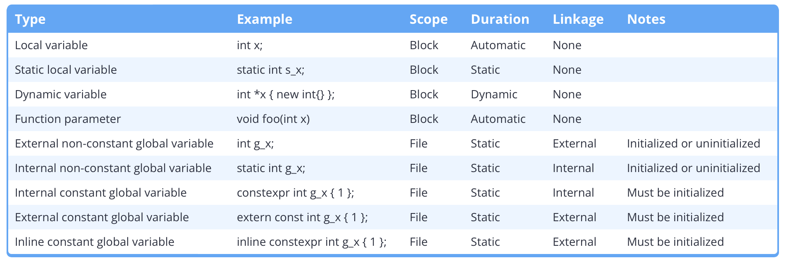
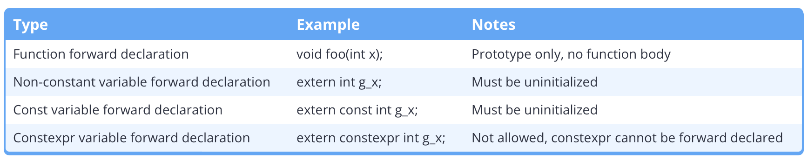
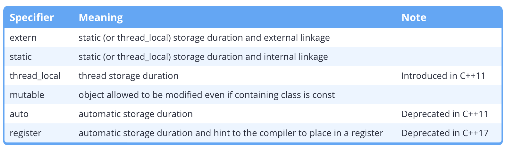

- [Blocks](#blocks)
  - [Namespace Alias](#namespace-alias)
- [Local Variables](#local-variables)
- [Global Variables](#global-variables)
- [Variable Shadowing](#variable-shadowing)
- [Internal Linkage](#internal-linkage)
- [External Linkage](#external-linkage)
- [Why Avoid Non-Const Global Variable](#why-avoid-non-const-global-variable)
  - [initialization order problem](#initialization-order-problem)
  - [When to use Non-Const Global Variable](#when-to-use-non-const-global-variable)
- [Global Constants Across Files](#global-constants-across-files)
  - [Pre C++17](#pre-c17)
  - [Post C++17](#post-c17)
- [Static Local Variables](#static-local-variables)
- [Short Summary](#short-summary)
- [Using](#using)
  - [Using Declaration](#using-declaration)
  - [Using Directive](#using-directive)
  - [Cautions](#cautions)
- [Unnamed Namespace](#unnamed-namespace)
- [Inline Namespace](#inline-namespace)

# Blocks
- *alias* compound statement, block statement
- *def.*: zero or more statements treated by the compiler as one single statement
- ```{ statements }```
- ```c
  //outer block
  {
      // inner block / nested block
      {
          //...
      }
  }
  ```
- *def.* **nesting level/nesting depth**: maximum number of nested blocks within a function
    - compilers typically support ~100 levels, but it varies
    - the standard states it supports 256
- a good practice is to keep nesting level below 3

# Namespace
## Namespace Definition
```c
namespace foo {
    // define variables and member functions here
}
```
- *def.* **user-defined namespace**: as above
- it is possible to define a namespace across different files
  - for example, the ```std``` namespace goes across many different files like ```iostream```, ```cmath```, etc.
  - *DO NOT EXTEND ``std`` YOURSELF!*
  - define namespaces in header files
- Nested namespaces
  - *ex.1* nested definition
    ```c
    namespace foo {
        namespace goo {
            // ...
        }
    }
    ```
  - *ex.2* "direct" definition (C++17)
    ```c
    namespace foo::goo {
        //...
    }
    ```
- note that:
  - in C++, namespaces are primarily to prevent collisions, not to provide information hierarchy (as in C#). Do not overly nest namespaces even if the practice is common in C#
    - *ex. C++* ```std```
    - *ex. C#* ``UnityEngine.Experimental.Rendering. ...`` 
## Namespace Alias
```c
namespace active = foo::goo;
active::bar();
```

- use namespaces when exporting your code as a library
- separate out reusable (cross-project, potentially) code into namespaces like ``physics`` and ``math``, instead of having them together with application-specific code

# Local Variables
- within a scope, variable identifiers need to be unique
- *def.* **storage duration**: rules governing the creation and destruction times of a variable
  - **automatic storage duration**: created at point of def., destroyed at end of scope
  - duration is *not* the same as **lifetime**, which is the actual runtime times of creation/destruction
- local variables have *no* **linkage**
  - *def.* whether other declarations of the name refer to the same object
  - whereas scope governs singular declarations, linkage governs multiple declarations
- a good practice is to define variables in the most limiting scope

# Global Variables
- declared outside of functions
- *naming* start with ```g``` or ``g_``
- *def.* **global scope**: visible from point of definition until the end of file
- *def.* **static duration**: created upon program start, and destroyed upon program end
- unlike local variables, global variables are zero-initialized by default

# Variable Shadowing
- *alias.* name-hiding, shadowing
- there is no limit for shadowing between nested blocks
  ```c
  int foo;
  if (bar) {
    int foo; // this shadows the outer foo
  }
  ```
- shadowing should generally be avoided

# Internal Linkage
- if different files have variables ```foo``` both with internal linkage, then those variables will be treated as independent (per file)
- *def.* **internal variables** global variables with internal linkage
  - for ``const`` and ``constexpr``, they have internal linkage by default
  - for other global variables, use ``static``
    - ``static`` is a **storage class specifier**
- using ``static`` on functions make them only visible within the file

# External Linkage
- methods and non-constant variables are by default external
- for constant variables to be interenal, use ``extern`` on global
- *def.* **forward declarations** for variables, similar to function prototype declarations but with ``extern``
  - in this context, ``extern`` just denotes the statement being a forward declaration, instead of being a storage class
  - *ex.*
    - in ``a.cpp``
      ```c
      int g_x {2};
      extern const int g_y {3};
      ```
    - in ``main.cpp``
      ```c
      extern int g_x;
      extern const int g_y;

      int main() {
        // use g_x and g_y here
      }
      ```
- technically, all variables have *file* scope
  - they can be used outside, but it needs external linkage to be specified
- but informally, this *file scope + extern link* setup is called a *global scope*

# Why Avoid Non-Const Global Variable
- makes program path unpredictable
- makes functions less self-contained (and thus harder to test)
- good practices include
  - using local variables, and keep declarations close to point of use
  - do not use global variables, at least not for decision making
## initialization order problem
1. **static initialization** runs first, initializing everything that has constant/literal right hand side
2. **dynamic initialization** runs next, initializing everything with non-constant right hand side (method call, for example)
- do not have global variables depend on the values of other global variables, since the dependency might not be initialized yet
- the same order issue exists between different files

## When to use Non-Const Global Variable
- as log file
  - *ex.* ``std::in``, ``std::out``
- good practices include
1. wrap with namespace
2. encapsulate using accessor/modifier functions
   * this way there is no need for ``extern``
   * *ex.*
      ```c
      namespace constants {
        const int size;
      }

      int getSize() {
        return constants::size;
      }
      ```

# Global Constants Across Files
## Pre C++17
- file << header << namespace << constant declaration (``constexpr``)
- *issue.* since constant variables have internal linkage, duplicate headers lead to duplicate declarations
  - this means that changing one value will lead to mandatory re-compilation of all files referencing it
  - this is because compilers often optimize ``constexpr`` to literals
- *fix.* use ``const`` instead of ``constexpr`` so that it could be forwarded as external
  - *constants.cpp*
    ```c
    #include <constants.h>
    namespace constants {
      extern const type_t foo { bar }; // actual declaration
    }
    ```
  - *constants.h*
    ```c
    #ifndef CONSTANTS_H
    #define CONSTANTS_H

    namespace constants {
      extern const type_t foo; // forward declaration
    }

    #endif
    ```
  - *main.cpp*
    ```c
    #include <constants.h>

    int main() { ... }
    ```
- *naming*: since the above global constants already exist in namespaces, using the ``g_`` prefix is not necessary
- when constant value changed, only ``constant.cpp`` needs recompilation
  - however, less optimization could be done because ``const`` is less restrictive than ``constexpr`` in its properties
  - these variables are treated as run-time constants outside ``constants.cpp``, and compile-time constants within the file
  - for this reason, it is actually not preferred to use ``extern const``
## Post C++17
- *def.* **inline**: allowed multiple definitions per file
  - external linkage by default
  - ``constexpr`` qualities are retained
  - all declarations must be identical for them to be collapsed
- *ex.*
  ```c
  #ifndef CONSTANTS_H
  #define CONSTANTS_H

  namespace constants {
    inline constexpr double g = 9.81;
  }

  #endif
  ```
- the method retains the downside of mandatory re-compiling of all references to the header
  - essentially the improvement from the old ``extern constexpr`` is the memory save from reduced copies

# Static Local Variables
- the ``static`` keyword has multiple meanings under different contexts
- *naming.* use ``s_`` prefix on static local variables, similar to ``g_`` for global ones
  - use static variables to reduce repeated initializations of the same thing

# Short Summary




# Using
- *def.* **qualified nanme** a name prefixed by ``<namespace>::``
  - skipping ``<namespace>`` means the name is qualified by global 
    - *ex.* ``::foo`` alone, with nothing before the scope resolution operator
  - *def.* **unqualified name** has no resolution operator nor scope

## Using Declaration
- the ``using <namespace::name>`` declaration tells the compiler to recognize unqualified ``name``s as ``namespace::name``
- *ex.*
  ```c
  using std::cout;
  cout << "this outputs" << std::endl; // here, endl is not using-declared yet, so std:: still needs to be added
  ```
  - using using declarations is generally considered safe *within* a function

## Using Directive
- ``using namespace <namespace>``
- imports all names within the namspace into the scope
- using directives should generally be avoided in order to prevent current and future collisions
- another possible error is using subsequent namespaces that intersect
  - *ex.*
    ```c
    namespace a {
      int foo {};
    }
    namespace b {
      int foo {};
    }

    int main() {
      using namespace a;
      using namespace b;
      // collision of foo
    }
    ```

## Cautions
- ``using`` statements (both directives and declarations) cannot be voided within scope (you cannot un-use a namespace/qualification)
- for this reason, either avoid using it or limit its scope

# Unnamed Namespace
- *ex.*
  ```c
  namspace {
    void foo() { ... }
  }
  ```
- all names within an unnamed (anonymous) namespace are considered to be within the parent namespace, but have internal linkage

# Inline Namespace
- typically used to version content
- members of an inline namespace are treated as though they belong to its enclosing scope, while retaining the ability to be qualified through the namespace
  - *ex.*
    ```c
    inline namespace v1 {
      void foo() {}
    }
    namespace v2 {
      void foo() {}
    }

    int main() {
      v1::foo();
      v2::foo();
      foo(); // addresses to v1 by default
    }
    ```