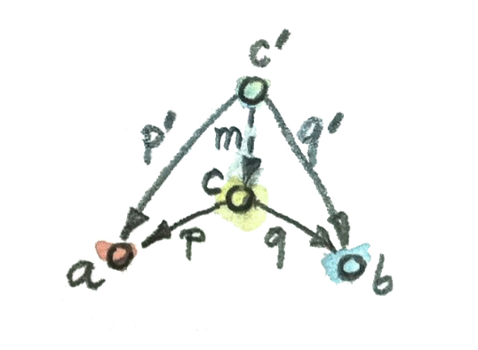
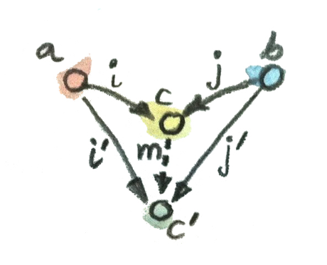
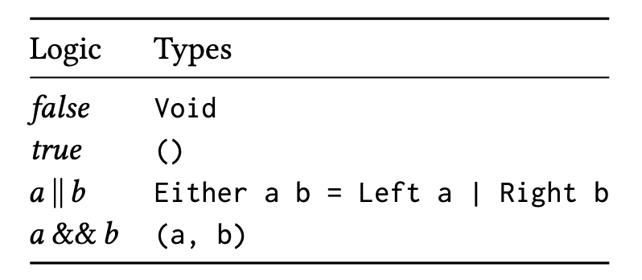
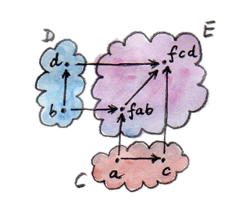

- [Intro](#intro)
  - [Arrows as Functions](#arrows-as-functions)
  - [Programs as Compositions](#programs-as-compositions)
- [Types and Functions](#types-and-functions)
  - [Types](#types)
  - [Denotational Semantics](#denotational-semantics)
  - [Function Side-Effects](#function-side-effects)
  - [Examples of Types](#examples-of-types)
- [Categories](#categories)
  - [Monoids](#monoids)
  - [Kleisli Categories](#kleisli-categories)
- [Category Products and CoProducts](#category-products-and-coproducts)
  - [Isomorphisms](#isomorphisms)
  - [Products](#products)
  - [Coproducts](#coproducts)
  - [Asymmetry](#asymmetry)
- [Algebraic Data Types](#algebraic-data-types)
  - [Product Types](#product-types)
  - [Sum Types](#sum-types)
  - [Algebra of Types](#algebra-of-types)
- [Functors](#functors)
  - [Functors in Programming](#functors-in-programming)
  - [Typeclasses](#typeclasses)
  - [Functors in C++](#functors-in-c)
  - [Lists as Functors](#lists-as-functors)
  - [Reader Functor](#reader-functor)
  - [Functors as Containers](#functors-as-containers)
  - [Functor Composition](#functor-composition)
- [Functoriality](#functoriality)
  - [Bifunctors](#bifunctors)
  - [Product/Coproduct Bifunctors](#productcoproduct-bifunctors)
  - [Algebraic Data Types (ADTs)](#algebraic-data-types-adts)
  - [Functors in C++](#functors-in-c-1)
  - [Revisiting the Writer Functor](#revisiting-the-writer-functor)
  - [Covariant and Contravariant Functors](#covariant-and-contravariant-functors)

# Intro
book: Bartosz Milewski, Igal Tabachnik, *Category Theory for Programmers (2019)*

## Arrows as Functions
- certain languages like Haskell support direct declaration of arrows like `f :: A -> B`
- arrow composition is function chaining
- composition must be associative, and compositions for compositable arrows must exist in $Mor_C$
- for every object an identity morphism must exist (the identity is explicitly defined for objects in the category)

## Programs as Compositions
- decomposition of the problem, composition of solutions/solvers
- category theory discourages examination of the objects themselves, instead only relying on arrows
  - this is similar to OOP where visibility is limited, and methods act as arrows

# Types and Functions
- the analogy of type checking (with functions/methods being arrows) is to make sure the arrows are actually compositable
  - i.e. for $f \circ g$, $cod(g)=dom(f)$
- unit testing does not replace type checking, and vice versa
  - a good static & strong type system will provide semantic information in a program and prevent erroroneous casting
## Types
- intuitively, types are sets of values like `T/F`
  - this definition of types create issues when there are polymorphic functions
  - the limitation of sets is also problematic in a program perspective
> the book talks about Haskell and how it deals with non-halting
> 
> the ideal is that types are sets and functions are set functions, and the "bottom" value provides a patch where the computation doesn't terminate
>
> **partial** functions could return a bottom, **total** functions never return a bottom
## Denotational Semantics
- programming languages rarely have semantics
  - people interpret what they write by simulating a run, instead of referring to something else
- denotational semantics aim for an alternative where semantics are based on math, allowing the program's properties to be proven
  - this is more important for critical programs
  - computational "effects" can be represented with monads, meaning that the program itself does not need to be mathematical in nature

## Function Side-Effects
- functions with no side effect is called a **pure** function
  - pure functions are *memoizable*, meaning that they really only need to evaluated once in a program run for equivalent arguments
    - subsequent runs can reuse stored values
    - this isn't practical for large input spaces
- functions with side effect is called a **dirty** function
  - *ex.* a C function that increments a `static` counter variable when it is run

## Examples of Types
- type with no value (empty set)
  - functions taking in this type cannot actually be called, because there is no way to provide a value for it
- type with one value (singleton)
  - *ex.* C++ `void`
  - a function with input type `void` does not *actually* take in nothing, it takes in a dummy value that is the only possible value of that type (which is just omitted)
  - imperative programming often uses a `void` return type while having useful side-effects, but in a math sense this kind of function is only used to discard some argument

# Categories
- trivial category: no objects, no morphisms
> the book goes over constructing categories out of simple graphs and orders
## Monoids
- set with binary, associative operation with one identity
  - *ex.* $(Z, +)$ with identity $0$
- multi-argument functions
  - not actually possible
  - instead, do something like `m -> m -> m` which maps the first input to a function of type `m -> m` accepting the second input
    - effectively, the rightmost type is the return type, everything before are arguments
> the book goes over defining a string concatenation monoid in Haskell, as well as in the proposed *concepts* syntax for C++
- monoids are single-object categories with multiple morphisms mapping from that object back to itself
  - in the case of concatenation, each morphism is a `m -> m`
  - in other words, every possible value of the monoid's set is a morphism (the operator with one side being the identity and the other the value itself)
    - for $(A, \cdot)$, $Ob_M=A$ for monoid category M, and $M[A, A]$ consists of all possible morphisms $f: A \to A = a \cdot c$
    - i.e. one-to-one relation between $a \in A$ and $f \in M[A, A]$
  - "multi-argument" functions are composite morphisms

## Kleisli Categories
- consider example function that negates a bool and writes to log
  - since the log is some global buffer, this function is not pure and thus not memoizable
  - to make it memoizable (in theory), pass in the log itself as a second argument
  - to make it actually memoizable, return a pair `<bool, string>` instead of just `bool`, where the `string` is whatever is added to the log during the function run
  - this kind of **embellishment** makes individual worker functions memoizable, but is very repetive, demanding abstraction
- Embellishment in category perspective
  - even though the embellished function returns a `pair`, we still view it as a morphism in the original sense
  - instead of chaining embellished functions, `compose` them using the following template
  - ``` c++
    template <typename A, typename B, typename C>
    std::function<std::pair<C, std::string>(A)> compose(
        std::function<std::pair<B, std::string>(A)> m1,
        std::function<std::pair<C, std::string>(B)> m2
    ) {
        return [m1, m2](A x) {
            auto p1 = m1(x);
            auto p2 = m2(p1.first);
            // concatenate logs
            return std::make_pair(p2.first, p1.second + p2.second);
        }
    }
    ```
  - alternatively, as a generalized lambda function
    ``` c++
    auto const compose = [](auto m1, auto m2) {
        return [m1, m2](auto x) {
            auto p1 = m1(x);
            auto p2 = m2(p1.first);
            return std::make_pair(p2.first, p1.second + p2.second);
        }
    }
    ```
    - note this style allows for general embellishments
  - *ex.* `auto embellishedRun = compose(isEven, negate)(1);`
- identity morphisms can also be written in this embellished style
  - ```c++
    template <typename A>
    std::pair<A, std::string> identity(A x) {
        return std::make_pair(x, "");
    }
    ```
> the book goes over the same embellishment process for Haskell
- **Kleisli Categories** have objects correxponding to types in a program
  - the embellishment process above is a type of **monad**
  - partial functions can be embellished to have a flag denoting "bottom" (i.e. error)
    - such embellished partial functions can be treated as morphisms of embellished objects
    - the book goes over the implementation of a generic `optional<T>` type that is basically the same with `nullable<T>`

# Category Products and CoProducts
- the goal is to find objects in a category
  - this can only be done (without examining each object) by querying whether the arrows related to an object matches the designed pattern (shape)
  - aka. **universal constructions**
- the simplest shape is one object
  - the notion of **initial object** makes this shape more meaningful:
    - the initial object has one and only one morphism from itself to some other object (including itself)
    - there may be multiple initial objects in a category, but they will be isomorhpic anyway
    - (this is analogous to having multiple minimums in a POSet)
    - in $\bold{Set}$, the initial object is the null set
  - the dual of initial object is the **terminal object**, where there is one and only one morhpism from any other object (including itself) to itself
    - *ex.1* `void` is a terminal object because there is only one morphism from other types to it
    - *ex.2* `bool` is not a terminal object because there can be two morphisms from some types to it (like `int -> bool`, but not `void -> bool`)
    - similarly, terminal objects are also isomorphic
> the book goes over duality, see the _prev chapter
## Isomorphisms

> see definition in _prev
- proving that initial/terminal objects are unique up to isomorphism
  - $i_1$ being initial/terminal implies there is a unique morphism from/to $i_1$ to/from $i_2$, namely $f$
  - conversely there must also be $g$ going the opposite direction
  - note that there can only be one morphism from/to $i_1$ to/from $i_1$ based on the definition of initial/terminal objects
    - this means $g \circ f = id_{i_1}$ and conversely $f \circ g = id_{i_2}$
    - this satisfies isomorphism's requirement
  - note that the uniqueness of $f$ and $g$ also means that the isomorphism itself between any $i_1$ and $i_2$ is unique

## Products
- in the context $\bold{Set}$...
  - let $a, b, c$ where $p: c \to a$, $q: c \to b$
  - for a pair $(a, b)$ there may exist various $c$'s that allow for this pattern to be found in C, for each candidate $c$, $p$ and $q$ are called its **projections**
  - the product of the category object sets $a$ and $b$ is the most universal candidate
  - from these candidates $c_i$, the "most universal" candidate is chosen as the product
    
    - to compare two candidates $c$ and $c'$, 
    - projections are less universal if they can be "factored"
      - in this case $p' = p \circ m$, $q' = q \circ m$, where $m$ is a factor
      - we conclude that $c$ is better than $c'$ because $c'$'s projections can be reconstructed with $c$'s
  - the most universal $c$ in $\bold{Set}$ turns out to always the pair $a, b$ (i.e. the cartesian product of object sets $a \times b$), because for any other object there will always be some $m$ from it to $(a, b)$
> note: this is different with the concept of category product as introduced in _prev

## Coproducts
- in the dual category, the same universality rules apply
  
  - here, the factorization happens in the opposite side where $p' = m \circ p$, $q' = m \circ q$
  - in $\bold{Set}$, the product happens to be the *disjoint union*
    - *i.e.* for any two sets $A$ and $B$, tag elements $a \in A$ as $(a, 0)$, $b \in B$ as $(b, 1)$, then perform union on the tagged elements
    - doing so will keep a "duplicate" for overlapped elements, with the same value but tagged differently
- C++ supports tagged unions in different ways
  1. by manually adding an enumeration at the start of the `struct`
  2. by using the `boost::variant` library
     - the naming is from the alias **variant** of "tagged union"

## Asymmetry
- the duals initial+coproduct/terminal+product behaves very differently
  - the coproduct set's size is the sum, while the product set's size is multiplication
  - if coproduct is sum, then initial object is analogus to 0
    - the null set has no incoming morphisms, and one unique morphism to any set
  - if product is multiplication, then terminal object is analogous to 1
    - the singletom set has one incoming morphism fron any other set, as well as outgoing morphisms to everything except the null set
  - this **asymmetry** of $\bold{Set}$ is not a property of sets themselves but rather a property of functions
    - for product, it is possible to use singleton sets as candidates, then reason about $m$, and then $p$ and $q$
    - for coproduct, it is impossible to reason about the sources or $m$ if we start with singleton sets
    - functions must cover their domains, but not neccessarily their codomains
    - functions with the domain of a singleton set ends up selecting only one element from the codomain, instead of covering it
    - functions can also collapse multiple domain elements to one codomain element, adding to the asymmetry

# Algebraic Data Types
## Product Types
- a product type has values that each belong to the types $a$ and $b$ that are being multiplied
- the canonical implementation of a product is a `std::pair`
- nested pairs form tuples
  - note that however the type of different tuple arrangement aren't the same (`std::pair<A, std::pair<B, C>>` is not `std::pair<std::pair<A, B>, C>`)
  - it is possible to write a template converter between the two arrangements for a 3-tuple
- in the monoid case, the two products $a(bc)$ and $(ab)c$ are definitely equal
  - in the general $\bold{Set}$ case, they are equal up to isomorphism
  - technically, the product of `a` and the unit (type `void`) is still isomorhpic to `a`, even if it is now a `std::pair`
    - note this is the same with any singleton set, just that in programming languages usually the only singleton set is type `void`
    - isomorphism $a \to (a, ())$ with the inverse $(a, ()) \to a$
> the book goes over different ways in Haskell to declare a variable of type pair<string, bool>

- product type with named fields
  - *ex.* an `atom` type with `string name`, `string symbol`, `int number`
> the book goes over isomorphic conversion between records and tuples in Haskell. names of fields also act as accessors

## Sum Types
> the book discusses Haskell's `Either` type that is the coproduct (sum) analogy of `Pair`
>
> `Either` can be used to construct optional types that are either `()` (the only value of `void`) or some value of type `a`
- a sum type includes values that can act as members of types $a$ or $b$ at once
- C++ sums are `union`s/variants
- the simpler and more common sum type is just `enum`, or the `bool` primitive
- initial objects in C++ are usually done with null pointers and impossible values (*ex.* `-1`)
  - alternatively use `optional<T>`
  - *ex.* a LinkedList can be seen to have a `nil` value when its `head` points to `null`
> the book goes over Haskell's use of immutable values and constructor tracing to match between types
- in C++ types are matched via vtables and virtual function calls

## Algebra of Types
- $\bold{Set}$ is **monoidal** with respect to sum and product
  - *i.e.* it is a category but can act as a monoid, with binary operators disjoint union / cartesian product and identities being initial/terminal objects
- practically, this means the category of programming language types are also monoidal for the repective implementations of sum and product
- zero is implemented through uninhabited types (types with no values)
  - any type product (pair) with type `Void` (note: the Haskell `Void` with no value, not C++ `void` with single value) cannot actually be instantiated
  - since `(A, Void)` is the null set, and `Void` is also the null set, `(A, Void)=Void` or $a \cdot 0 = 0$
- the distributive property also holds
  - in Haskell, `a Either b c` is the same as `Either (a, b) (a, c)`
> the book goes over conversion between sums and products, as well as similarities with *semirings* in math (rings but without - or /)
> 
> for example, boolean algebra is a semiring because it defines + and * but not - or /
> 
- show that $a + a = 2 \cdot a$ where $2$ is `bool`
  - $a+a$ is the disjoint union tagged with 2 tags, those 2 tags can be assigned values `T/F` with `T` representing "originally from the left set" and `F` otherwise
  - if the tag is on the left, then the sum is identical to the product
  - if the tag is on the right, then the sun is isomorphic to the product (the isomorphism is just swapping the sides of the pair)

# Functors
- functors map between categories
  - for functor $F$ and object $a$ in $C$, the image is denoted $Fa$ which is in $D$
  - for functor $F$ and morphism $f$ in $C$, the image is denoted $Ff : Fa \to Fb$
- functors preserve structure
  - for $h = g \circ f$ in $C$, $Fh = Fg \circ Ff$ in $D$
  - $Fid_a = id_{Fa}$
  - functors may collapse/embed elements in the destination category, but they never disrupt the shape of the target category
- the trivial functor is a functor from a singleton category to any other non-empty category
  - it selects an object $d$ in that category as well as that object's identity $id_d$
- conversely, the $\Delta_C$ functor (the constant functor) maps all categories to the singleton category with object $c$
  - this functor is said to be "maximally collapsing"
- note that previously we are viewing each programming language itself as a category (or some way of viewing $\bold{Set}$), here we are viewing each type as its own category
  - functors in functional programming are not meant to traverse between languages!

## Functors in Programming

> the book goes over the Maybe functor in Haskell, analogous to the Optional functor below in C++

- the `Optional` functor maps from type `A` to type `optional<A>`
- similarly, the morphism aspect of the `Optional` functor can be defined as mapping a function from `A` to `B` to a function from `optional<A>` to `optional<B>`
``` c++ 
template <typename A>
std::optional<A> Optional(A a) { return std::optional<A>{a}; }

std::function<std::optional<B>(std::optional<A>)> fmap (
    std::function<B(A)> f
) {
    return [f](std::optional<A> opt) {
        if (!opt.has_value) return std::optional<B>{};
        else return std::optional<B>{ f(opt.value) };
    }
}
```
- alternatively, accept both `f` and `opt` as arguments and directoy return the `optional<B>` value
  - this version is called "uncurried", as opposed to the "currying" mechanism that converts a multi-argument function to a sequence of single-argument functions
  - the curried function call `fmap(f)(a)` becomes `fmap(f, a)` after uncurrying

## Typeclasses
- typeclasses in Haskell defines a class of types that share some common interface
- this is similar to interfaces or concepts
  - *ex.*
    - the typeclass `Eq` defined in the book share the operator `==` as `T, T` $\to$ `bool`
    - similar constructs appear in C# and Java as interfaces like `IEquatable<T>` and etc.
- the difference is that in Haskell this specification can be done later in client code, instead of actually being in the class declaration itself

## Functors in C++
- uses the `template template` parameter
``` c++

template <template<typename> typename F, typename A, typename B>
F<B> fmap(std::function<B(A)>, F<A>);

```
- the template takes in another template `F` with one type parameter, which could just be the uncurried `fmap` template for `std::optional<T>` discussed above
  - note: due to language reasons, prior to C++17 `F` must be specified as a `template<typename> class F` or `template<class> class F` instead of using `typename` throughout
- specifications would need to be manually provided (as in, writing out the specific `fmap` for `F = std::optional<T>` as above)

## Lists as Functors
- the functor `List` maps each element in `A` to a single node list of type `List<A>`
  - similarly, it "lifts" $f: A \to A$ to $Ff: List A \to List A$
  - doing so essentially does a `map` in JS or `Select` in C# LinQ
- in C++ this functor can be written with `template`s, similar to that for the `Optional` functor
``` c++
template <typename A, typename B>
std::vector<B> fmap (std::function<B(A)> f, std::vector<A> v) {
    std::vector<B> w;
    std::transform( std::begin(v), std::end(v), std::back_inserter(w), f);
    return w;
}

```
- this is the uncurried version and is basically a wrapper for `std::transform`

## Reader Functor
- maps `A` to some function that returns value of type `A`
  > the book goes over the fact that in Haskell a Functor specification requires a type constructor. since the operator `(->) a b` is curried, `(->) a` is actually a type constructor that expects the type `b` and constructs the function type `a -> b`
- the reader functor takes a reader $g: r \to a$ (with `r` denoting some readable environment), and lifts the original function $f: a \to b$ to $Ff: r \to b = f \circ g$

## Functors as Containers
- Haskell implements certain lists *as* functions
  - for example the infinite list is just a number generator
- a **functor object** is something that may contain
  - a value of the parametrized type, or
  - a generator for that value
- accessing the exact value is not important when manipulating functor objects
-*ex.* the Const functor $\Delta_c$ takes everything and maps it to some constant value. similarly it lifts all $f: a \to b$ to $Ff: a \to c$
``` c++
// note that the Const functor ignores the origin type and only cares about the target type C, where the constant value lives
template <typename C, typename A>
struct Const {
    Const (C v) : _v(v) {}
    C _v;
};

// the same collapsing behavior exists in Const's corresponding fmap
template <typename C, typename A, typename B>
Const<C, B> fmap(std::function<B(A)> f, Const<C, A>C) {
    return Const<C, B>(c._v);
}
```
- arguably the only use for `B` here is in type checking, whatever value `B` has is ignored

## Functor Composition
- functor composition is just the composition of their object and morphism aspects
  - structure is preserved between `C` and `D`, `D` and `E`, so also `C` and `E`
- functor composition is associative because composition of morphisms within a category is already associative by def.
- functors have all the properties of morphisms because they *are* morphisms in $\bold{Cat}$
  - category of all **small** categories, in order not to break the definition like "set of all sets"
  - as long as $Ob_C$ is a set and not anything "bigger", the category $C$ itself is said to be small
  - $\bold{Cat}$ itself is not small
    - here the justification is omitted, but from its definition we know it must not be small because the point of that definition is to exclude itself from itself

# Functoriality
- building larger functors from smaller ones
- *def.* **functoriality** is whether an operation that is defined "like a functor" is indeed a functor
  - it preserves category laws of identity and composition
## Bifunctors
- functors with two arguments
- maps the product of two categories to another category $F: C \times D \to E$
> see _prev chapter for notion of product between categories
- for some of the cases, if the bifunctor $F$ repects the category rules for $C$ and $D$ arguments separately, it also respects them in combination
  - when for some category $C$ with some operation defined to be $C \times C \to C$, separate functoriality does not guarantee joint functoriality, the category is said to be **premonoidal**
  - otherwise, the category is said to be **monoidal**
    - recall that $\bold{Set}$ is monoidal with respect to product and coproduct
    - note that here the operation must be a functor for the category to be monoidal
- monoid lifts two functions $g: a \to c$, $g': b \to d$ with another two-argument function $f$
  
  
  - for example if for operations `+1`, `!`, the bifunctor will lift these two operations to `(a, b) -> (a+1, !b)`
  - the book's implementation also includes partial lifting called `first` and `second` that assumes `g` or `g'` to be identity
    - `(a -> c) -> (f a b -> f c b)` assumes the second to be identity
    - `(b -> d) -> (f a b -> f a d)` assumes the first to be identity
- note that functors are also "up to isomorphism", in that their resultant objects are unique up to isomorphism

## Product/Coproduct Bifunctors
- when a product is defined on all pairs of values $c \in C, d \in D$ then the product bifunctor forms pairs $(c, d)$
- similarly, the coproduct bifunctor maps to `Either`
  - for some `Either a | b`, `a` is the `left` type, `b` is the `right` type
  - when the curried bimap (bifunctor fmap) accepts two function arguments `g: a -> c, g': b -> c`, only applying the appropriate function when an argument of type `Either a | b` is given

## Algebraic Data Types (ADTs)
- as previously discussed, complex data types *are* functors
  - *ex.* pair, list
- an ADT is constructed from some parameter type using:
  1. items that do not vary based on the parameter type (some $\Delta_c$)
  2. items that simply wrap the parameter type's member (i.e. the identity functor)
  3. a sum bifunctor
  4. a product bifunctor
> the book demonstrates the construction of the `Maybe` bifunctor from `Const` (the constant bifunctor returning `()`) and `Either` bifunctor that acts like the sum

## Functors in C++
- the lifting function `fmap` as a generic free function
- the book uses `dynamic_cast` to implement pattern matching
  - to enable `dynamic_cast`, the base class itself must have a `virtual` function, which the book designates as the destructor
  - (it is good practice in general to have `virtual` destructors)
- BOOK IMPLEMENTATION the example implements a template BST
  - a tree node can *either* be a leaf or a non-leaf node
    ```c++
    template <typename T>
    class Tree {
    protected:
      virtual ~Tree(){};
    };
    ```
  - the leaf node is a wrapper for the parametrized type, for this reason it acts as the *identity* for the `Tree` ADT
    ```c++
    template <typename T>
    class Leaf : public Tree<T> {
    public:
      T _label;
      Leaf(T l) : _label{l} {}
    };
    ```
  - the non-leaf node is a product type because is represents a pair of `Tree<T>` objects
    ``` c++
    template <typename T>
    class Node : public Tree<T> {
    public:
      Tree<T> *_left;
      Tree<T> *_right;
      Node(Tree<T> *l, Tree<T> *r) : _left{l}, _right{r} {}
    };
    ```
  - the curried `fmap` lifting function lifts some `f: A -> B` to `F f: Tree<A> -> Tree<B>`
    ``` c++
    template <typename A, typename B>
    Tree<B>* fmap(std::function<B(A)> f, Tree<A> *t) {

      Leaf<A> *leaf = dynamic_cast<Leaf<A>*>(t);
      if (leaf) return new Leaf<B>( f(leaf->_label) );

      Node<A> *node = dynamic_cast<Node<A>*>(t);
      if (node) {
        return new Node<B>(
          // calls fmap recursively on the children of the current node
          fmap<A>(f, node->_left),
          fmap<A>(f, node->_right)
        );
      }

      return nullptr;
    }
    ```
- C++ 20 implementation: see `1.8.tree/main.cpp`

## Revisiting the Writer Functor
- an **endofunctor** is a functor from a category to itself
  - endofunctors can be described as "a functor in $C$" for some category $C$
- the `Writer` functor is an endofunctor on the Kleisli Category

## Covariant and Contravariant Functors
- 