- [Untyped Arithmetic Expressions](#untyped-arithmetic-expressions)
  - [Grammar](#grammar)
  - [Syntax](#syntax)
  - [Semantic Styles](#semantic-styles)
- [ML Implementation of Arithmetic Expressions](#ml-implementation-of-arithmetic-expressions)
- [Untyped Lambda Calculus](#untyped-lambda-calculus)
  - [Definitions](#definitions)
  - [Multi-Argument Abstractions](#multi-argument-abstractions)
  - [Church Boolean](#church-boolean)
  - [Pairs](#pairs)
  - [Church Numerals](#church-numerals)
  - [Enriching the Calculus](#enriching-the-calculus)
  - [Recursion](#recursion)
  - [Representation](#representation)
- [Nameless Representation of Terms](#nameless-representation-of-terms)
  - [Terms and Contexts](#terms-and-contexts)
  - [Shifting and Substitution](#shifting-and-substitution)
  - [Evaluation](#evaluation)

# Untyped Arithmetic Expressions

## Grammar
- definition of a simple grammar
    ```
    t ::=
        true
        false
        if t then t else t
        0
        succ t
        pred t
        iszero t
    ```
- `::=` signifies the beginning of definition of some terms
- `t` is a **meta-variable** which acts as placeholder for any term
  - the **object language** is the actual programming language being defined
  - the **meta language** is the notation (such as the above segment) that defines the language
    - `t` is a variable of this meta language
  - **term** is used interchangeably with "expression"; a program is just a term w/ the above grammar
    - *ex.* `iszero pred(succ(0));` evaluates to `true`
    - the `()` and `;` here are **abstract syntax** that is not defined in the terms
- any integer is the abbreviation of some minimal combination of `0`, `succ`, and `pred`

## Syntax
- the grammar is a *compact* notation for the full, inductive definition of the language
  1. $\{true, false, 0\} \in \mathcal{T}$ these basic symbols are always in the language
  2. if $t_1 \in \mathcal{T}$ then $\{$`succ t1, pred t1, iszero t1`$\} \in \mathcal{T}$ defines all unary operations of a term to be in the language
  3. if $t_1, t_2, t_3 \in \mathcal T$ then `if t1 then t2 else t3` $\in \mathcal T$ defines all ternary operations of three terms to be in the language
- note that the language is the smallest set satisfying the rules
- the alternate notation uses **inference**
  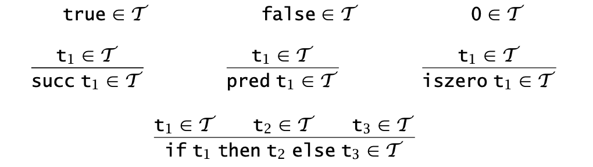
  - the top 3 without premises are called **axioms**
  - each *inference rule* is actually a **schema** since it occurs in the metalanguage and involves metavariables
  - each schema translate to some set of **concrete rules** by substituting metavariables with actual occurrences
- another alternate is the inductive rule for constructing the language
  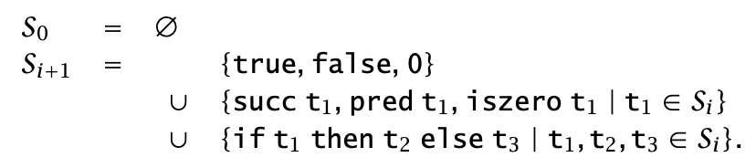
  - $S_1$ includes all the constants, $S_2$ adds all the first-level expressions (immediately evaluated based on constants), etc., until for some $S_n$ the process terminates for a particular program
  - $S = \bigcup_i S_i = S_n = \mathcal T$
  > the last S=T part is proven in the book via strong induction
  - $S \subseteq S_{i+1}$
- the book goes over several characteristics as result of this inductive construction
  - the set of all constants appearing in some term $Const(t)$ has properties like $Const($`succ t1`$) = Const($`t1`$)$
  - the **size** of term `t` has properties like $size($`succ t1`$) = size($`t1`$) + 1$
    - when `t1` is incorporated in some layer, `succ t1` is incorporated in the next layer
    - for multiple metavariables in a term like in if/else, their sizes are *summed* before `+1`
  - the **depth** is defined similarly, but for multiple metavariables their depths are *maxed* before `+1`
  - the later a term is introduced, the larger size and depth it has
  - constants always have size and depth of `1`
  - $|Const(t_1)| \leq size(t_1)$
- strong inductions can be done on size and depth (*ex.* instead of $n$, use some term $s$ and all terms $r$ with $size(r) < size(s)$)
- **structural induction** is where for term $s$ the terms $r$ are immediate subterms of $s$
- the general scheme of such inductive proofs is
  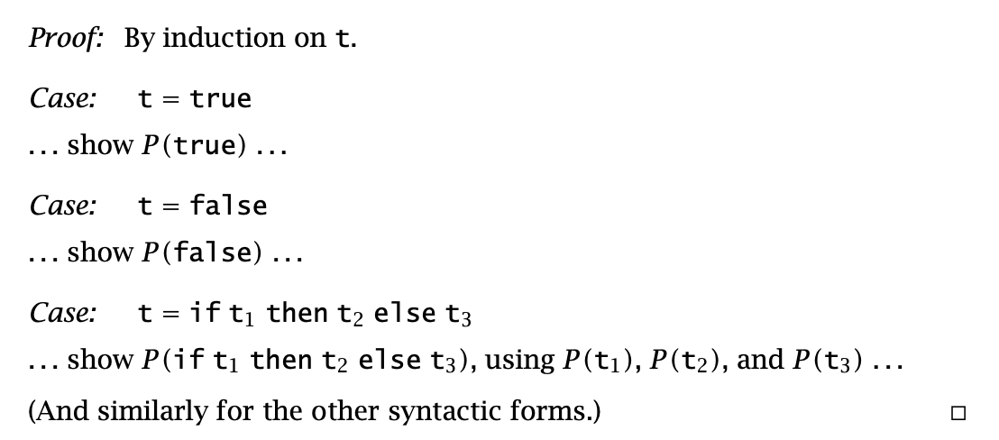
  
## Semantic Styles
- **semantics** is the evaluation of the actual terms in the language, with three basic approaches
  - **operational** approach defines an *abstract machine* for the language where machine code is directly taken from the language (instead of some lower level microprocessor command)
    - for term `t` (which could just be the program itself), the semantic of `t` is the final state of the abstract machine when the initial state is `t`
    - the book predominantly uses this approach
  - **denotational** approach is more abstract, in that it aims to find math *domains* of values for which terms can be interpreted against
  - **axiomatic** approach is direct, in that it takes the laws that define the language *as* the semantic
    - what a term means *is* what could be proven about it
- definition of a boolean grammar
  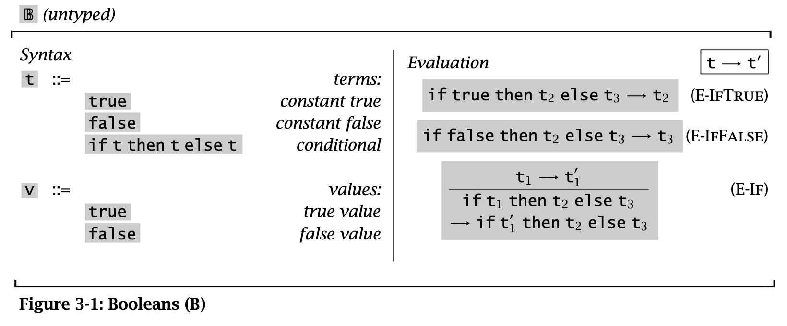
  - `t` section defines all terms similar to the previous sections
  - `v` is a subsection of `t` that defines all terms that could act as final values
  - on the right, each blob is a rule in the format `t1 -> t2` (`t1` evaluates to `t2`)
    - the first two rules are called **computation rules**
    - the last rule is called **congruence rule**, namely specifying that the `if`'s guard can be evaluated first (it determines *where* to evaluate)
  - an **instance** of an inference rule is a rule where the metavariable is replaced with an actual term
    - *ex.* `if true then false else true -> false` is an instance of `E-IFTRUE` where `t2`=`false`, `t3=true`
  - a rule *satisfies* a relation if its conclusion is in the relation or one of its premises is not in the relation
  - the **one-step evaluation relation** $\to$ is the smallest relation satisfying the evaluation rules of the language
    - `tRt'` means the evaluation `t -> t'` is **derivable**
    - in the boolean case, something derivable means it is either an instance of the computation rules, or an instance of `E-IF` whose premise is derivable
    - tracing derivability will create a tree structure
- proof by **induction on derivations**
  - traverses the derivability tree
  - *ex. thm.* prove: $(t \to t' \land t \to t'') \to t' = t''$ in the case of the boolean grammar
    - if the last rule used to derive `t -> t'` is E-IFTRUE, then `t` must have the form `if true then t2 else t3`
      - this means the last rule for `t -> t''` cannot be E-IFFALSE
      - `t -> t''` cannot be E-IF either, because the guard is `true` which does not evaluate to anything different
      - for this reason `t -> t''` is an instance of E-IFTRUE
      - the same rule applied to the same `t` can only end up with the same conclusion, so `t' = t''`
    - ... repeat for different cases of the last rule of `t -> t'`
  - *def.* for some premise on an evaluation statement $P(t \to t')$,
    - if
      - if all possible derivation trees leading to $t \to t'$ causes $P(t \to t')$ to be true
    - then $P(t \to t')$ must be true in general
- a **normal form** `t` has no applicable evaluation rules
  - t is normal form $\iff$ t is a value
- a **multi-step evaluation relation** $\to^*$ relates a term to all terms derivable from it in 0 or more single evaluation steps
  - this relation is the reflexive, transitive closure of the one-step $\to$, hence the notation
- *thm.* normal forms are *unique*, in that if `t ->* u`, `t ->* v`, then `u=v`
  - this is a direct result of the `t'=t''` theorem above for `->`
- *thm.* every term can be evaluated to a value
  - *i.e.* for every `t` there is some normal form `t'` where `t ->* t'`
- incorporation of natural numbers values in the `nv` section
  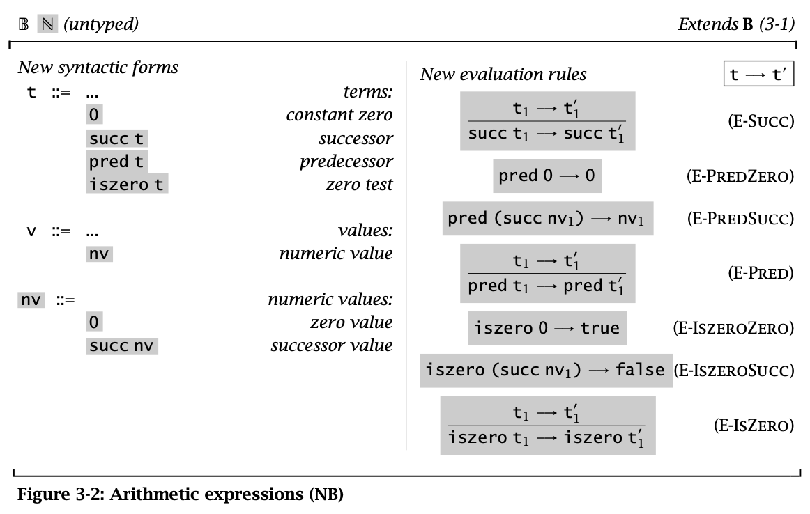
  - note `pred` is only used to cancel out `succ`, and it cannot go below `0`
- a term is **stuck** if it is in normal form but is not a value
  - all stuck terms evaluate to an `error` value
- note: the book uses **small step** notation when defining evaluation rules
- the **big step** notation directly states which terms evaluate to what

# ML Implementation of Arithmetic Expressions
> the book goes over implementation of the boolean & natural number arithmetic grammar in ObjectiveCAML, a functional programming language with gc

# Untyped Lambda Calculus

## Definitions
- lambda calculus is simultaneously
  - a language for describing computation
  - a subject that proofs can be written against
- core language features include common constructs like natural numbers, the book focuses on using more advanced constructs
- function definition
  - $\lambda n. \quad evaluation$
  - *ex.* factorial $f = \lambda n.$` if n=0 then 1 else n * f(n-1)`
  - everything is a function, including values
- formally defined in small step
  ```
  t ::=
    x             variable
    λx.t          abstraction
    t t           application
  ```
- concrete vs. abstract syntax
  - **concrete syntax** is what is actually written
  - **abstract syntax** is a simpler reprentation of the program, usually in a tree form (**AST** abstract syntax tree)
  - conversion from concrete to abstract
    1. a *lexer* (lexical analyzer) breaks strings into tokens, then normalizes those tokens
    2. a *parser* transforms token sequence into AST
      - precedence, associativity, etc. are applied here
 - the book's convensions on AST's
   - functions associate to the left: `s t u = (s t) u`

     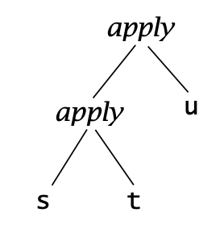
   - scopes extend to the farthest right: `λx. λy. x y x = λx. (λy. ((x y) x))

     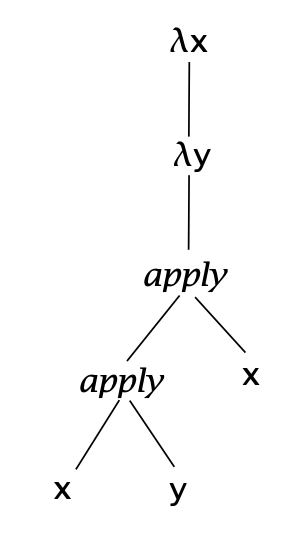
- the book will use english letter variables both for metavariables and object language variables, depending on context
  - when describing "the form" of something, the abstracted variables are metavariables
  - what is substituted for metavariables are object language variables
- scope
  - a variable `x` is **bound** by the body `t` of the abstraction `λx.t`
  - in other words, `λx` is the **binder** whose **scope** is `t`
  - a variable that is not bound by any binder is **free**
  - a term with no free variable is **closed** (also called **combinators**)
    - the trivial example: `id = λx.x`
- operational semantics of lambda calculus
  - each computation substitutes the argument (the term immediately to the right of the function) as the bounded variable into the body of the function
  - `(λx. t12)t2 -> [x -> t2]t12`
    - the rhs just means "make `x` into `t2` in `t12`"
    - the lhs in this particular form is called a **redex** (reducible expression)
    - rewriting a redex based on the above rule is called a **beta-reduction**
  - there are several **strategies** for beta-reduction
    - **full beta reduction** may reduce any redex at any time
    - **normal order** prefers the leftmost outermost redex
      - **call by name** strategy adds the constraint that bodies of abstractions cannot be reduced
        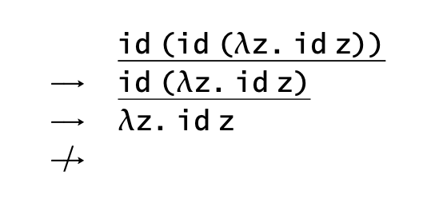
        - call by name is "lazy" as it does not require function arguments to be evaluated
      - **call by value** adds the constraint that an abstraction can only be reduced if its right has already been reduced to a value
        - call by value is "strict" as it requires evaluation of all function arguments, even if the function itself does not use that argument in the body
  - the choice of strategy has little effect on the discussion of type systems
  - call by value is preferred by the book because it is preferred in language implementations

## Multi-Argument Abstractions
- `f = λ(x, y) = λx.λy.s`, for some scope `s` with bounded `x` and `y`
  - let input pair `v, w`
  - using Currying, `f v w = (fv) w = λy.[x -> v]s) w = [x->v][y->w]s`

## Church Boolean
- `tru = λt.λf.t`
- `fls = λt.λf.f`
- true and false are basically selection preferences in a `if/else`
- the ternary `test b v w` can be defined as
  - `test = λl.λm.λn. l m n`
  - `test` is just a wrapper for `b`, `b v w` by itself evaluates to the same thing as `test b v w`, but `test` does provide a context that wraps `b v w` (i.e. view it as `test(b, v, w)` instead)
- boolean operators
  - `and = λb. λc. b c fls`
      - `and tru tru`
        - `(λb. λc. b c fls) tru tru`
        - `(λc. tru c fls) true` 
        - `tru tru fls`
        - `(λt. λf. t) tru fls`
        - `(λf. tru) fls`
        - `tru`
  - `or`
    - `or tru fls`
      - `(λb. λc. b c tru) tru fls`
      - `(λc. tru c tru) fls`
      - `tru tru tru = tru`
    - `or fls tru`
      - `(λb. λc. b c tru) fls tru`
      - `(λc. fls c tru) tru`
      - `fls tru tru = tru`
  - `not = λb. `
    - `not tru`
      - `(λb. fls tru) tru`
      - `tru fls tru = fls`
    - `not fls`
      - `(λb. fls tru) fls`
      - `fls fls tru = tru`

## Pairs
- pairs of values as terms
  - `pair = λf.λs.λb b f s` (`b` being the index)
  - `fst = λp. p tru`
  - `snd = λp. p fls`

## Church Numerals
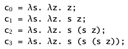
- `s` being successor, and `z` being zero
- note that `c0` is just `fls`
- the successor function `scc = λn. λs. λz. s (n s z)`
  - `scc c0`
    - `(λn.λs.λz. s (n s z)) (λs. λz. z)`
    - `λs.λz. s((λs. λz. z) s z)`
    - `λs.λz. s((λz. z) z)`
    - `λs.λz. s z = c1`
- plus `plus = λm.λn.λs.λz. m s (n s z)`
  - note that if we view `z' = n s z` then `m s (n s z) = m s z'`
  - this just means the `plus` is reapplying the successors of `m` onto those of `n`, forming the sum
- multiplication `times = λm.λn. m (plus n) c0`
  - applies the `plus n` for `m` times to `c0`
- zero test `isz = λm. m (λx. fls) tru`
  - applies the `λx. fls` to `tru` for `m` times
  - as long as it is never applied `tru` is kept, otherwise it becomes a `fls`
- predecessor function
  - `zz = pair c0 c0`
  - `ss = λp. pair (snd p) (plus c1 (snd p))`
  - `prd = λm. fst (m ss zz)`
    - applying `ss` once to `zz` yields `pair c0 c1`
    - applying `ss` for `m` times yields `pair c(m-1) cm`
    - taking the first element then yields `c(m-1)`
    - note that `prd c0 = c0`, so it clamps at natural numbers
- subtraction `sub = λm.λn. n pred m`
- numberic equality `equal = λm.λn. isz (sub m n)`

## Enriching the Calculus
- although pure lambda calculus does not need types, it is convenient to work with typed data
- below defines the system $\lambda N B$ for the enriched system with "actual" valued booleans and numbers
  - conversion to from church boolean: `realbool = λb. b true false` (note it is not `tru` `fls` in the church sense)
  - convertion to church boolean: `churchbool = λb. if b then tru else fls`
  - real equality: `realeq = λm. λn. (equal m n) true false`
  - real natural numbers: `realnat = λm. m (λx. succ x) 0`
    - intuitively the body should be `m succ 0`, but `succ` cannot be treated as "something by itself", so instead we apply the "abstraction that applies succ" instead of directly applying succ
> the book explains why $\lambda N B$ is actually good outside convenience. by the rules of call by value, `scc c1` does not actually evaluate to `c1`, but rather evaluates to something behaviorally identical to `c2`. in such case, calling `realnat(scc c1)` will force the conclusion of `scc c1` to actually evaluate and "force out" the hidden terms

## Recursion
- a **divergent** term has no normal form
  - *ex.* `omega = (λx. x x)(λx. x x)` evaluates to itself
- the fixed-point combinator `fix` is similar to `omega`, but helpful for defining recursive functions
  - `fix = λf. (λx. f (λy. x x y))(λx. f (λy. x x y))`
- the factorial function
  - `g = λfct. λn. if realeq n c0 then c1 else (times n (fct (prd n)));`
  - `factorial = fix g`
  - whenever `fct` persists in the evaluated left half of `fix`, `fix` keeps that invocation "alive" by wrapping it in another abstraction, constructing something similar to a call stack
  - at the tail, `fct` no longer exists so the call stack is complete
  - the call stack then evaluates
  - *ex.* `factorial c3`
    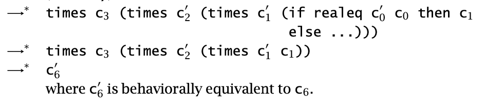

## Representation
- the church encoding *represents* each number as a function
  - with pure lambdas, these representations can be "non-canonical" (not minimal), but is behaviorally the same
- the church version of operations `scc`, `prd` *represents* the real functions `succ` and `pred`, in that when applied to the same numeric reprentation, the resultant representation agrees with `succ` and `pred`

> skipped: in the next section, the book goes over the operational semantics of untyped lambda calculus $\lambda$
> 
> one important concept is **variable capture**, where a naive substitution makes a free variable bound
>   - *ex.* `[x -> z](λz. x) = λz. z`
# Nameless Representation of Terms
> the book goes over several different approaches to avoid variable capturing and other issues with naive substitution

- the book chooses the approach of using canonical representations of variables and terms that do not need renaming

## Terms and Contexts
- **nameless terms** (de Brujin terms) are positional relative to their binders
  - for example the binder `λx.λy. x (y x)` is expressed as `λ.λ. 1 (0 1)`
  - the numeric value assigned is called **de Brujin index** or in compiler implementation terminology **static distance**
- terms can be classified with their *maximum* number of free variables
  - *0-terms*, *1-terms*, etc.
  - $\mathcal{T}$ is the smallest family of sets $\{\mathcal{T}_0, \mathcal T_1, ...\}$ where:
    - $\forall 0 \leq k < n : k \in \mathcal T_n$
    - if $t_1 \in \mathcal T_n$ and $n > 0$ then $\lambda.t_1 \in \mathcal T_{n - 1}$
      - attaching the context will bound the first free variable
    - if $t_1, t2 \in \mathcal T_n$ then $(t_1 \quad t_2) \in \mathcal T_n$
      - the free variables are shared across terms
- **naming contexts**
  - there is no definitive way of figuring out indices for free variables
  - instead, we define the context `Γ=x, y, z, a, b` as a wrapper for the term
    - the wrap does the same thing as appending `λx. λy. λz. λa. λb.` to the beginning of the term
  
    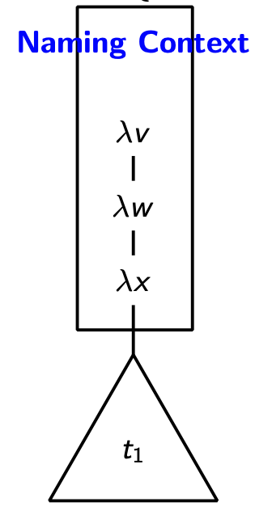
  - in this *context*, a term like `x (y z)` evaluates to `4 (3 2)`
  - *def.* for variable names $x_i \in \mathcal{V}$, the naming context `Γ = xn, x(n-1), ..., x0` assigns indices to free variables
  - $dom (\Gamma) = \{x_n, ..., x_0\}$
  - bounded scopes are attached beneath the naming context, whenever an originally free variable is referenced, the additional layer will cause it to *shift* its index

    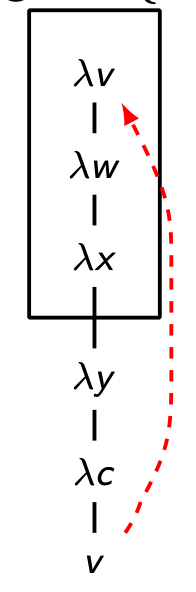
    - `v` here has index of `4` because it is `4` away from its original definition in the context
- the book uses the convention that
  - when a given problem provides the context $\Gamma$, any $t \in \mathcal T$ denotes $t \in \mathcal T_n$ where $n$ is the length of $\Gamma$

## Shifting and Substitution
- the substitution operator must take care of the free variable index shift within bounded scopes
  - for example, `x=1` in the outer context, and we want to perform `[x -> s](λy.x)`
    - note that when translated with distance-based index, the expression is actually `[1 -> s](λ.2)` where `1` does not match `2`
    - we want such an operation that brings `2` down but not the `0` in the scope down
  - the **shifting** function $\uparrow_c^d(k) = \begin{cases} k < c \to k \\ k \geq c \to k + d \end{cases}$
    
    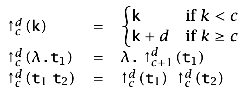
    - this function takes everything greater or equal to $c$ and shifts them by $d$
  - shifting can be used to implement correct substitution
    
    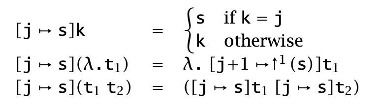
  
## Evaluation
- the evaluation relation for nameless lambda calculus must be redefined (against the new shifted substitution) 

  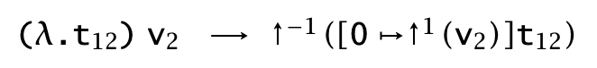
> the book implements nameless lambda calculus with ML