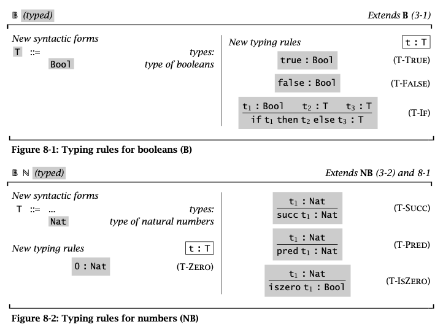
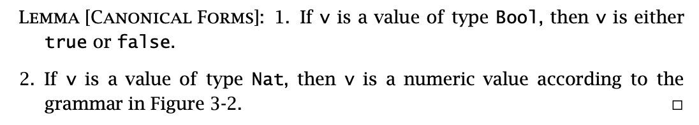
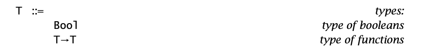
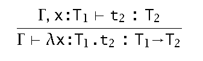
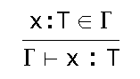
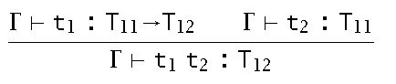
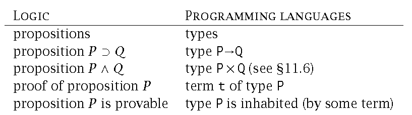
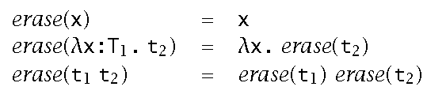

# Types
- "`t` has type `T`" means that `t` "obviously" evaluate to a value with the appropriate form to be accepted as an intance of `T`
  - "obviously" means that this can be determined statically by automated processes
  - based on the previous untyped bool/natural number system, the book introduces the basic types `Bool` and `Nat`
  - note that `static` here includes not examining any code paths, even predetermined paths like `if true then 0 else false` will not be determined as a `Nat` typed expression
    - however if two sides agree like `if true then 0 else 1`, then the type can be determined

## The Typing Relation

- note that the use of `T` for `T-IF` guarantees `t2` and `t3` are of some same type
- `T-SUCC` and `T-PRED` "propagates" the `Nat` typed-ness of the `t1`
  - `: Nat` is the condition for applying them
- the **typing relation** `:` is the smallest binary relation between terms and types that satisfies the above definition and covers the program itself
  - a term is **well-typed** if it can be related to a type
- *thm.* by induction, every subterm of a well-typed term is also well-typed
- **type derivations** are deductions made based on typing rules
- *thm.* the *inversion lemma / generation lemma* of the typing relation
  - a set of lemmas directly translated from the typing rules (by substituting appropriate `T` values)
  - these lemmas constitute steps for actually deriving a term's type
- *thm.* each term has at most one type
  - the inversion lemmas are unique and deterministic
  - derivations use **derivation trees** with the final result being the root, proofs often perform induction on this derivation tree
- this simple type system is **safe/sound**
  - *def.* a well-typed term is never stuck, which consists of two behaviours
    - **progress** a well typed term is either already a value or can be evaluated
    - **preseration** well-typed-ness is preserved in evaluations
    - these two behaviours proven using the **cannonical forms** of all types in the system
    
      - the actual proofs are induction on derivation trees, and each case consists of different types and their cannonical forms

# Simply Typed Lambda Calculus
> the book version only includes boolean arithmetics for simplicity
- type `->` represents functions
  - corresponding to the typing rule `λx.t : ->`
  - to actually distinguish between functions, function types will need to contain argument and return types
    
## The Typing Relation
- to resolve parameter types, languages adopt different approaches
  - **explicit**: the type itself is marked in the function: `λx:T1.t2`
    - note that the type of `t2` dictates the return type of the function
  - **implicit**: the type is deduced when needed
- usually, types are resolved under a *context*
  - the context itself can be throught of as a function from bound variables (those in `dom(Γ)`) to their respective types
  - "the closed term t has type T under the typing context Γ"
  - *i.e.* `Γ⊢t:T`, where `⊢` means "entails"
    - here, the different symbol is used to avoid duplication with `->`
  - typing abstraction for functions under a context
    
    
    
    - strictly speaking the `x` here must not be bound by `Γ`
  - typing rule for variables bound by that context
   
    
  - type application rule under a context (with function-typed `t1` and its parameter `t2`)
 
    

- *thm.* **progress** theorem
  - *lem.* **uniqueness of types**
    - in `Γ`, a term `t` has at most one type, and that type has only one derivation path in the program
  - *lem.* **canonical forms**
    - *ex.* in the example simply typed (boolean) lambda calc.
      
      1. if value `v:Bool`, then `v` is either `true` or `false`

      2. if value `v:T1 -> T2`, then `v` must be of the form `λx:T1.t2`
  - for closed and well typed term `t` (i.e. `null⊢t:T`, the term `t` has type `T` even without information from any context)
  - `t` is either a value, or ther is some `t'` with `t -> t'`
  - the result is that all normal forms are values
  - open terms break this theorem because things like `a false` (where `a` is defined in the context) is a normal form but not a value
- *thm*: **preservation** of types across evaluation
  - *lem* **permutation**: permutations $\Delta$ (rearranged version) of a context $\Gamma$ behaves the same as the context itself
    - $t$ still evalutes to the same type under $\Delta$, and the derivation of if retains the same depth
  - *lem* **weakening**: for variable $x$ not bound by $\Gamma$ ($x \not\in dom(\Gamma)$) and some other $t$ where $\Gamma \vdash t:T$, $\Gamma, x:S \vdash t:T$
    - adding the type of $x$ to the context does not change the value and depth of the original derivations done under the original context $\Gamma$
  - *lem* **type preservation under substitution**
    - if
      - $\Gamma, x:S \vdash t:T$
      - $\Gamma \vdash s:S$
    - then
      - $\Gamma \vdash [x \mapsto s] t:T$ where $\mapsto$ denotes substitution
  - from the above, $(\Gamma \vdash t:T) \land (t \to t') \to (\Gamma \vdash t':T)$
    - $t \to t'$ means $t$ evaluates to some other $t'$
## Curry-Howard Correspondence
- originally in logics
  - a proof of proposition P consists of evidence for P
  - proving $P\to Q$ means to mechanically construct a proof of Q from a proof of P
  - proving $P \land Q$ means to mechanically struct a proof of both P and Q
  - the **correspondence** is between constructive logic and type systems
    

- the correspondence gives rise to different type systems as direct translations of different logical systems
- the conclusion is that the type constructor $\to$ corresponds to two types of typing rules
  - **introduction rule** describing the creation of elements of that type
  - **elimination rule** describing how to consume elements of that type
## Erasure and Typability
- *def.* **erasure**: compilers typically do not keep type annotations in the compiled program, instead "erasing" those annotations and converting the program effectively to untyped
  - the erasure opperation can be abstracted as:
  
- *def.* a term $m$ in untyped lambda calculus $\lambda$ is **typable** in the typed lambda calculus $\lambda_{\to}$ if
  - there are some simply typed term $t$, type $T$, and context $\Gamma$
  - such that $erase(t)=m$ and $\Gamma \vdash t:T$
  - *i.e.* the types and contexts are reconstructable
> the book goes over ML implementation of simply typed (boolean) lambda calculus

# Simple Extensions
- 