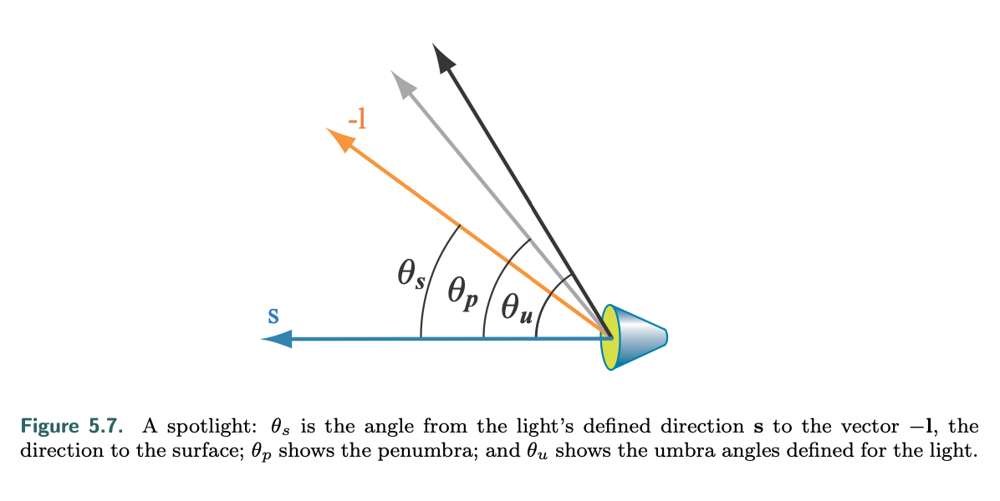

**Real Time Rendering (4'th Edition)**

- [I: Symbols & Conventions](#i-symbols--conventions)
  - [coordinates](#coordinates)
- [II: Pipelining](#ii-pipelining)
  - [Application Stage](#application-stage)
  - [Geometry Stage:](#geometry-stage)
  - [Rasterization:](#rasterization)
  - [Pixel Shading:](#pixel-shading)
- [III. Graphics Processing Unit](#iii-graphics-processing-unit)
  - [Minimizing Latency](#minimizing-latency)
  - [Models for the GPU pipeline](#models-for-the-gpu-pipeline)
  - [Unified Shader Design](#unified-shader-design)
  - [Vertex Shader](#vertex-shader)
  - [Tessellation](#tessellation)
  - [Geometry Shader](#geometry-shader)
  - [Stream Output](#stream-output)
  - [Pixel (Fragment) Shader](#pixel-fragment-shader)
  - [Merging Stage](#merging-stage)
  - [Compute Shader](#compute-shader)
- [IV. Transforms](#iv-transforms)
  - [Matrix-based](#matrix-based)
  - [Quaternions](#quaternions)
  - [Vertex Blending](#vertex-blending)
  - [Morphing](#morphing)
  - [Geometry Cache Playback](#geometry-cache-playback)
  - [Projection](#projection)
    - [Orthographic Projection](#orthographic-projection)
    - [Perspective Projection](#perspective-projection)
- [V. Shading Models](#v-shading-models)
  - [Lambertian Model](#lambertian-model)
  - [Types of Light](#types-of-light)
    - [Directional Light](#directional-light)
    - [Punctual Light](#punctual-light)
  - [Implementing Shading Models](#implementing-shading-models)
  - [Example Implementation](#example-implementation)
    - [Shader Inputs and Outputs](#shader-inputs-and-outputs)
    - [Pixel Shader](#pixel-shader)
    - [Vertex Shader](#vertex-shader-1)

# I: Symbols & Conventions
## coordinates
- $z$ out, $x$ right, $y$ up
# II: Pipelining

- *def.* pipelining: separate different stages for parallelism
## Application Stage
- determines the primities to render, happens in the CPU
## Geometry Stage:
   1. vertex shading:
      1. model transform: model $\to$ world space
      2. view transform: world $\to$ view/camera space
      3. projection + clipping: view/camera space $\to$ unit cube
       - *def* shading: operation determining the effect of light on an object 
   2. vertex processing optionals
      1. tessellation: optimally breaking curved surfaces to polygon primitives, based on level of detail and on-screen size
      2. geometry shader: geometric new vertices around key points
      3. stream output: output processed vertices as an array
   3. clipping
       * discard primitives wholly outside the volume
       * keep primitives fully in
       * clip primitives partially in
   4. screen mapping
       * map view volume to unit cube
        * openGL: $z \in [-1, 1]$, origin lower left
        * directX: $z \in [0, 1]$, origin upper left
## Rasterization:
1. triangle setup: computer shape data
2. triangle traversal: generate fragments
## Pixel Shading:
* *def.* frame buffer: color buffer, z buffer, alpha better, stencil buffer
* *def.* double buffering: write to back buffer, only swap front-back buffer when finish the current frame
1. fragment shader: texturing
2. merging: use shaded fragments to update the color buffer
     * z-buff alg (O(n)): for pixel $i$ belonging to fragment $f$, only write $i$ to the color buffer if $z_f$ is closer than what was already on the z-buffer at $i$


# III. Graphics Processing Unit
## Minimizing Latency
  - cpu: caches, branch prediction, ...
  - gpu: multiple shader cores, non-interdependent tasks, ...
    - maximizes throughput (jobs per time), but latency is high
    - each core has some local memory (registers)
    - constantly switching across different fragments to fill waiting time
      - *ex.* do some fragment shading while texturing awaits for memory fetch
  - SIMD (Single Instruction Multiple Data):
    - GPU thread: entity consisting of input + register specifications
    - similar threads are bundled, then assigned to *warp/wavefront*
    - for each warp/wavefront, split into single threads and assign to *SIMD Lanes*
    - each warp/wavefront is scheduled for 32 shader cores
      - when stalled, the entire warp is swapped out
  - *def.* occupancy: # threads currently on the GPU
    - low occupancy = low throughput
    - occupancy limited by register count and shared memory size
  - *def.* thread divergence: when branched, both versions are calculated while awaiting for branch evaluation. Too many subsequent branchings make branch counts out of control
## Models for the GPU pipeline
  - logical: the model of the GPU exposed *to* the API (*ex.* OpenGL, Vulcan, ...)
  - physical: actual implementation of the instructions
  - Programmable stages:
    - vertex shader, geometry shader, tessellation
  - Fixed Function stages:
    - clipping, triangle setup, triangle traversal
  - Configurable:
    - *def.*: fixed function stage but with a large amount of settings
    - merging stage

## Unified Shader Design
- same ISA, leading to good predictors for scheduler about computational load
  - DirectX: HLSL $\to$ byte code $\to$ ISA
  - OpenGL: GLSL
- *def.* draw call: invocation of API on a group of primitives
  - *def.* unifying input: constant within draw call, but may vary between different calls
    - *ex.* material color
  - *def.* varying input: varying within draw call
    - *ex.* current pixel
  - inputs are assigned to constant and varying registeres respectively
    - usually the GPU has more constant registers
  - operations, intrinsic operators (sqrt, ...), functions (normalize, ...)
  - flow control: static branching (for dynamic in.), dynamic branching (for varying in.)
  - other GPU languages
    - Volkan (SPIRV): lower overhead
    - OpenGL ES: embedded systems
      - WebGL: interpreted from JS

## Vertex Shader
- input asseembler handles data before vertex shader
- vertex shaders deal exclusively with vertex properties
- cannot create or delete primitives

## Tessellation
- render curved surface efficiently by adjusting level of detail
- components
  1. tessellation control shader
  2. primitive generator
  3. tessellation evaluation shader

## Geometry Shader
- primitive $\to$ vertices
- moficiation & copying of data (under preserved order)
- not often used since performance is slow

## Stream Output
- used for iterative processing
  - feed generated vertices back to vertex shader and start over

## Pixel (Fragment) Shader
- col, z, ... $\to$ result
- modify z and alpha, but mostly produces color
- interpolate values
- can discard fragment
- multiple render targets (outputs outside the merging stage)
- computation of gradients:
  - access adjacent fragments *in the same warp*
  - not compatible with dynamic branching:
    - all four vertices of the quad must pass at once, not stalled
  - random access mechanisms:
    - Unordered Access View / Shader Storage Buffer Object
  - Rasterizer Order Views: enforace layer order

## Merging Stage
- to same resource, processors usually do merge testing *before* pixel shading ("early z")
    - this is incompatible with pixel shaders that change z, since merging (occlusion) is z-based

## Compute Shader
- GPU as parallel processor, through interfaces like CUDA
- access bufferes on the GPU
- post processing (*ex.* average luminance)
- minimize CPU-GPU communication

# IV. Transforms
## Matrix-based
- Linear (3x3)
- Affine (Linear + Translate)
  - parallel preserved
- Homogeneous coordinates
  - direction: $w=0$
  - location: $w=1$
- rigid body: $X = T(\bold{t})R$
    - no similarity
- scaling in a certain direction
  - for basis $F = \begin{pmatrix} \hat \bold{f}_x & \hat \bold{f}_y & \hat \bold{f}_z & 0 \\ 0 & 0 & 0 & 1\end{pmatrix}$, do $FS(\bold{s})F^T\bold{v}$
- normal transform (transforming a direction)
  - use transpose of adjoint, then re-normalize
  - other than projection, $w$ is unchanged, so usually taking the upper 3x3 for tr. adj. is enough
- simple inverse transforms
    1. Reverse using given properties
        * $R(\phi)^{-1} = R(-\phi)$
        * $T(\bold{t})^{-1} = T(-\bold{t})$
        * $S(\bold{s})^{-1} = S(\bold{s}^{-1})$
    1. A known orthogonal matrix can be inverted by transposing
    2. Inverse of concatenated transforms: $(T_1 T_2)^{-1} = T_2^{-1} T_1^{-1}$
- Euler transforms
  - $E(h, p, r) = R_z(r) R_x(p) R_y(h)$
  - however, Euler matrices are non-unique so interpolation could be erroneous
  - extraction could be done using inverse trig (mtrx $\to$ hpr)
  - *def.* gimbal lock: method cannot determine when degree of freedom is lost
- Rotation about Arbitrary Axis
  - let axis $\hat \bold r$, angle $\alpha$
  - find $\bold{s} = \bold{r}$ with smallest component set to 0, and the other two swapped, one of the two negated (this approximates the tangent)
  - $\hat \bold{s} = normalized(\bold{s})$, $\hat\bold t = \hat\bold r \times \hat\bold s$
  - basis $M = \begin{pmatrix}\hat\bold r & \hat\bold s & \hat\bold t\end{pmatrix}$
  - $R_{\hat\bold r}(\alpha) = M^TR_x(\alpha) M$
## Quaternions
- stable and interpolable, but more expensive
- *def.* $\hat q = (\bold q_v, \bold q_w) = \bold i q_x + \bold j q_y + \bold k q_z + q_w$
- where
  - $\bold i^2 = \bold j^2 = \bold k^2 = -1$
  - $\bold{jk = -kj = i}$
  - $\bold{ki = -ik = j}$
  - $\bold{ij = -jk = k}$
- multiplication: $\hat q \hat r = (\bold i q_x + ...)(\bold i r_x + ...) = (\bold q_v \times \bold r_v + r_w \bold q_v + q_w \bold r_v, q_w r_w - \bold q_v \cdot \bold r_v)$
- conjugate: $\hat q^* = (-\bold q_v, q_w)$
  - $\hat q \hat q^* = \hat 1$
- norm: $n(\hat q) = \sqrt{q_x^2 + q_y ^2 + q_z ^ 2 + q_w ^ 2}$
- identity: $\hat 1 = (\bold 0, 1)$
- inverse: $\hat q^{-1} \hat q = \hat q \hat q^{-1} = \hat 1$
  - *thm.*
    - $\hat q \hat q^* = (0, \bold q_w \bold q_w + \bold q_v \cdot \bold q_v) = (0, n(\hat q)^2) = n(\hat q)^2 \hat 1$
    - $$\frac{\hat q \hat q^*}{n(\hat q)^2} = \hat 1$$
    - $$\hat q^{-1} = \frac{\hat q^*}{n(\hat q)^2}$$
- scalar mult.: $\hat s = <\bold 0, s>$, $\hat q \hat s = (s \bold q_v, s \bold q_w)$
- other properties
  - $(\hat q^*)^*=\hat q$
  - $n(\hat q^*) = n(\hat q)$
  - linear: left and right multiplication distribute, as long as on the original side
  - associative
- unit quaternions
  - $n(\hat q) = 1$
  - another representation as $\hat q = (\sin{(\phi)} \bold u_q, \cos{(\phi)})$, with $||\bold u_q|| = 1$
  - note that $\cos{(\phi)}+\bold i \sin{(\phi)} = e^{\bold i \phi}$
  - which means $\hat q = e^{\bold u_q \phi} = \cos{(\phi)} + \sin{(\phi)}\bold u_q * (\bold i, \bold j, \bold k)$
  - following this definition of exponential: $\ln {\hat q} = \bold u_q \phi$
  - power: $\hat q^t = e^{\bold u_q t \phi} = \sin (t\phi)\bold u_q + \cos (t\phi)$
  - $\hat q$ encodes the transform that rotates $2\phi$ radians around $\bold u_q$
    - to apply, use quaternion multiplication $\hat q \bold p \hat q^{-1} = \hat q \bold p \hat q^*$
    - although $\bold p$ is a homogenous vector, treat it as though it is a quaternion
    - for multiple rotations: $(... \hat r \hat q) \bold p (\hat q^* \hat r^* ...)$
  - matrix representation: $\hat q \to M^q$
  - *proc.* spherical linear interpolation
    - let unit quaternions $\hat q$, $\hat r$, $t \in [0, 1]$
    - $s(\hat q, \hat r, t) = (\hat r \hat q^{-1})^t \hat q$
      - implemented in software, it is $s = \frac{\sin(\phi(1 - t))}{\sin \phi}\hat q + \frac{\sin(\phi t)}{\sin \phi} \hat r$, for $\cos \phi = \hat q \cdot \hat r$
    - pro. slerp always traverses the shortest arc around a fix axis at constant speed
    - con. computationally expensive
  - *proc.* spherical cubic interpolation
    - generates smooth spline from multiple $\hat q_i$
    - calculate augmentations $\hat a_i$ and $\hat a_{i+1}$ between $\hat q_i$ and $\hat q_{i+1}$
      - $$\hat a_i = \hat q_i e^{-\frac{\ln(\hat q^{-1}_i \hat q_{i-1}) + \ln(\hat q^{-1}_i \hat q_{i+1})}{4}}$$
      - $$squad(\hat q^i, \hat q^i+1, \hat a^i, \hat a_{i+1}, t) = slerp \begin{pmatrix} slerp(\hat q_i, \hat q_{i+1}, t) \\ slerp(\hat a_i, \hat a_{i+1}, 2t(1-t)) \end{pmatrix}$$
        - $2t(1-t)$ is a downward parabola with intercepts at $x=0, 1$ and $y_{max} = 0.5$
  - *proc.* unit evctor rotation interpolation
    - a rotation from $\hat \bold s$ to $\hat \bold t$ can be represented by...
    - let $\bold u = \hat \bold s \times \hat \bold t$, $\hat\bold u = normalize(\bold u)$
    - let $2\phi$ be the angle between
      - this means $\cos(\phi) = \hat\bold s \cdot \hat\bold t$, $\sin(\phi) = ||\bold u||$
    - $\hat q = (\sin \phi \hat\bold u, \cos\phi) = e^{\hat\bold u \phi}$
      - here, the sines can be eliminated with the half angle formula
      - a matrix representation of this is also possible, but is unstable near $0, 2\pi$ due to trig issues
## Vertex Blending
- *appl.* skin-bone systems (skin mesh deformations based on bone movement)
- *proc.* for $n$ bones with non-negative weights $w_i$ adding up to 1, original skin point $\bold p$ is transformed to point $\bold u$ following $\bold u = \sum_{i=1}^n w_iB_iM_i^{-1} \bold p$
- where
  - $B_i$ is the bone deformation matrix relatiev to the bone's POV
  - $M_i$ is the bone's original basis
- blending can be improved to prevent unwanted deformations
  - *ex.* center of rotation blending: retains local rigidity

## Morphing
- *appl.* smooth transition between key frames of motion capture
- *proc.* vertex correspondence: establish key-point correspondence between subsequent frames, often done just by keeping track of key-point identities
- *proc.* interpolation: (linear) lerp between keypoint states
- morph targets / blend shapes
  - for poses $\mathcal{P_1} ... \mathcal{P_k}$, neutral pose $\mathcal{N}$
  - there are difference poses $\mathcal{D_i} = \mathcal{P_i} - \mathcal{N}$
  - a morphed model for weights $w_1 .. .w_k$ is $\mathcal{M} = \mathcal{N} + \sum_{i=1}^n w_i \mathcal{D}_i$

## Geometry Cache Playback
- find a space-efficient way to store vertex data for video
- optimizations
  1. quantization
  2. spatial predictions + deviations (low entropy for good predictions $\sim$ very sparse derivation data $\to$ utilize sparse data structures)
  3. temporal prediction
     * *ex.* assume items remain in the same motion between frames

## Projection
### Orthographic Projection
- orthographic, canonical $P = \begin{pmatrix} I^2 & ... \\ ... \\ ... & 1\end{pmatrix}$
- ortographic with clipping:
  - represented by $l, r, b, t, n, f$ (left, right, bottom, top, near, far) for the 6 faces of the view volume
    - by convention, $-z$ is into the page, so $n > f$
    - in general, $P=ST$ for some $S$, $T$
    - for OpenGL, $z$ is from $-1$ to $1$:
      - $S_{O[-1, 1]} = S(2<r-l, t-b, f-n>^{-1})$
      - $T_{O[-1, 1]} = T(-\frac{1}{2}<r+l, b+t, n+f>)$
    - to convert back to $z$-inward convention for computer graphics, add a $z$ mirroring transform $M_z$

### Perspective Projection
- $P_p = \begin{pmatrix} I_3 & ... \\ ... & -\frac{1}{d} & 0 \end{pmatrix}$
- asymmetric frustrua: $t \neq -b$ and or $r \neq -l$
- field of view
  - $\phi = 2\tan^{-1}(\frac{w}{2d})$, for
    - $w =$ width perpendicular to sight $d =$ distance from camera
- In general
  - $$P_p = \begin{pmatrix} \frac{2n}{r-l} & 0 & -\frac{r+l}{r-l} & 0 \\ 0 & \frac{2n}{t-b} & -\frac{t+b}{t-b} & 0 \\ 0 & 0 & \frac{f+n}{f-n} & -\frac{2fn}{f-n} \\ 0 & 0 & 1 & 0 \end{pmatrix}$$
  - for infinite far plane ($f \to \infty$), replace third row with $<0, 0, 1, -2n>$
  - $\bold q_{xyzw} = P_p \bold p_{xyzw}$, $\bold q_{xyz} = \bold q_{xyzw} / \bold q_w$
- note that depth of the projected point increases non-linearly
  - evaluate canonical depth (normalized device coordinates' depth) and write to z buffer (depth01)
  - 

# V. Shading Models
- unit directions
  - $\hat\bold n$ vertex normal
  - $\hat\bold l_i$ vertex to light $i$
  - $\hat\bold v$ vertex to view
- in general, a shading model produces color $\bold c \in [0, 1]^3$
- lit-unlit split:
  - $$c=f_{unlit}(\hat\bold n, \hat\bold v) + \sum_{i} f_{lit}(\bold c_i, \bold c_{surf}, \hat\bold n, \hat\bold{v}, \hat\bold{l}_i)$$
## Lambertian Model
  - $f_{lit} = (\hat\bold l_i \cdot \hat\bold n)^+ \bold c_i * \bold c_{surf}$

## Types of Light
### Directional Light
- $\hat\bold l, \bold c$ constant, no physical location
### Punctual Light
- *def.* has position $\bold p$
1. Point Light:
   * $\hat\bold l = normalize(\bold p - \bold p_0)$
   * $r = ||\bold p - \bold p_0||$
   * distance attenuation: $\bold c(r) = \bold c_{0} att(r)$
     * inverse square attenuation: $att(r) = (r_{0} / r)^2$
     * solving divide by 0
       * $r+\epsilon$ instead for denominator
       * $max(r, r_{min})$ instead for denominator, with $r_{min}$ being physical light size
     * clip to 0 at far distance
       * $\bold c(r) = \bold c_{0} att(r)f_{window}(r)$
       * a popular choice is $f_{window} = (1 - (\frac{r}{r_{max}})^4)^{+^2}$
       * another notation has $f_{dist}(r) = att \circ f_{window}(r)$, named "distance fall-off"

2. Spot Light
    * $\bold c = c_0 f_{dist}(r) f_{dir}(\hat\bold l)$
    * $f_{dir}$ depends on design
      * umbra angle $\theta_u$, penumbra angle $\theta_p$
      * 
      * $t=(\frac{\cos \theta_s - \cos \theta_u}{cos \theta_p - cos \theta_u})^\mp$
      * *ex.1* $f_{dir}(\hat\bold l) = t^2$
      * *ex.2* $f_{dir}(\hat\bold l) = smoothstep(t)$, where smoothstep is a cubic polynomial lerp with ease-in and ease-out
3. IES Light
    * IES profiles are standards for representing light patterns
4. Other: area, capsule, ...

## Implementing Shading Models
- Frequency of Evaluation
  - once per ever (like constants)
  - once per a while (aka. amortized): values changing slowly, like world lighting data
  - once per frame
  - ...
  - corresponding to shader stages
    1. vertex shader: per pre-tessellation vertex
    2. hull shader: per surface patch
    3. domain shader: per post-tessellation vertex
    4. geometry shader: per primitive
    5. pixel (frag) shader: per pixel
  - most actual evaluations are per pixel
- difference between per-pixel shading and per-vertex shading
  - for dense meshes, differences are small
  - for sparse meshes, pixel is more accurate
    - for this reason, vertex shaders are used mostly for non-shading operations
- for pixel shading:
  - interpolating normal vectors result in non-unit lengths, needing re-normalization
  - $\hat\bold l$ and $\hat\bold v$ are calculated from interpolated $\bold p$, instead of being interpolated themselves
- vertex shader space:
  - the vertex shader transforms entities to an appropritate coordinate system
  - using world space avoids the need to transform light positions, which helps when there are lots of lights
  - using camera space helps calculate the view vector, and may improve precision
- flat shading: done in vertex shader by disabling interpolation

## Example Implementation
### Shader Inputs and Outputs
```glsl
// varying inputs are marked 'in'
in vec3 vPos;
in vec3 vColor;
out vec4 outColor;

// exerpt of uniform inputs 
// ...
struct Light {
    // vec4 used for standard std140 data layout
    vec4 position;
    vec4 color;
};

uniform LightUBlock { Light uLights[MAXLIGHTS]; }; // at compile, MAXLIGHTS is replaced in a C-directive-like manner
uniform uint uLightCount;

// ...
```

### Pixel Shader
```glsl
vec3 lit(vec3 l, vec3 n, vec3 v) { ... }
void main() {
    // calculate n, v from world coords (vNormal, vPos)
    // relative to uEyePosition
    outColor = vec4(uFUnlit, 1.0); //initialize as unlit
    for (uint i = 0u; i < uLightCount; i++) {
        // calculate l
        // evaluate f_lit and add to outColor's rgb. this includes
        //  1. getting light intensity by projecting l onto n
        //  2. multiplying intensity to result of lit(l, n, v),
        //     then to uLights[i]'s color
    }
}
```

### Vertex Shader
```glsl

```