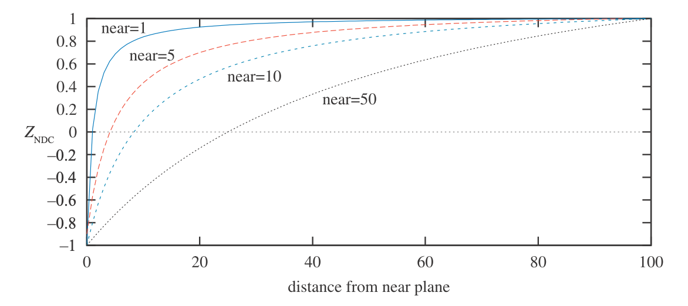

- [IV. Transforms](#iv-transforms)
  - [Matrix-based](#matrix-based)
  - [Quaternions](#quaternions)
  - [Vertex Blending](#vertex-blending)
  - [Morphing](#morphing)
  - [Geometry Cache Playback](#geometry-cache-playback)
  - [Projection](#projection)
    - [Orthographic Projection](#orthographic-projection)
    - [Perspective Projection](#perspective-projection)

# IV. Transforms
## Matrix-based
- Linear (3x3)
- Affine (Linear + Translate)
  - parallel preserved
- Homogeneous coordinates
  - direction: $w=0$
  - location: $w=1$
- rigid body: $X = T(\bold{t})R$
    - no similarity
- scaling in a certain direction
  - for basis $F = \begin{pmatrix} \hat \bold{f}_x & \hat \bold{f}_y & \hat \bold{f}_z & 0 \\ 0 & 0 & 0 & 1\end{pmatrix}$, do $FS(\bold{s})F^T\bold{v}$
- normal transform (transforming a direction)
  - use transpose of adjoint, then re-normalize
  - other than projection, $w$ is unchanged, so usually taking the upper 3x3 for tr. adj. is enough
- simple inverse transforms
    1. Reverse using given properties
        * $R(\phi)^{-1} = R(-\phi)$
        * $T(\bold{t})^{-1} = T(-\bold{t})$
        * $S(\bold{s})^{-1} = S(\bold{s}^{-1})$
    1. A known orthogonal matrix can be inverted by transposing
    2. Inverse of concatenated transforms: $(T_1 T_2)^{-1} = T_2^{-1} T_1^{-1}$
- Euler transforms
  - $E(h, p, r) = R_z(r) R_x(p) R_y(h)$
  - however, Euler matrices are non-unique so interpolation could be erroneous
  - extraction could be done using inverse trig (mtrx $\to$ hpr)
  - *def.* gimbal lock: method cannot determine when degree of freedom is lost
- Rotation about Arbitrary Axis
  - let axis $\hat \bold r$, angle $\alpha$
  - find $\bold{s} = \bold{r}$ with smallest component set to 0, and the other two swapped, one of the two negated (this approximates the tangent)
  - $\hat \bold{s} = normalized(\bold{s})$, $\hat\bold t = \hat\bold r \times \hat\bold s$
  - basis $M = \begin{pmatrix}\hat\bold r & \hat\bold s & \hat\bold t\end{pmatrix}$
  - $R_{\hat\bold r}(\alpha) = M^TR_x(\alpha) M$
## Quaternions
- stable and interpolable, but more expensive
- *def.* $\hat q = (\bold q_v, \bold q_w) = \bold i q_x + \bold j q_y + \bold k q_z + q_w$
- where
  - $\bold i^2 = \bold j^2 = \bold k^2 = -1$
  - $\bold{jk = -kj = i}$
  - $\bold{ki = -ik = j}$
  - $\bold{ij = -jk = k}$
- multiplication: $\hat q \hat r = (\bold i q_x + ...)(\bold i r_x + ...) = (\bold q_v \times \bold r_v + r_w \bold q_v + q_w \bold r_v, q_w r_w - \bold q_v \cdot \bold r_v)$
- conjugate: $\hat q^* = (-\bold q_v, q_w)$
  - $\hat q \hat q^* = \hat 1$
- norm: $n(\hat q) = \sqrt{q_x^2 + q_y ^2 + q_z ^ 2 + q_w ^ 2}$
- identity: $\hat 1 = (\bold 0, 1)$
- inverse: $\hat q^{-1} \hat q = \hat q \hat q^{-1} = \hat 1$
  - *thm.*
    - $\hat q \hat q^* = (0, \bold q_w \bold q_w + \bold q_v \cdot \bold q_v) = (0, n(\hat q)^2) = n(\hat q)^2 \hat 1$
    - $$\frac{\hat q \hat q^*}{n(\hat q)^2} = \hat 1$$
    - $$\hat q^{-1} = \frac{\hat q^*}{n(\hat q)^2}$$
- scalar mult.: $\hat s = <\bold 0, s>$, $\hat q \hat s = (s \bold q_v, s \bold q_w)$
- other properties
  - $(\hat q^*)^*=\hat q$
  - $n(\hat q^*) = n(\hat q)$
  - linear: left and right multiplication distribute, as long as on the original side
  - associative
- unit quaternions
  - $n(\hat q) = 1$
  - another representation as $\hat q = (\sin{(\phi)} \bold u_q, \cos{(\phi)})$, with $||\bold u_q|| = 1$
  - note that $\cos{(\phi)}+\bold i \sin{(\phi)} = e^{\bold i \phi}$
  - which means $\hat q = e^{\bold u_q \phi} = \cos{(\phi)} + \sin{(\phi)}\bold u_q * (\bold i, \bold j, \bold k)$
  - following this definition of exponential: $\ln {\hat q} = \bold u_q \phi$
  - power: $\hat q^t = e^{\bold u_q t \phi} = \sin (t\phi)\bold u_q + \cos (t\phi)$
  - $\hat q$ encodes the transform that rotates $2\phi$ radians around $\bold u_q$
    - to apply, use quaternion multiplication $\hat q \bold p \hat q^{-1} = \hat q \bold p \hat q^*$
    - although $\bold p$ is a homogenous vector, treat it as though it is a quaternion
    - for multiple rotations: $(... \hat r \hat q) \bold p (\hat q^* \hat r^* ...)$
  - matrix representation: $\hat q \to M^q$
  - *proc.* spherical linear interpolation
    - let unit quaternions $\hat q$, $\hat r$, $t \in [0, 1]$
    - $s(\hat q, \hat r, t) = (\hat r \hat q^{-1})^t \hat q$
      - implemented in software, it is $s = \frac{\sin(\phi(1 - t))}{\sin \phi}\hat q + \frac{\sin(\phi t)}{\sin \phi} \hat r$, for $\cos \phi = \hat q \cdot \hat r$
    - pro. slerp always traverses the shortest arc around a fix axis at constant speed
    - con. computationally expensive
  - *proc.* spherical cubic interpolation
    - generates smooth spline from multiple $\hat q_i$
    - calculate augmentations $\hat a_i$ and $\hat a_{i+1}$ between $\hat q_i$ and $\hat q_{i+1}$
      - $$\hat a_i = \hat q_i e^{-\frac{\ln(\hat q^{-1}_i \hat q_{i-1}) + \ln(\hat q^{-1}_i \hat q_{i+1})}{4}}$$
      - $$squad(\hat q^i, \hat q^i+1, \hat a^i, \hat a_{i+1}, t) = slerp \begin{pmatrix} slerp(\hat q_i, \hat q_{i+1}, t) \\ slerp(\hat a_i, \hat a_{i+1}, 2t(1-t)) \end{pmatrix}$$
        - $2t(1-t)$ is a downward parabola with intercepts at $x=0, 1$ and $y_{max} = 0.5$
  - *proc.* unit evctor rotation interpolation
    - a rotation from $\hat \bold s$ to $\hat \bold t$ can be represented by...
    - let $\bold u = \hat \bold s \times \hat \bold t$, $\hat\bold u = normalize(\bold u)$
    - let $2\phi$ be the angle between
      - this means $\cos(\phi) = \hat\bold s \cdot \hat\bold t$, $\sin(\phi) = ||\bold u||$
    - $\hat q = (\sin \phi \hat\bold u, \cos\phi) = e^{\hat\bold u \phi}$
      - here, the sines can be eliminated with the half angle formula
      - a matrix representation of this is also possible, but is unstable near $0, 2\pi$ due to trig issues
## Vertex Blending
- *appl.* skin-bone systems (skin mesh deformations based on bone movement)
- *proc.* for $n$ bones with non-negative weights $w_i$ adding up to 1, original skin point $\bold p$ is transformed to point $\bold u$ following $\bold u = \sum_{i=1}^n w_iB_iM_i^{-1} \bold p$
- where
  - $B_i$ is the bone deformation matrix relatiev to the bone's POV
  - $M_i$ is the bone's original basis
- blending can be improved to prevent unwanted deformations
  - *ex.* center of rotation blending: retains local rigidity

## Morphing
- *appl.* smooth transition between key frames of motion capture
- *proc.* vertex correspondence: establish key-point correspondence between subsequent frames, often done just by keeping track of key-point identities
- *proc.* interpolation: (linear) lerp between keypoint states
- morph targets / blend shapes
  - for poses $\mathcal{P_1} ... \mathcal{P_k}$, neutral pose $\mathcal{N}$
  - there are difference poses $\mathcal{D_i} = \mathcal{P_i} - \mathcal{N}$
  - a morphed model for weights $w_1 .. .w_k$ is $\mathcal{M} = \mathcal{N} + \sum_{i=1}^n w_i \mathcal{D}_i$

## Geometry Cache Playback
- find a space-efficient way to store vertex data for video
- optimizations
  1. quantization
  2. spatial predictions + deviations (low entropy for good predictions $\sim$ very sparse derivation data $\to$ utilize sparse data structures)
  3. temporal prediction
     * *ex.* assume items remain in the same motion between frames

## Projection
### Orthographic Projection
- orthographic, canonical $P = \begin{pmatrix} I^2 & ... \\ ... \\ ... & 1\end{pmatrix}$
- ortographic with clipping:
  - represented by $l, r, b, t, n, f$ (left, right, bottom, top, near, far) for the 6 faces of the view volume
    - by convention, $-z$ is into the page, so $n > f$
    - in general, $P=ST$ for some $S$, $T$
    - for OpenGL, $z$ is from $-1$ to $1$:
      - $S_{O[-1, 1]} = S(2<r-l, t-b, f-n>^{-1})$
      - $T_{O[-1, 1]} = T(-\frac{1}{2}<r+l, b+t, n+f>)$
    - to convert back to $z$-inward convention for computer graphics, add a $z$ mirroring transform $M_z$

### Perspective Projection
- $P_p = \begin{pmatrix} I_3 & ... \\ ... & -\frac{1}{d} & 0 \end{pmatrix}$
- asymmetric frustrua: $t \neq -b$ and or $r \neq -l$
- field of view
  - $\phi = 2\tan^{-1}(\frac{w}{2d})$, for
    - $w =$ width perpendicular to sight $d =$ distance from camera
- In general
  - $$P_p = \begin{pmatrix} \frac{2n}{r-l} & 0 & -\frac{r+l}{r-l} & 0 \\ 0 & \frac{2n}{t-b} & -\frac{t+b}{t-b} & 0 \\ 0 & 0 & \frac{f+n}{f-n} & -\frac{2fn}{f-n} \\ 0 & 0 & 1 & 0 \end{pmatrix}$$
  - for infinite far plane ($f \to \infty$), replace third row with $<0, 0, 1, -2n>$
  - $\bold q_{xyzw} = P_p \bold p_{xyzw}$, $\bold q_{xyz} = \bold q_{xyzw} / \bold q_w$
- note that depth of the projected point increases non-linearly
  - evaluate canonical depth (normalized device coordinates' depth) and write to z buffer (depth01)
  - 
