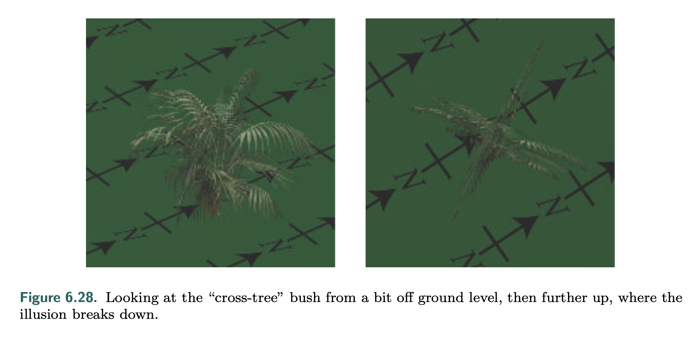
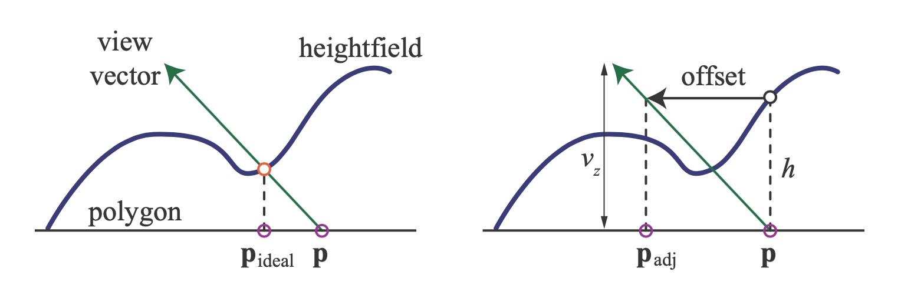

# VI. Texturing
## Texturing Pipeline
- on the pixel level
  - instead of taking surface color, take from some image
  - the corresponding "pixel" of the pixel on that image (texture) is a **texel**
1. **texture mapping**: from object space to texture coordinates (parameter space) via a projection function
   - i.e. putting things into uv
2. *corresponders* map from paramter space to texture space, which can be used to retrieve texture information
3. the texture value is extracted from the texture map, using the texture-space coordinate
4. a *value transform function* processes the texture value and outputs it, where it will be used for some kind of modification

### Projector Function
- xyz to uv
- spherical, cylindrical, planar, natural projections
  
- usually actual projection functions are complex and dependent on the model/how the artist handles it in the modeling software
- types
  - **spherical**: casts points onto imaginary sphere arounc some origin
  - **cylindrical**: `u` is the same with spherical, but `v` is along the cylinder's axis
    - distortion for when surfaces are near-perpendicular to that axis
  - **planar**: orthographic projection, severe distortion on the edge
- **uv unwrapping**
  - an automated process that either decomposes or helps the artist decompose the model such that
    - each polygon has a piece of the texture's area that is more proportional to its own area
    - mesh connectivity is maximized, so that artifacts do not occur on edges
    - a field in mesh parameterization
- the texture space can be above 2, or even 3 dimensions
- directional texture coordinates are accessed by a direction vector
  - *ex.* cube maps sampled from view direction
- there are also 1 dimentional textures, such as those determining coloration by altitude of some landscape

### Corresponder Function
- transforms texture coordinates before being interpolated and used in sampling
  - i.e. mapping from texture coordinates to actual points in texture space
- types
  - api-specific functions like selecting subimages
  - matrix transformations
  - wrapping mode/texture addressing mode
    - wrap (basically a `mod`)
    - mirror
    - clamp
    - border: outside `[0, 1]` some other color is used
- it is common to use texture tiling to generate large landscapes, often combined with some other non-tiled texture to provide more variation
  - alternatively, use shaders to generate some unique corresponder functions
  - *ex.* **Wang tile**
    - set of tiles with textures of matching edges
    - tiles are selected applied randomly

### Texture Values
- usually RGB/RGBA to store color
- channels can also be used for various other purposes such as bumps, normals, etc.
- some map `[0, 1]` to `[-1, 1]` instead, usually for normals

## Image Texturing
- an image texture is composed of **cell**s, each with the pixel at its center
- the GPU converts texture coordinates in 01 range to texel coordinates with integer coordinates
- **dependent texture read** 
  - *def 1. for mobile devices* pixel shader calculates texture coords instead of using the coords calculated by the vertex shader
    - without dependent texture read, the GPU usually optimizes the process by prefetching the texture immediately after vertex shading ends
    - using dependent texture reads reduces performance, but is sometimes necessary to achieve visual effects
  - *def 2. for older desktop devices* tex coords that depend on the result of some other tex sample
    - *ex.* sampling a normal map, and then using the result to 
    - fetches under this definition also impact performance
- **power of two (POT) textures**: textures of size $2^m \times 2^n$
  - modern GPUs can handle non-POT (NPOT) textures with mipmapping, but older GPUs may not
- magnification/minification is needed when the projected fragment covers more or less pixel than the actual region of the texture
  - **magnification**
    - nearest neighbor filtering: uses the nearest neighboring texel to the pixel, prone to pixellation effects
    - bilinear interpolation (linear interpolation): considers the $2 \times 2$ neighborhood of texels that surrounds the pixel
      - within the neighborhood, the pixel has a position of $(u', v') \in [0, 1]^2$ that is used for interpolation
        - $u' = (u w_t + 0.5) \mod 1$
        - $v' = (v h_t + 0.5) \mod 1$
      - note that different APIs have use different calculations for texels
    - cubic convolution: weighted sum of $4 \times 4$ or $5 \times 5$ array of texels
    - **detail textures** are high frequency textures overlaid on magnified textures to provide more detail
    - GPU hardware for lerping can be reused for higher order filters like the bicubic
    - another alternative to lerping is to use a curve instead of linear, common choices are
      - **smoothstep**: $x^2(3-2x)$
      - **quintic**: $x^3(6x^2-15x+10)$
        - note that $q''(0) = q''(1) = 0$
      - for some curve *c*, instead of using $u, v$, use the transformed coordinates
        - $u', v'$ calculated as prior
        - $\bold t = c([u', v'])$
        - $[p, q] = [u'_{int}, v'_{int}] + [t_u, t_v] - 0.5$
        - $p, q$ is then used in bilinear filtering instead of $u, v$
      - 
  - **minification**
    - several cells per pixel
      - impossible to precisely compute the influence of all cells cheaply
    - **nearest neighbor**: same as magnification case, causes artifacts inbetween frames during movement, as the exact prioritized cell changes when aligning with the pixel's center
      - contributes to temporal aliasing
    - **bilinear interpolation**: same as magnification case, works well when pixel is affected by less than 4 cells, but doesn't work well otherwise
    - **antialiasing**
      - typically, the texture is preprocessed in a fixed cost in some manner so that the frequency will be less than half of the sampling frequency (Nyquist limit, as described in chapter 5 antialiasing)
      - **mipmapping**
        - downsample from $2 \times 2$ to 1 texel using averages
        - repeat the process until the texture becomes 1 texel, creating a **mipmap chain**
        - using better filters than box filter when sampling the neighborhood results in better mipmaps
        - sRGB needs to converted to linear space when filtering, or else the result will look darker than actual
        - accessing the mipmap
          - the pixel's area is projected onto the texture, covering one or more texels
          - computation of the texture level of detail $d$
            - method 1: approximate coverage with the longer edge of the pixel border, after projected to the texture
            - method 2: largest absolute value of $\partial u / \partial x$, $\partial u /\partial y$, $\partial v / \partial x$, $\partial v / \partial y$ (texture coordinate change in relation to the screen axis x and y)
              - gradients are available to the pixel shader
          - as $d$ increases, more texels influence the pixel, meaning that a smaller mipmap should be chosen
            - the $u, v, d$ triplet is used to access mipmap
            - ideally the pixel to texel rate should be 1
            - $d$ is used as a fractional texture level, where the mipmap immediately above & below $d$ are sampled
            - note that each mipmap sample is already bilinearly sampled, the two sets of mipmap samples are interpolated again (**trilinear interpolation**)
          - the user can maually add a **level of detail bias (LOD Bias)** to $d$
            - increasing $d$ blurs the sampled texture, decreasing $d$ sharpens the sampled texture
          - the alternative $d$ control is just to calculate and supply the $d$ value with some custom shader
      - the benefit of mipmapping is the fixed cost for different levels of minification
      - however, there are artifacts such as overhblurring for pixels that project to a slant region on the texture, where $d$ is a bad estimation
        - mipmaps do not support rectangular sampling
    - **summed-area table (SAT)**
      - array with the same size but more precision (bits) per channel
      - at each point on the array, an average is computed on all texels in the rectangle formed between the point and the texture origin (0, 0)
      - 
      - the average color of the bounding box is $c = \frac{s[x_{ur}, y_{ur}] - s[x_{ur}, y_{ll}] - s[x_{ll}, y_{ur}] + s[x_{ll}, y_{ll}]}{(x_{ur} - x_{ll})(y_{ur} - y_{ll})}$
        - note that two subtracted terms correspond to $A \cup C$ and $B \cup C$, and $C$ is added back with the fourth term
        - the denominator is the rectangular area for the bounding box of the pixel cell's projection
      - note that the bounding box is not actually the pixel cell's projection
        - how well it approximates the actual cell depends on the angle
      - the SAT is an **anisotropic** filtering method due to its ability to sample rectangles on the texture
      - takes at least double the memory for textures less than $16 \times 16$ sized, more precision is needed for larger textures
    - **unconstrained anisotropic filtering**
      - further improve texture filtering by improving existing mipmap hardware
      - 
      - several squares are used to cover the quad
      - the shorter side of the quad is used to determine $d$, unlike in mipmapping where the longer side is used
      - the ratio of anisotropy can be controlled
        - usually between $1:1$ and $2:1$, with higher ratio meaning more samples on the line of anisotropy (higher cost)
      - further improvements add filters and weighting on these samples
- **volume textures**
  - 3 dimensional texture indexed with $u, v, w$
  - most GPUs support volume texture mipmapping
    - for volumes, bilinear is extended to trilinear, trilinear (for mipmaps) is extended to quadrilinear
  - volume textures bring unique benefits for higher cost
    - skips the mesh parameterization process for 2d textures
    - can represents 3d volumetric structures
    - fits well with 3d painting processes
- **cube maps**
  - takes a 3 component texture coordinate vector specifying a direction from the origin to some face of the cube
  - the specific implementation depends on the graphic API's coordinate system
- **texture representation**
  - **texture atlas**: put several images to a larger texture
    - further improvements include using Ptex and related adjacency-bsed structures
      - each quad on a subdivision surface has its own small texture
      - avoid assignment of unique tex coords over a mesh, preventing artifacts for seams
    - a problem is subtextures bleeding into eachother during mipmap generation, which can be solved by generating mipmaps before constructing the atlas
    - problems can arise when using corresponder functions with the atlas, such as wrapping and reflecting
    - an alternative solution is to use texture arrays, avoiding problems with mipmapping and repeat modes
      - all textures in the array have the same
        - dimension, format, mipmap hierarchy, MSAA settings
      - textures in the array are set up at the same time, and then accessed using an index
        - much faster than subtexture binding
    - **bindless textures**
      - with texture binding, there is a limit to the number of texture units
      - bindless textures removes this upper limit, instead associating each texture with a word-sized pointer (**handle**)
      - faster than texture binding
- **texture compression**
  - mainly to solve bandwidth and cache size issues
    - tradeoff by compress/decompressing, which takes time but save space
    - note that if bandwidth is the main concern, spacial issues are also time issues
  - popular image compression methods are too expensive for hardware
  - **S3 Texture Compression (S3TC)**, where S3 Graphics is the company
    - incorporated into DXTC for DirectX
      - named Block Compression (BC) in DirectX 10
    - also the default for OpenGL
    - fixed size
    - implementation
      - each block is $4 \times 4$
      - for each block, store 2 reference colors
      - for each texel, store an interpolation factor between the two reference values
    - the method is lossy
    - 7 variants of BC
      - different storage, reference color formats, etc.
      - newer versions provide support for multiple lines instead of one single line of interpolation
  - **Ericsson Texture Compression (ETC)**
    - for OpenGL ES
    - similar use of reference colors
    - use of static lookup tables
    - luminance modification
  - **Ericsson Alpha Comopression (EAC)**
    - similar to ETC but for single channel (alpha)
- **normal compression**
  - the obvious step is to take out a coordinate using the fact that normals are unit length, giving a $3 : 2$ rate
  - further steps could include use of EAC or some other compression for the two remaining channels x and y
    - when not supported, the fallback is to just use compressions for regular RGB values
- **data compression asymmetry**
  - decompression is usually must faster than compression, and is done by hardware fixed-function processors
  - note that different compression times are preferred by different applications
    - in fixed textures that preprocessing can be used, compression rate is prioritized over compression speed
    - in procedural textures (*ex.* skyboxes containing moving clouds), compression speed is usually prioritized over compression rate
> among prior sections, the book also lists
>   1. several other compression algorithms
>   2. proposals to improve/calibrate certain compressions
>   3. use of YCoCg color space and its convertion to/from RGB

## Procedural Texturing
- trade off between storage and computation
  - instead of storing a large texture, or one that is hard to access, use a function evaluation instead to generate the texture
- **noise functions**
  - typically used in place of volume textures
  - evaluated at successive power of 2 frequences (octaves)
  - sum of weighted octaves evaluates some **turbulence** function
  - often some kind of interpolation on a lattice (*ex.* Perlin/Simplex)
    - the lattice values can be precomputed
- **cellular textures**
  - measuring distances from each location to a set of *feature points* (*ex.* Voronoi)
- **simulations**
  - interactive processes, such as ripples and cracks
  - more dynamic than fixed textures
- pose difficulties in parameterization
  - some skip parameterization and directly place the texture on the surface
  - (field of texture synthesis)
- pose difficulties/solutions in antialiasing
  - no preconfigured way like mipmapping to solve the issue
  - sometimes inner knowledge about the procedural texture's implementation helps implement the antialiasing
    - *ex.* for noise functions, the octaves above the Niquest limit can just be discarded

## Texture Animation
- video textures
- texture coordinate changes/matrix transforms
- texture blending between different sources

## Material Mapping
- material properties can be read from texture channels
- *ex.* **albedo color map/diffuse color map**: surface color
  - roughness, heightfield, etc.
    - note that these features are not linear, and can cause higher frequencies to arise, meaning that antialiasing should be taken care of
- use a channel to specify lerp factor between two different materials

## Alpha Mapping
- can be used to accomplish several effects
- decaling, cross trees, etc.
  - 
  - note that in this case it is very inefficient to actual treat each fragment with alpha values, since it usually involves sorting and displaying back-to-front
    - instead, just do a cutoff using `discard` for any alpha values below some threshold
    - this way, the texture is actually opaque and the sorting can just be skipped
- mipmaps may not work well with alpha testing, since alpha values are blended
  - a possible fix is to use **coverage**
    - for a mipmap of level $k$, the coverage $c_k$ is
      - $\frac{1}{n_k}\sum(\alpha(k, i) > \alpha_t)$
      - basically counts the portion of pixels passing the test
      - instead fixing the alpha test value, find a $\alpha_k$ for each value so that $c_k$ is closest to $c_0$
      - then, for that mipmap level, scale all alpha values by $\alpha_t / \alpha_k$
  - an alternative fix is to scale up the alpah inside the shader instead of the mipmap
  - another solution is to just use a random threshold (i.e. a hash2D function to avoid temporal factors)
    - on average, the result approaches correct results
    - the inputs to the hash function is the object space coordinates divided by the max screen space derivatives of the object space coords, clamped
    - due to the derivatives being low close by, there are very little stochastic artifacts when near
    - however, since all mipmap levels are still treated the same, the final display may still not be optimal
  - **alpha to coverage**
    - similar to screen-door transparency, but at the subpixel level
    - takes a fragment coverage value and use that to determine how many samples per pixel are covered
    - good for antialiasing alpha testing
    - artifacts when used together with alpha-blending, especially when two semitransparent fragments with coverage are overlapping
> the book describes making alphas work with bilinear interpolation, this is explained already in chapter 5
> basically, make sure RGB values are premultiplied by alpha before blending
  - note that for image formats like PNG, RGB is not premultiplied to A due to loss in precision, causing black frindges
  - there are ways to work around if pre-multiplication is not possible, by detecting and erasing the artifacts *after* composition

## Bump Mapping
- *def.* modifying the per-pixel shading to show 3D details
  - details at different scales
    - **macrogeometry**: lots of pixels, represented by vertices and triangles
    - **mesogeometry**: between macro and micro, such as wrinkles and folds that are too small to be modeled by mesh primitives
    - **microgeometry**: substantially smaller than a pixel, handled by shading model with pixel shader usually in conjunction with textures (*ex.* smoothness, roughness, metallic)
- the bump map perturbs the surface normal relative to the **tangent frame**
  - i.e. **tangent-space basis**
    - per vertex
    - $\begin{pmatrix}
        t_x & t_y & t_z & 0 \\
        b_x & b_y & b_z & 0 \\
        n_x & n_y & n_z & 0 \\
        0 & 0 & 0 & 1
       \end{pmatrix}$
    - $b$ here denotes the **bitangent** vector
      - together, the tangent and bitangent points along the $u$ and $v$ axis fo the texture
    - the matrix is abbrieviated as **TBN**
    - transforms world space to tangent space
    - this basis is not always orthogonal
    - sometimes $n$ is not stored and instead crossed from $t$ and $b$
      - however, this is only simple when the handedness of the map is always the same
      - sometimes to save space for symmetric objects, the same map is used (and flipped), in that case an additional bit must be used to indicate the handedness, although the normal channel itself can still be skipped
- 
- the tangent space helps determine the material's orientation, which helps materials like brushed metal
### Blinn's Methods
- original bump mapping method
- each texel stores signed $b_u$ and $b_v$ that describes how much the normal should vary along the $u$ and $v$ axis
  - for this reason it is named **offset vector bump map** or **ofset map**
- the alternative is using a monocrome **heightfield**
  - differences are taken along neighboring columns/rows to evaluate the slope
### Normal Mapping
- 3 signed channels, usually in tangent space (i.e. describes perturbation)
- relation between normal and shaded color is often not linear
  - filtering methods may be needed to deal with reflection artifacts on bumped surfaces
- **lambertian surfaces**
  - a specific case where normal map has approximately linear effect on shading (lambertian describes the reflective property of the surface, not the shape/curvature of the surface)
  - this is due to lambertian shading being a dot product
    - $\bold l \cdot \frac{\sum \bold n_i}{n} = \frac{\sum \bold l \cdot \bold n_i}{n}$ takes the average of several normal vectors and dots it to the light vector
    - note that the actual lambertian shading is clamped so it's not exactly a dot
- deriving normal map from neight map
  - $h_x(x, y) = \frac{h(x+1, y) - h(x-1, y)}{2}$
  - $h_y(x, y) = \frac{h(x, y+1) - h(x, y-1)}{2}$
  - the unnormalized normal $\bold n = (-h_x, -h_y, 1)$
  - note that 1 and 2 can be replaced with $1\epsilon$ and $2\epsilon$ in the $h_x$ and $h_y$ calculations
    - $\epsilon$ determines the sampling precision on the heightfield
## Parallax Mapping
- *def.* positions of objects move relative to one another as the observer moves
- the technique is used to change the actual height of bumps instead of just changing the normals
- bumps are stored in heightfield texture
  - when viewing the texture, the heightfield value is retrieved to shift the texture coordinates to retrieve a different part of the surface
  - 
    - $\bold p_{adj} = \bold p + \frac{h \cdot \bold v_{xy}}{v_z}$, where
      - $\bold p$ is the texture coordinate
      - $h$ is thet heightfield value at that texture coordinate
      - $\bold v$ is the view vector in tangent space
    - this approximation works well for slow-changing bumps
    - doesn't work well with shallow viewing angles, where a small view angle change results in a large texture coordinate change
- **offset limiting**
  - limit the shifting to below $h$
  - $\bold p_{adj} = \bold p + h \cdot \bold v_{xy}$
  - the surface will seem less bumpy at shallow angles
### Parallax Occlusion Mapping (POM)
- the problem with basic bump mapping is that bumps can never occlude each other
- also, it is assumed that height change is slow in any neighborhood (not just being smooth, but varying slowly)
- POM approaches uses multiple samples of the heightfield along the view ray in order to find possible intersections before $\bold p$
  - *ex.* the first sample with the ray evaluating below the heightfield counts
- this approach also enables shadow casting
- different variations of POM use
  - different underlying data structures to describe the heightfield
  - different sampling methods
- a common issue is maintaining parallax and occlusion at the horizon and silhouette
- the best method always depends on the GPU and the application
> the book outlines several implementations of POM with varying techniques

## Textured Lights
- aka. *gobo*/*cookie* lights
- often projective lights with a cone/frustrum shaped volume, where a texture can be used to regulate intensity
- for non-projective lights, a cubemap can be used to regulate
  - a volume texture can also be used to control falloff