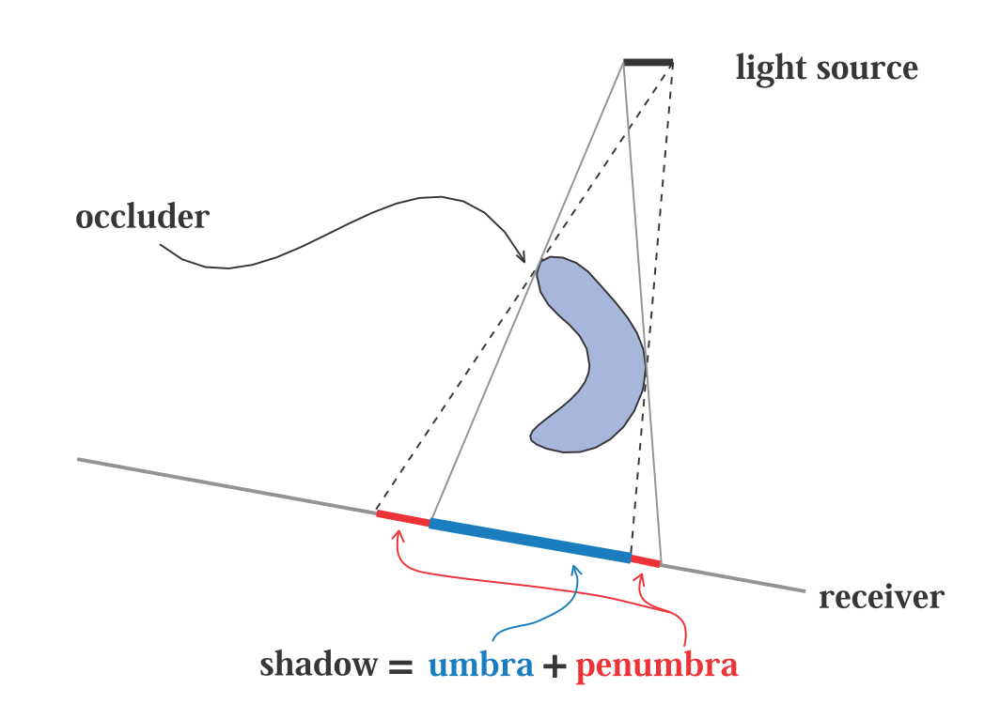
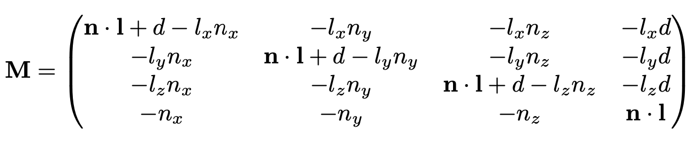
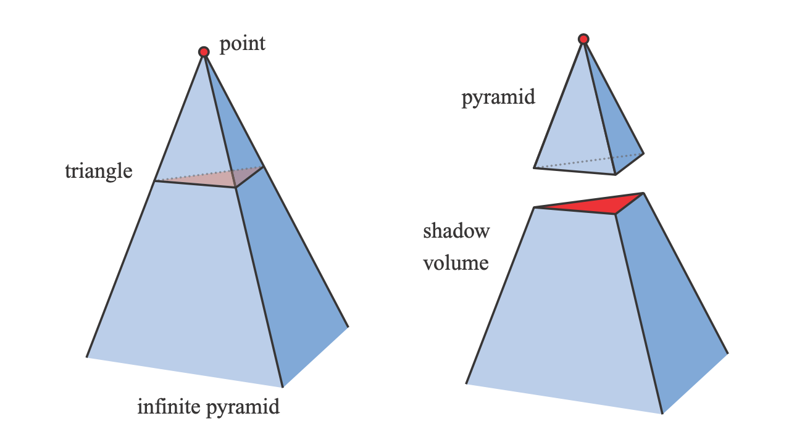
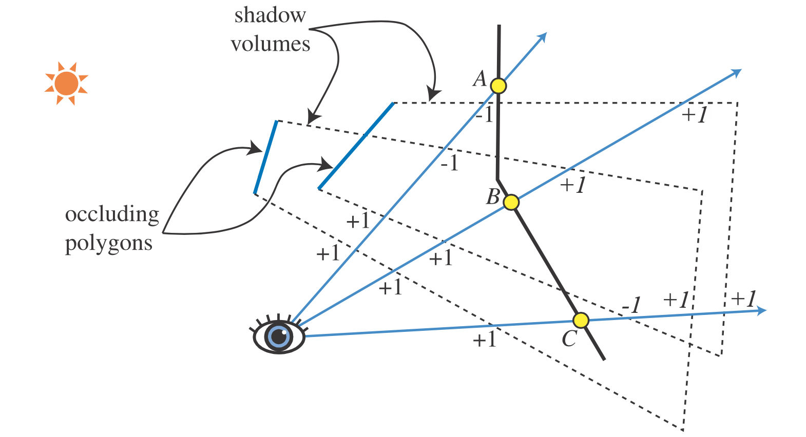
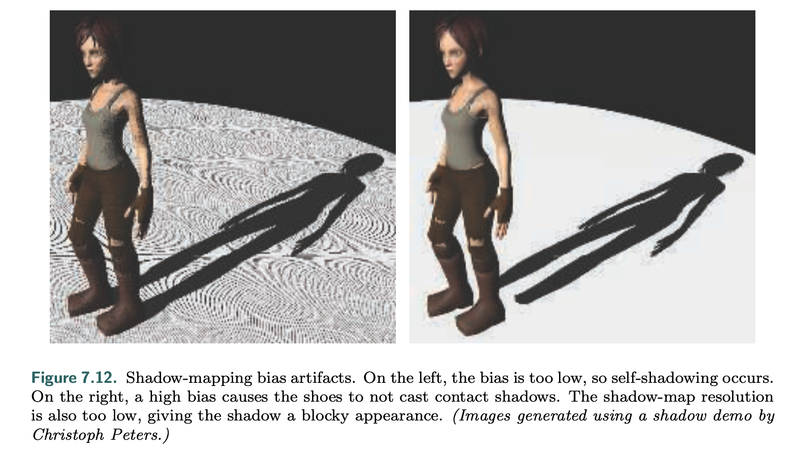
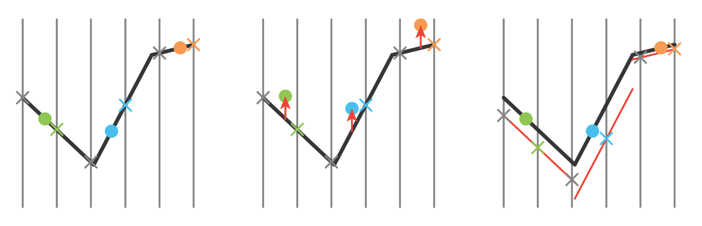
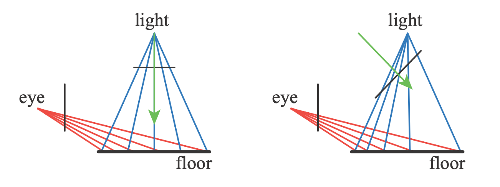
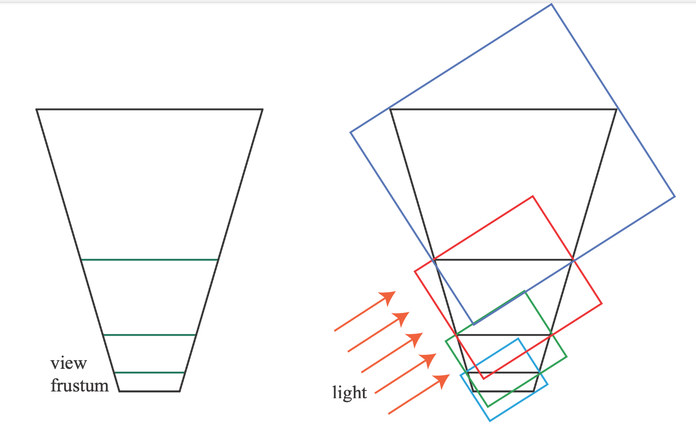
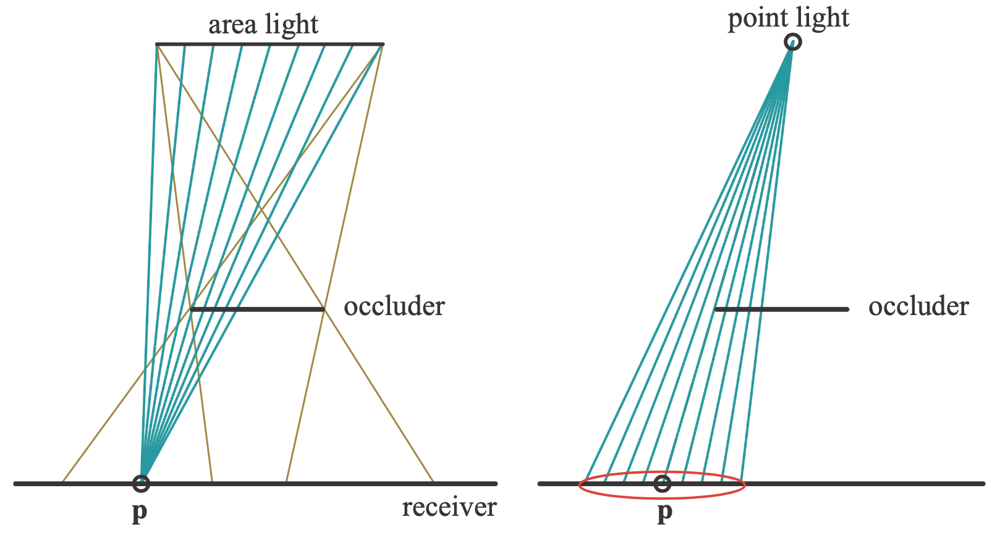

# Shadow
- **terminlology**
  
- **hard shadows**: fully shadowed regions generated when
  - the light source is punctual
  - the occluder is near the receiver
- **soft shadows**: with noticable penumbra
## Planar Shadows
- objects cast shadows onto a planar surface
### Projection Shadows
- under world space, for vertex $\bold v$ and lightsource $\bold l$, a projection $\bold p$ to the ground (y=0), the projection is
  - $\frac{p_x - l_x}{v_x - l_x} = \frac{l_y - 0}{l_y - v_y}$
  - $p_x = \frac{l_y v_x - l_xv_y}{l_y - v_y}$
  - similarly, $p_z = \frac{l_yv_z - l_zv_y}{l_y - v_y}$
  - (see similar triangles formed with $lv$ and $lp$ repectively as hypotenuse)
  - for this special case, $\bold M = \begin{pmatrix}
                            l_y & -l_x & 0 & 0 \\
                            0 & 0 & 0 & 0 \\
                            0 & -l_z & l_y & 0 \\
                            0 & -1 & 0 & l_y
                            \end{pmatrix}$
- for a general case with plane $\pi : \bold n \cdot \bold x + d = 0$
  - $\bold p = \bold l - \frac{d + \bold n \cdot \bold l}{\bold n \cdot (\bold v - \bold l)}(\bold v - \bold l)$
  - this extends the ray from $\bold l$ to $\bold v$ by a correct factor as to reach $\bold p$
  - 
- the planar shadow is basically the original object projected by $\bold M$ and then drawn (with z testing off) onto the receiver, usually just the ground plane
  - for a bounded ground, a stencil buffer can be used to limit the shadow to be within the ground region
- alternatively, it is possible to draw the shadow on a **lightmap** texture which regulates the light intensity on the receiver
- the occluder must be between the lightsource and the receiver
  - if it is partially higher than the lightsource, an **antishadow** is generated
  - objects below the receiver should not be projected, nor do objects above the light source
### Soft Shadows
- appears when lightsource has an area
- the simplest way to render soft shadows is just to take several punctual light samples on the light's area and render shadows to a buffer
  - the soft shadow is the average of the samples
- frustum-based method
  - treat the light itself as viewer, and generate receiver's textures from its perspective
  - hard shadows are overlaid onto the receiver textures, and then averaged to yield soft shadows
- it requires a lot of samples (*ex.* 256) to look accurate, making cost high
  - for this reason, these methods are usually only used to generate ground truth for testing other methods
- **convolution**
  - blurring a hard shadow
  - uniform blurring is unrealistic
  - significantly less cost
## Shadows on Curved Surfaces
- the light projects the shadow onto receivers
  - this differes from the ground shadow texture because the shadow is an image made as a view from the light itself
- issues with the approach
  - must identify the actual occluders and receivers for each light
  - occluders cannot cast shadows on themselves
  - occluders must be between the light and the receiver, the relation must be maintained by the program itself

## Shadow Volumes
- unpredictable cost, leading to low adaptation
- uses the stencil buffer
- 
- 
  - the ray implementation of shadow volumes, where each view ray has some counter that is
    - incremented every time it enters some shadow volume
    - decremented every time it leaves that same shadow volume
    - if a view ray has a positive counter, it is in shadow
  - the stencil implementation
    - for each volume, draw on the stencil buffer its front-facing triangles via incrementing
    - for each volume, draw on the stencil buffer its back-facing triangles via decrementing
    - clamp the stencil buffer
- even though the method can be improved, the variation is still large depending on the number of lights and occluders (and how detailed those occluders are)

## Shadow Mapping
- from each light, what is "sees" is illuminated
  - render a depthmap of that view, creating a **shadow map/shadow depth map/ shadow buffer**
  - relative to that view, everything with a higher z value is in shadow
    - this is done when rendering the scene again from the actual viewer's perspective
    - the shadowmap's evaluation is applied by texture mapping
- shadow maps can be pre-generated (baked)
- linear cost with number of primitives, constant access time
- different types of lights
  - projective lights naturally has frustums for use
  - directional lights can use orthographic projection
  - a local point light can be divided into a six-view cube (**omnidirectional shadow maps**)
  - main challenge is avoiding artifacts at seams
- only objects that are marked as potential occluders are considered
  - engines like Unity give this control
- multiple improvements can be done to shrink the effective frustums evaluated in the Z-testing, both to skip unwanted fragemnts and improve Z-buffer precision (since the number of bits is set for the entire near to far clipping planes)
- common artifacts due to issues with z-buffer & shadow map precision
  - **self-shadow aliasing/shadow acne**: a shape is considered to be its own shadow
    - because shadow map generations are independent from the screen rendering itself, the points sampled for each process almost never aligns perfectly
    - there will always be some error between the point sampled for shadow mapping and the point sampled for the screen pixel
    - the solution is to add a small bias to subtract from the receiver's distance to the light so that it rises above the shadow
    - 
    - a more effective method adds a **slope scale bias** that increases per angle away from the light
      - this is because the error bound increases when the receiver points away from the light source
      - practically, the slope bias is added to a constant and also clamped upon evaluation (to avoid tangents)
      - 
        - the dots show rendering samples, and crosses are shadow map samples
        - the higher it is, the closer to the lightsource
        - the goal is to get the rendering samples above the shadow map samples with thet least amount of deviation
        - the middle diagram shows the constant bias
        - the right shows a slope bias
    - another alternative is the **normal offset bias** which shifts the worldspace position of the receiver along the surface normal, proportional to the sine of the angle between $\bold l$ and $\bold n$
    - another alternative is **second-depth shadow mapping** which renders only the backfaces to the shadow map
      - however the scheme does not work very well for thin/double sided primitives
      - biases are still needed to fix sihouette edges
      - more susceptible to light leaking
    - some choose the midpoint instead of either front/backface, resulting in a **dual shadow map**
  - **light leaks/peter panning**
    - too much light, as to show the object floating above the receiver (see fig. 7.12 above)

### Resolution Enhancement
- ideally 1 shadow map texel covers 1 pixel
- **perspective aliasing**: a large number of pixels depend on one single shadow map texel
  - happens when the occluder is too close to the light, so that a small sized occlusion is casted to a far receiver creating a large image
- a solution is to change the way the shadow map itself gets sampled so that the image closely resembles the actual sampled area fo the shadow by the view
  - this is commonly done by manipulating the frustum of the light itself
    - the light still points the same direction, but the window of the light's view and the direction of the light's view could be altered
  - this class of solutions is called **matrix-warping**
    - works the best when the light's direction is almost perpenedicular to the view direction
    - 
  - a common pitfall is when the light points towards the camera, often called **dueling frusta/deer in the headlights**
  - due to shifts along camera movement as well as unstable quality, matrix warping methods are usually not favored
- another solution is to take multiple samples
  - generate a fixed set of shadow maps at different resolutions
  - issues with transition between resolutions
  - some proposed mixing statically generated and dynamically generated shadow maps at varying resolutions
- another solution **cascaded shadow maps (CSM)/parallel-split shadow maps** is to slice the view frustum along the view direction
  - each section is proportionally deepter than the prior section
  - the light's view direction is used to create bounding boxes around each frustum section (see below)
  - within each bounding box, shadow map samples are taken in appropriate frequency
    - each section should have roughly equal samples, since the farther ones need to be blurrer and the closer ones need to be sharper
    - the resulting shadow map is still one entity using texture arrays
  - 
  - another enhancement is **z-partitioning**
    - each section occupies a different range of depth
    - with logical split of the range, more bits can be used to convey details in shallower frustum sections
    - often controlled with $r = \sqrt[c]{\frac{f}{n}}$, where $c$ is the number of maps, $f, n$ are far and near planes of the entire frustum, $c$ is the number of sections
    - the result $r$ is the *ratio*
      - for each $n_i, f_i$ pair defining a section, $f_i - n_i = r(f_{i-1} - n_{i-1})$
      - in other words, each section is $r$ times deeper than the prior
    - a side effect is that render results become dependent on the near plane, since small values result in asymptotic behavior
  - **sample distribution shadow maps (SDSM)**
    - uses the z-depth values from the previous frame to determine better partitioning via two strategies
      1. call `reduce` to find the min/max z-depths, using them to set $n$ and $f$
      2. reate a histogram of z-depths
        - extremes of the distribution are used to set $n$ and $f$
        - gaps are used to further optimize the sections, so that unused z ranges are ditched
- another issue is with shimmering artifacts inbetween frames
  - solutions try to stabilize shadow map samples so that small variations do not result in large qualitative changes (highlights emerging, shadow map resolutions of an area changes, etc.)
  - *ex.* have overlapping sections and smoothly transition in the overlapping regions, as more than one sample exist
  > the book lists several more optimizations

## Percentage-Closer Filtering (PCF)
- an extension of shadow mapping that enables soft-like shadows
- similar to texture magnification
  - take more samples and interpolate between the z-test results (0 is shadow, 1 is light, the inbetween is soft)
- 
- similar to a "reverse" of the regular shadow map sampling process where a point light creates multiple $\bold p$ values
  - calculates the percentages of the receiving surface that is closer to the light than the shadow
  - pick samples on a poison disk (avoid grid pattern) around $\bold p$, checking if each sample is visible to the light
    - the disk radius should be proportional to the distance between the occluder and the receiver
    - randomization of the disk results in noise, which is better than other artifacts
> the book describes several bias factors specific for PCF

## Percentage-Closer Soft Shadows (PCSS)
- sample the shadow map to find all possible occluders, and the average distance from the receiver to those occluders are used to determine sampling width
  - $w = w_{light}\frac{d_r - d_o}{d_r}$ where $d_r$ is the receiver from light and $d_o$ is the average occluder from light
  - assumes that the average occluder gives a good predictor of penumbra size, and doesn't account directly for light area
    - leaves artifacts for specific cases
> the book details several implementations of PCSS, as well as the **hierarchical min/max shadow map** used to find fully lit/shadows regions and skip those parts in PCF/PCSS

## Filtered Shadow Maps
- *ex.* **variance shadow map (VSM)**
  - stores depth and depth squared, both are filterable textures
  - VSM is one case for a class of algorithms
    - sample the depth map once at the receiver's location to find the average depth of the closest occluder, $M_1$ (first moment)
      - the original paper uses a Sum Area Table based shadow map
    - let  the receiver be $t$ deep, if $M_1 > t$, then the receiver is in full light
    - when $M_1 < t$
      - $P(x \ge t) \le p_{max}(t)=\frac{\sigma^2}{\sigma^2+(t-M_1)^2}$, where $p_{max}$ is the maximum visibility percentage of the receiver bounding the illumination percentage $p$
      - $\sigma$ is the variance of the depth sample
      - $x \ge t$ is the depth comparison for shadow, and $P(x \ge t)$ is the fraction of texels actually failing the test
        - this is the same concept in PCF
        - note that $M_1 = E(x) = x$ and $\sigma^2 = E(x^2) - E(x)^2$, according to the original paper (E denoting expected value)
      - based on Chebyshev's inequality
      - both $\sigma$ and $t$ varies within the penumbra, resulting in an approximately linear drop in $p_{max}$
  - overall, VSM yields better performance per time cost due to using GPU's texture capabilities and only sampling once
  - similar to PCF, filtering kernel width determines softness
  - **light bleeding** for VSM happens when
    - two occluders for the same receiver, where one occluder is closer
      - in the penumbrae, partial occlusion throws the $p_{max}$ approximation off
    - more samples can be taken similar to PCF to solve this issue
    - for this reason, VSM is commonly used for shadow from terrain, since doing so is cheaper and the chance for multiple occlusion is rare
> the book lists several other filter-based soft shading methods, including Convolution Shadow Map (CSM), Exponential Shadow Map(ESM) and their derivatives

## Volumetric Shadow Techniques
- 